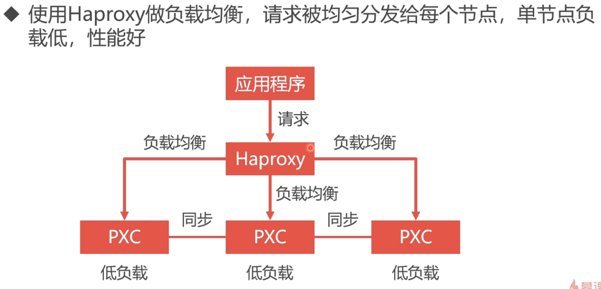
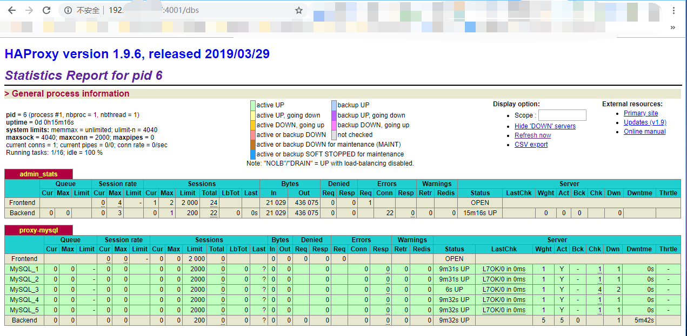

# Mysql数据库集群化部署
### 1. Mysql集群部署方案：Replication 与 PXC


+ PXC集群化部署原理（此次总结使用此部署方案）
  - 同步复制，事物在所有集群节点同时提交，有一个节点挂掉所有节点不能写入，保证数据的强一致性
  - 所有节点都可以进行读写 


### 2. 使用docker安装PXC镜像及PXC容器开启原理
- 2.1 下载PXC镜像
```
docker pull percona/percona-xtradb-cluster

[root@localhost ~]# docker images
REPOSITORY                       TAG                 IMAGE ID            CREATED             SIZE
nginx                            latest              2bcb04bdb83f        7 days ago          109MB
percona/percona-xtradb-cluster   latest              70b3670450ef        4 weeks ago         408MB
```

+ 2.2 创建docker内部网络
```bash
# Docker 默认网段默认开头：172.17.0.0
# 创建键一个内部网段
docker network create --subnet=172.18.0.0/24 netpxc 
--subnet 参数指定创建时的网段地址段，没有这个参数默：第一个 网段 ，以：172.18.0.0开头，第二个 网段 ，以：172.19.0.0开头，

# 查看网段相关信息
docker network inspect netpxc

# 删除网段
docker network rm netpxc
```

+ 2.3 创建容器卷轴（解决PXC无法使用目录映射的问题）
```bash
# 卷创建
docker volume create --name v1
# 卷信息查看
docker inspect v1
```

+ 2.4 创建PXC容器
```bash
docker run -d -p 3306:3306 -v v1:/var/lib/mysql \
-e MYSQL_ROOT_PASSWORD=ABC123456 \
-e CLUSTER_NAME=PXC \
-e XTRABACKUP_PASSWORD=ABC123456 \
--privileged --name=node1 --network=netpxc --ip 172.18.0.2 percona/percona-xtradb-cluster
```

### 3. Docker 开启5个 pxc 容器
```bash
docker volume create --name v1
docker volume create --name v2
docker volume create --name v3
docker volume create --name v4
docker volume create --name v5

docker run -d -p 3306:3306 -v v1:/var/lib/mysql -e MYSQL_ROOT_PASSWORD=ABC123456 -e CLUSTER_NAME=PXC -e XTRABACKUP_PASSWORD=ABC123456 --privileged --name=node1 --network=netpxc pxc

docker run -d -p 3307:3306 -v v2:/var/lib/mysql -e MYSQL_ROOT_PASSWORD=ABC123456 -e CLUSTER_NAME=PXC -e CLUSTER_JOIN=node1 -e XTRABACKUP_PASSWORD=ABC123456 --privileged --name=node2 --network=netpxc pxc

docker run -d -p 3308:3306 -v v3:/var/lib/mysql -e MYSQL_ROOT_PASSWORD=ABC123456 -e CLUSTER_NAME=PXC -e CLUSTER_JOIN=node1 -e XTRABACKUP_PASSWORD=ABC123456 --privileged --name=node3 --network=netpxc pxc

docker run -d -p 3309:3306 -v v4:/var/lib/mysql -e MYSQL_ROOT_PASSWORD=ABC123456 -e CLUSTER_NAME=PXC -e CLUSTER_JOIN=node1 -e XTRABACKUP_PASSWORD=ABC123456 --privileged --name=node4 --network=netpxc pxc

docker run -d -p 3310:3306 -v v5:/var/lib/mysql -e MYSQL_ROOT_PASSWORD=ABC123456 -e CLUSTER_NAME=PXC -e CLUSTER_JOIN=node1 -e XTRABACKUP_PASSWORD=ABC123456 --privileged --name=node5 --network=netpxc pxc
```

### 4. 数据库负载均衡



+ 4.1 创建Haproxy配置文件
  - [点击查看haproxy.cfg配置实例](./source/haproxy.cfg) 
  - [点击查看haproxy.cfg配置网络教程](https://zhangge.net/5124.html)
```bash
mkdir -p /home/Haproxy
touch /home/Haproxy/haproxy.cfg 
```

+ 4.2 Docker创建Haproxy容器
```bash
# 下载Haproxy镜像
docker pull haproxy

# 创建容器haproxy(两台，供后面双机热备使用)，使用 docker ps -a 查看容器是否启动
docker run -itd -p 4001:8888 -p 4002:3306 -v /home/Haproxy/:/usr/local/etc/haproxy --name h1 --privileged --network=netpxc haproxy
docker run -itd -p 4003:8888 -p 4004:3306 -v /home/Haproxy/:/usr/local/etc/haproxy --name h2 --privileged --network=netpxc haproxy

# 容器创建成功后进入容器
docker exec -it haproxy bash

# 指定配置文件开启haproxy
root@64896fcad3e7:/# haproxy -f /usr/local/etc/haproxy/haproxy.cfg
```

+ 4.3 创建 mysql 数据库心跳检测账号
```bash
# 登录mysql命令行
mysql > CREATE USER 'haproxy'@'%' IDENTIFIED BY '';
```

+ 4.4 通过Haproxy心跳监控查看mysql主机状态
[监控地址http://192.168.1.***:4001/dbs](http://192.168.1.***:4001/dbs) admin/abc123456



### 5. 利用 Keepalived 实现Haproxy双机热备
+ 5.1 方案设计


+ 5.2 安装keepalived 并设置配置
```bash
# 进入h1 和 h2容器内部，安装 keepalived 并配置
docker exec -it haproxy bash
root@64896fcad3e7:/# apt-get update
root@64896fcad3e7:/# apt-get installl keepalived
# /etc/keepalived/keepalived.conf 配置文件设置

# 在容器中 启动 Keepalived 之后，宿主机可以ping虚拟ip
root@64896fcad3e7:/# service keepalived start
root@64896fcad3e7:/# ping 192.168.0.201
```
[点击此处查看keepalived.conf实例](./source/keepalived.conf)


```bash
# 在宿主机安装 keepalived 并配置
docker exec -it haproxy bash
yum -y installl keepalived

# /etc/keepalived/keepalived.conf 配置文件设置

# 在容器中 启动 Keepalived 之后，宿主机可以ping虚拟ip
service keepalived start
ping 192.168.0.201
```
[点击此处查看在宿主机上的配置实例（注意修改文件名称为keepalived.conf）](./source/master_keepalived.conf)

