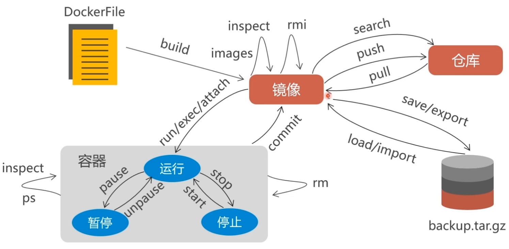

### [常用命令参考网址](http://www.runoob.com/docker/docker-command-manual.html)(http://www.runoob.com/docker/docker-command-manual.html)

#### 容器生命周期管理
`run` docker run ：创建一个新的容器并运行一个命令

`start` docker start :启动一个或多个已经被停止的容器

`stop` docker stop :停止一个运行中的容器

`restart` docker restart :重启容器

`kill` docker kill :杀掉一个运行中的容器

`rm` docker rm ：删除一个或多少容器

`pause` docker pause :暂停容器中所有的进程

`unpause` docker unpause :恢复容器中所有的进程

`create` docker create ：创建一个新的容器但不启动它

`exec` docker exec ：在运行的容器中执行命令

#### 容器操作
`ps`  docker ps : 列出容器

`inspect` docker inspect : 获取容器/镜像的元数据。

`top` docker top :查看容器中运行的进程信息，支持 ps 命令参数。

`attach`  docker attach :连接到正在运行中的容器。

`events`  docker events : 从服务器获取实时事件

`logs`  docker logs : 获取容器的日志

`wait`  docker wait : 阻塞运行直到容器停止，然后打印出它的退出代码

`export`  docker export :将文件系统作为一个tar归档文件导出到STDOUT

`port`  docker port :列出指定的容器的端口映射，或者查找将PRIVATE_PORT NAT到面向公众的端口

#### 容器rootfs命令
`commit`  docker commit :从容器创建一个新的镜像

`cp`  docker cp :用于容器与主机之间的数据拷贝

`diff`  docker diff : 检查容器里文件结构的更改

#### 镜像仓库
`login`   docker login : 登陆到一个Docker镜像仓库，如果未指定镜像仓库地址，默认为官方仓库 Docker Hub

`logout ` docker logout : 登出一个Docker镜像仓库，如果未指定镜像仓库地址，默认为官方仓库 Docker Hub

`pull`  docker pull : 从镜像仓库中拉取或者更新指定镜像

`push`  docker push : 将本地的镜像上传到镜像仓库,要先登陆到镜像仓库

`search`  docker search：从Docker Hub查找镜像

#### 本地镜像管理
`images`  列出本地镜像

`rmi` docker rmi : 删除本地一个或多少镜像。

`tag` docker tag : 标记本地镜像，将其归入某一仓库。

`build` docker build 命令用于使用 Dockerfile 创建镜像。

`history` docker history : 查看指定镜像的创建历史。

`save`  docker save : 将指定镜像保存成 tar 归档文件。

`import`  docker import : 从归档文件中创建镜像。