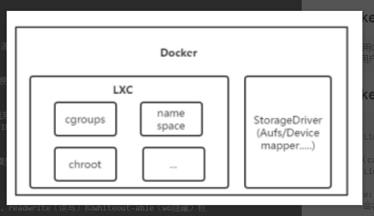

# Docker介绍
### 1.什么是Docker
```html
Docker是一个开源的应用容器引擎，基于LXC（Linux Container）内核虚拟化技术实现，提供一系列更强的功能，比如镜像、Dockerfile等；
Docker理念是将应用及依赖包打包到一个可移植的容器中，可发布到任意Linux发行Docker引擎上。使用沙箱机制运行程序，程序之间相互隔离；
Docker使用Go语言开发
```
### 2.Docker架构
```html
Docker采用C/S架构，Dcoker daemon作为服务端接受来自客户端请求，并处理这些请求，比如创建、运行容器等。
客户端为用户提供一系列指令与Docker daemon交互。
```
### 3.Docker内部组件
```html
LXC：
	Linux容器技术，共享内核，容器共享宿主机资源，使用namespace和cgroups对资源限制与隔离。

Cgroups（control groups）：
	Linux内核提供的一种限制单进程或者多进程资源的机制；比如CPU、内存等资源的使用限制。

NameSpace：
	命名空间，也称名字空间，Linux内核提供的一种限制单进程或者多进程资源隔离机制；
	一个进程可以属于多个命名空间。Linux内核提供了六种NameSpace：UTS、IPC、PID、Network、Mount和User。

UFS（UnionFS）：
	联合文件系统，支持将不同位置的目录挂载到同一虚拟文件系统，形成一种分层的模型；
	成员目录称为虚拟文件系统的一个分支（branch）。

AUFS（advanced multi layered unification filesystem）：
	高级多层统一文件系统，是UFS的一种，每个branch可以指定readonly（ro只读）、readwrite（读写）和whiteout-able（wo隐藏）权限；
	一般情况下，aufs只有最上层的branch才有读写权限，其他branch均为只读权限。
```


### 4.Docker的优点，与KVM区别
+  优点：
	- 持续集成在项目快速迭代情况下，轻量级容器对项目快速构建、环境打包、发布等流程就能提高工作效率 
	- 版本控制每个镜像就是一个版本，在一个项目多个版本时可以很方便管理。 
	- 可移植性容器可以移动到任意一台Docker主机上，而不需要过多关注底层系统。 
	- 容器保证了所有配置、依赖始终不变。 
	- 隔离性与安全容器之间的进程是相互隔离的，一个容器出现问题不会影响其他的

+ 与KVM区别：
	```html
	1)启动时间
	Docker秒级，KVM分钟级。
	2)　轻量级
	容器资源占用小，镜像大小通常以M为单位，部署更快速
	3)　性能
	容器共享宿主机内核，系统级虚拟化，占用资源少，没有Hypervisor层开销，容器性能基本接近物理机；
	4)　安全性
	由于共享宿主机内核，只是进程级隔离，因此隔离性和稳定性不如虚拟机，容器具有一定权限访问宿主机内核，存在一定安全隐患。
	5)　使用要求
	KVM基于硬件的完全虚拟化，需要硬件CPU虚拟化技术支持；
	容器共享宿主机内核，可运行在主流的Linux发行版，不用考虑CPU是否支持虚拟化技术。
	```
