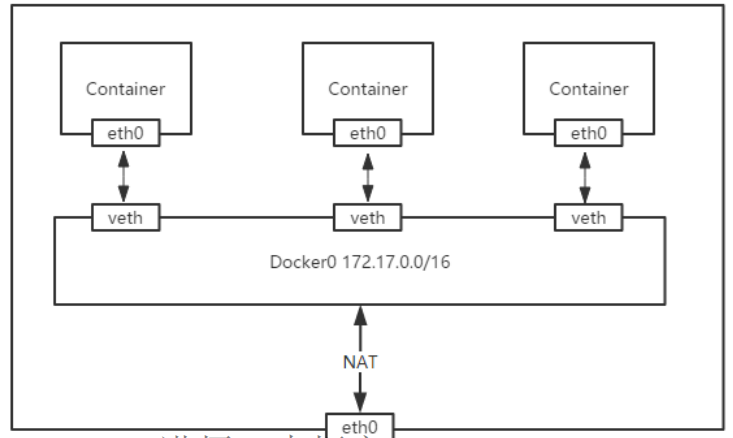

## 网络模式

#### Docker支持五种网络模式
- bridge
默认网络，Docker启动后创建一个docker0网桥，默认创建的容器也是添加到这个网桥中；IP地址段是172.17.0.1/16
- host
容器不会获得一个独立的network namespace，而是与宿主机共用一个。
- none
获取独立的network namespace，但不为容器进行任何网络配置。
- container
与指定的容器使用同一个network namespace，网卡配置也都是相同的。
- 自定义
自定义网桥，默认与bridge网络一样。

>下载网桥管理工具:用于查看网络桥接状态
```
[root@localhost ~]# yum -y install bridge-utils
[root@localhost ~]# brctl show
bridge name	bridge id		STP enabled	interfaces
docker0		8000.024267cec56d	no		veth7a77c8f
							vethc8487ff
```


- `docker inspect`获取容器/镜像的元数据(可查看docker容器的所有相关数据信息 json格式)
```
$ docker inspect centos 
~~~
      "Networks": {
                "bridge": {
                    "IPAMConfig": null,
                    "Links": null,
                    "Aliases": null,
                    "NetworkID": "62d80611ec168d7a5f16fe4e5b74d746ca4159c89ecbcd2354b78de76a779acd",
                    "EndpointID": "cc82ae9872ad2de41c794a00c35b8c2e6b5d1d947b2f0571b18f9c7b1be2e625",
                    "Gateway": "172.17.0.1",
                    "IPAddress": "172.17.0.2",
                    "IPPrefixLen": 16,
                    "IPv6Gateway": "",
                    "GlobalIPv6Address": "",
                    "GlobalIPv6PrefixLen": 0,
                    "MacAddress": "02:42:ac:11:00:02",
                    "DriverOpts": null
                }
            }

~~~
```

- 创建容器时可以指定网络模式 默认为gridge
`docker run -net host centos`

- 查看所有docker网卡信息
`docker network ls`


#### bridge 网络模式原理
先创建一个docker0的网桥，使用veth pair创建一对虚拟网卡，一端放到新创建的容器中，并重命名eth0，另一端放到宿主机
上，以veth+随机7个字符串命名，并将这个网络设备加入到docker0网桥中，网桥自动为容器分配一个IP，并设置docker0的IP
为容器默认网关。所以容器默认网络都加入了这个网桥，因此都可以彼此通信。同时在iptables添加SNAT转换网络段IP，以便
容器访问外网



### 创建 docker 内部网络
```bash
# Docker 默认网段默认开头：172.17.0.0
# 创建键一个内部网段
docker network create --subnet=172.18.0.0/24 net1 
--subnet 参数指定创建时的网段地址段，没有这个参数默：net1 网段 ，以：172.18.0.0开头，net2 网段 ，以：172.19.0.0开头，

# 查看网段相关信息
docker network inspect net1

# 删除网段
docker network rm net1
```