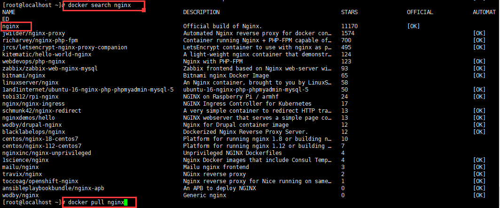

# 容器管理

### 1. 从镜像仓库查找和下载
```bash
docker search nginx
docker pull nginx
```


### 2. 本机镜像的管理
```bash
# 查看本机的镜像列表
docker images -a 

# 删除本地镜像列表中的nginx镜像
docker rmi nginx

# 本机镜像导出一个tar包
docker save nginx > /home/nginx.tar.gz

# 将镜像tar包加载到本机的镜像列表当中
docker load > /home/nginx.tar.gz

# 镜像标签（复制nginx镜像，并另起名为 nginxbak）
docker tag nginx nginxbak
```

### 3. 创建并启动容器
`docker run` 创建并运行一个容器
>将宿主机目录挂载到容器目录。

数据卷特点：
- 在容器启动初始化时，如果容器使用的宿主机挂载点有数据，这些数据就会拷贝到容器中。
- 数据卷可以在容器直接共享和重用。
- 可以直接对数据卷里的内容进行修改。
- 数据卷的变化不会影响镜像的更新。
- 卷会一直存在，即使挂载数据卷的容器已经删除。

示例：宿主机目录挂载
```bash
docker run -itd --name web01 -p 80:8080 -p 9000:8888 -v /home/web01:/data --privileged nginx
-- name 指定容器的名称为 web01
-p 端口映射 本机80 => 容器8080 ，本机9000 => 容器8888
-v 目录映射 本机目录/home/web01 => 容器/data
--privileged 本机映射的目录在容器中有最高权限，读写执行都是可以的
nginx 容器使用的镜像名称
```
### 4. 容器的状态管理
```bash
# 先决条件：容器名称 web01
# 容器暂停
docker pause web01(或容器编号)

# 容器从暂停恢复启动
docker unpause web01(或容器编号)

# 容器停止
docker stop web01(或容器编号)

# 容器从暂停恢复启动
docker start -i web01(或容器编号)
```

### 5. 容器的状态管理


-p 
注：`/container_data/web`为宿主机目录，`/data`是容器中目录，目录不存在会自动创建。
### 2. 容器数据卷
>将一个运行的容器作为数据卷，让其他容器通过挂载这个容器实现数据共享。

示例：
`docker run -itd -v /data --name dvdata ubuntu`
`docker run -itd --name web01 --volumes-from dvdata ubuntu`
