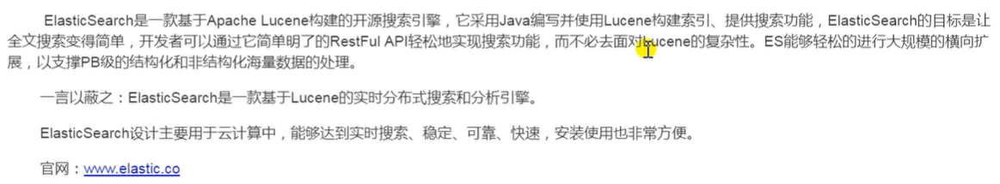
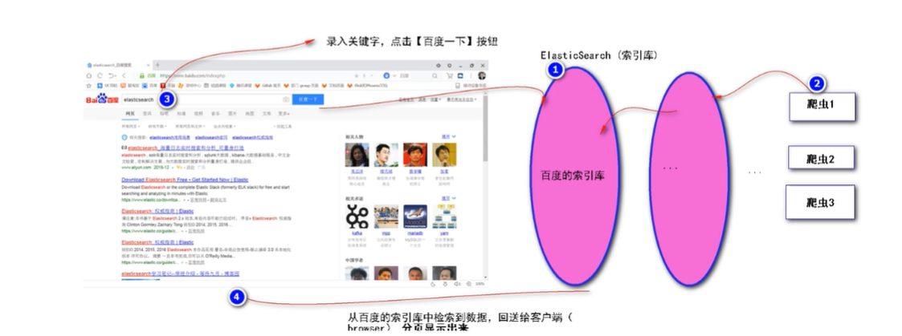
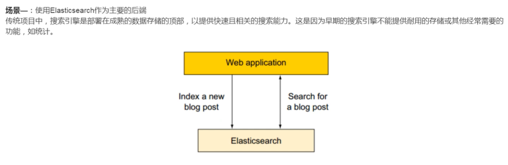
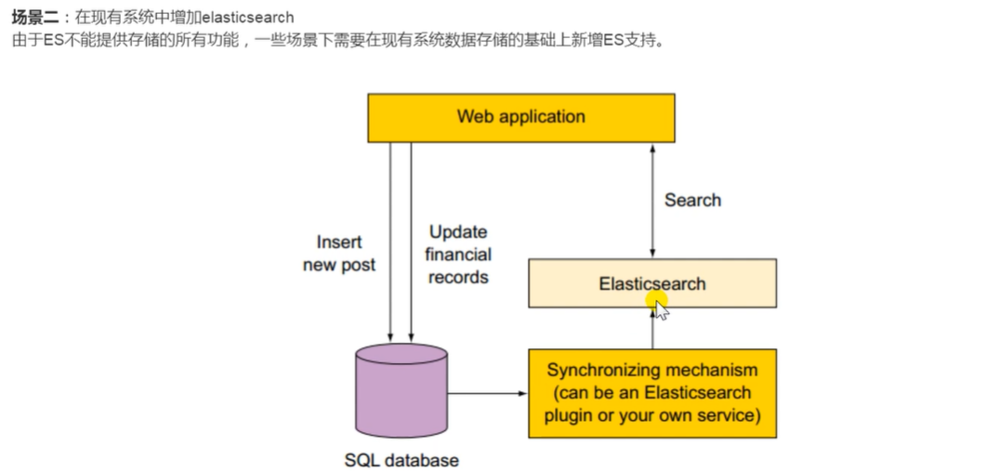
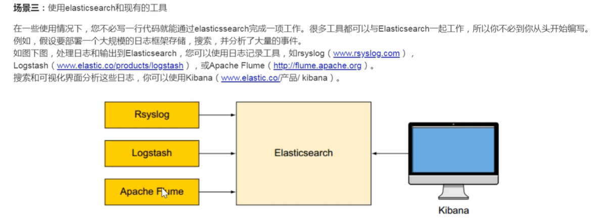
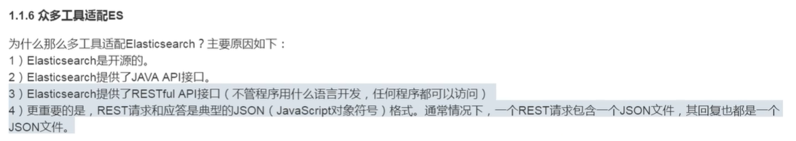
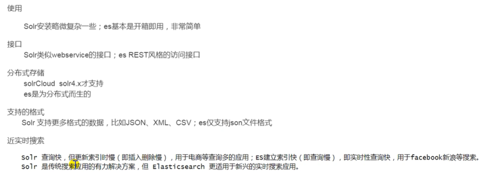
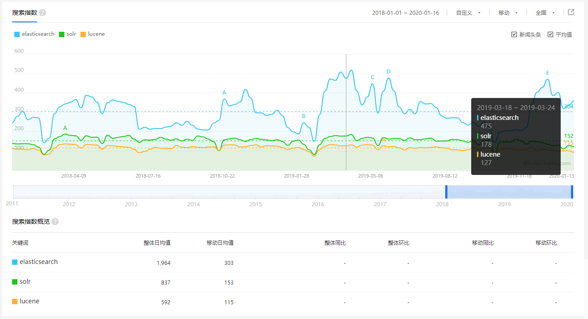
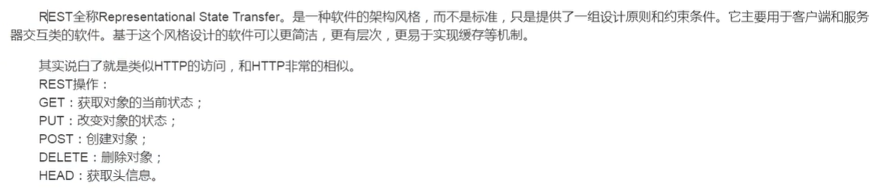

### 1.ES定义
- ES是Elasticsearch的简写，是一款基于 Lucene 的开源的分布式查询与分析引擎.

### 2.检索原理

### 3. 作者简介

### 4.与使用场景

### 5. Solr与ES对比
- 都是基于`Lucene`,都是对于`Lucene`的封装

- 基于`百度指数`的对比结果

### 6. RESTFULL API简介
- [RESTFULL API架构详解](https://www.runoob.com/w3cnote/restful-architecture.html)

