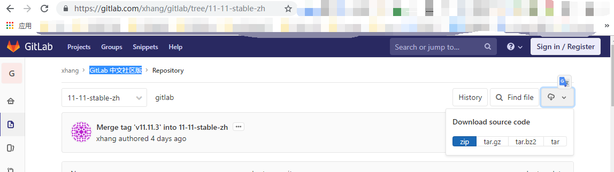

# Gitlab中文设置

>下载中文配置文件，采用文件覆盖方式

### 1.  查看运行环境的版本

```bash
cat /opt/gitlab/embedded/service/gitlab-rails/VERSION
11.11.3
```

### 2.  下载对应版本中文包[GitLab 中文社区版](https://gitlab.com/xhang/gitlab/tree/11-11-stable-zh)

```bash
wget https://gitlab.com/xhang/gitlab/-/archive/11-11-stable-zh/gitlab-11-11-stable-zh.zip
unzip gitlab-11-11-stable-zh.zip
```



### 3. 中文设置

```bash
# 备份默认语言文件
cp -ra /opt/gitlab/embedded/service/gitlab-rails /opt/gitlab/embedded/service/gitlab-rails.def

# 使用中文语言文件覆盖默认语言文件
cp -ra gitlab-11-11-stable-zh/* /opt/gitlab/embedded/service/gitlab-rails/


cp: cannot overwrite non-directory `/opt/gitlab/embedded/service/gitlab-rails/log' with directory `gitlab-v10.7.0-zh/log'
cp: cannot overwrite non-directory `/opt/gitlab/embedded/service/gitlab-rails/tmp' with directory `gitlab-v10.7.0-zh/tmp'
#此报错不用管，因为已经设置root密码，登录过，所以会报错。

```

### 3.  重启后访问

```bash
#重新配置gitlab
gitlab-ctl reconfigure
#重启启动gitlab
gitlab-ctl restart
#再次访问 ，便是中文版了。
```
