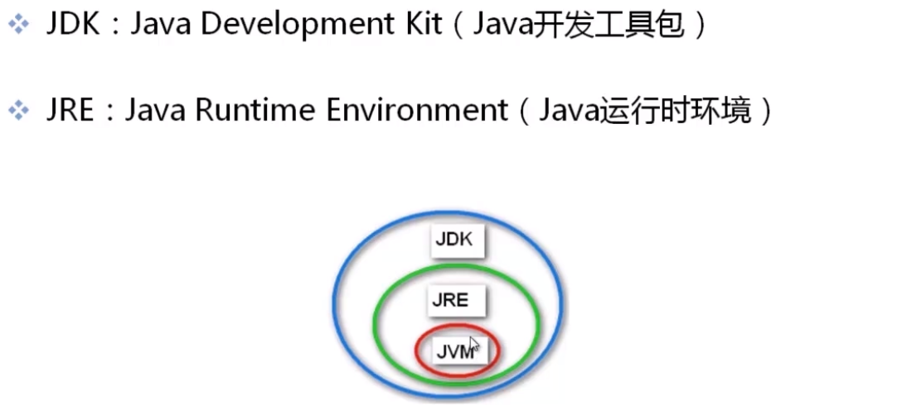
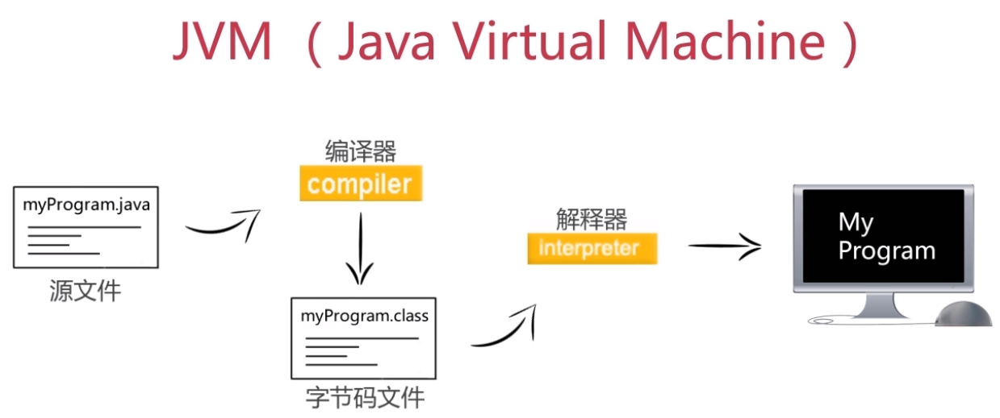

# Java简介

## 一  体系结构
- JavaSE(J2SE)  (Java2 Platform Standard Edition，java平台标准版) 
- JavaEE(J2EE)  (Java 2 Platform,Enterprise Edition，java平台企业版)
- JavaME(J2ME)  (Java 2 Platform Micro Edition，java平台微型版)。

