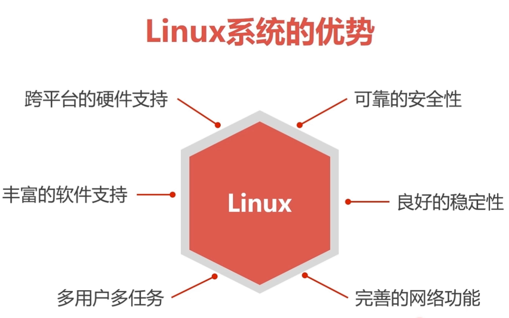
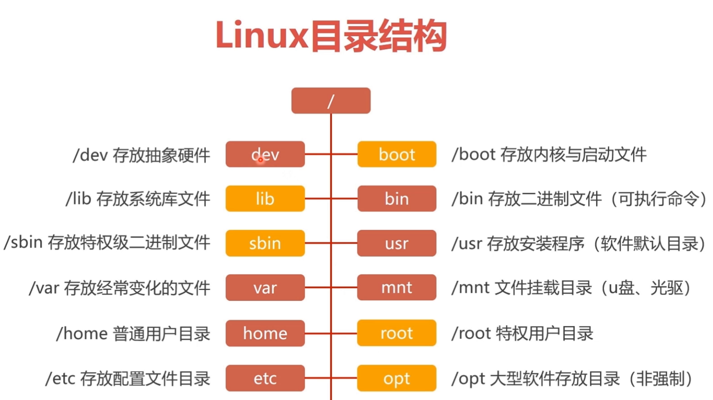
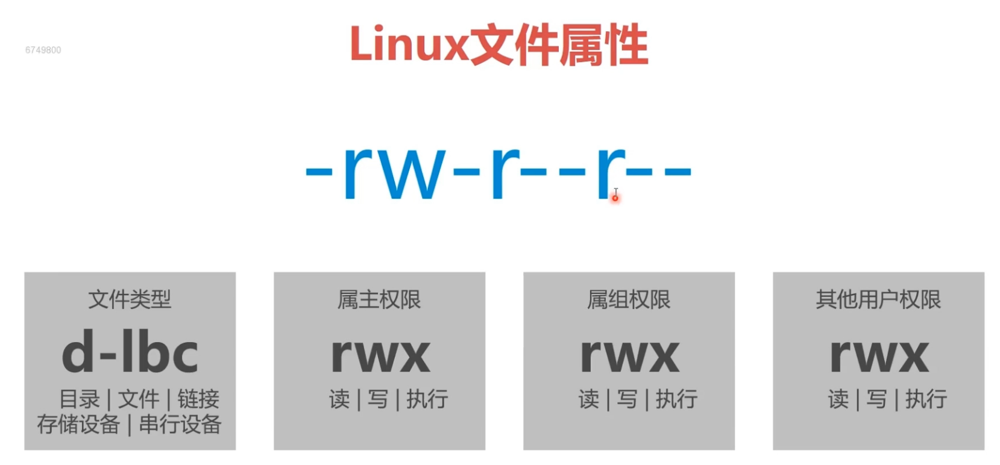

# Linux系统基础介绍

### 1. Linux对比Windows的优点


### 2. Linux目录结构介绍


### 3. Linux文件属性


### 4. Linux 的 7 个启动级别
```txt
语法 init 0-6
0: 系统停机模式
1: 单用户模式，root权限，用于系统维护，禁止远程登录，类似windows的安全模式
2: 多用户模式,没有NFS和网络支持
3: 完整的多用户文本模式，有NFS和网络，登陆后进入控制台命令行模式
4: 系统未使用，保留的，一般不用
5: 图形化模式
6: 重启模式
```