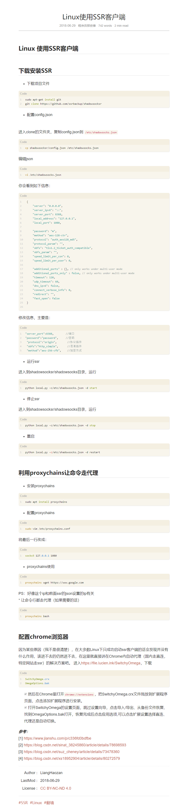

## Linux 环境下 安装 ssr 客户端安装，shadowsocks
参考链接：https://mikoto10032.github.io/post/%E7%A8%8B%E5%BA%8F%E5%91%98%E9%82%A3%E4%BA%9B%E4%BA%8B/linux%E4%BD%BF%E7%94%A8ssr%E5%AE%A2%E6%88%B7%E7%AB%AF/



```bash
vi /etc/shadowsocks.json
{
    "server": "99.99.99.99",
    "server_ipv6": "::",
    "server_port": 48898,
    "local_address": "127.0.0.1",
    "local_port": 1080,

    "password": "123456",
    "method": "aes-256-ctr",
    "protocol": "auth_aes128_sha1",
    "protocol_param": "",
    "obfs": "tls1.2_ticket_auth",
    "obfs_param": "",
    "speed_limit_per_con": 0,
    "speed_limit_per_user": 0,

    "additional_ports" : {}, // only works under multi-user mode
    "additional_ports_only" : false, // only works under multi-user mode
    "timeout": 120,
    "udp_timeout": 60,
    "dns_ipv6": false,
    "connect_verbose_info": 0,
    "redirect": "",
    "fast_open": false
}
```

## 安装代理软件
```bash
# 下载包
git clone https://github.com/rofl0r/proxychains-ng

# 编译安装
cd proxychains-ng
./configure --prefix=/usr --sysconfdir=/etc

make 
make install
make install-config