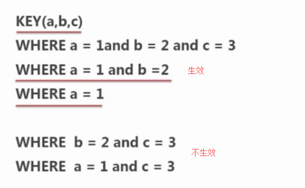

### 1.数据表引擎
    innodb 真正的热备份，行级锁
    myisam 设计简单，全文索引
    csv
    memory

### 2. 锁机制
- 当多个数据进行修改时就会触发表锁，会产生并发控制的问题
- 读锁
  共享锁，都可以读取资源
- 写锁
  排它锁，只允许一个人写入，防止其他用户写入资源
- 锁粒度
  表锁，系统性能开销最小，会锁定整张表，myisam使用表锁
  行锁，最大程度的支持并发事务，但是也带来了最大开销，innodb引擎使用行级锁

### 3.  事务处理
    提供事务处理的表引擎是INNODB
    服务器比管理事务，由下层的引擎实现，所以同一个事务中，使用多种引擎不靠谱
    在非事务的表上执行事务mysql不会发出提醒和报错

### 4.  存储过程
    为以后的使用保存一条或多条的mysql语句的集合
    存储过程就是业务逻辑和流程的集合
    可以在存储过程中创建表、更新数据、删除等等。

### 5. 触发器
    是提供给程序员进行数据完整性的一种方法，它是与表事件相关的特殊的存储过程
    使用场景：
    可通过数据库中的相关表实现级联更改
    实时监控某张表中的某个字段的更改而需要做出相应的处理
    滥用会造成数据库和程序的维护困难


### 6. 索引基础和类型

- 性能
  大大减少扫描的数据量
  帮助服务区避免排序和临时表
  将随机I/O变顺序I/O
  大大提高查询速度

  占用磁盘空间，降低写操作的速度

- 使用场景
  对于非常小的表，大部分情况下全表扫描的效率更高
  中到大型表，索引非常有效
  特大型的表，建立和使用索引代价随之增大，可以使用分区技术来解决

- 索引类型
  ```txt
  普通索引：最基本的索引，没有任何约束限制
  唯一索引：与普通索引类似，但是具有唯一性约束
  主键索引：特殊的唯一索引，不允许有空值

  一张表只能有一个主键索引，可以有多个唯一索引
  主键索引一定是唯一索引，唯一索引不是主键索引

  主键可以和外键构成参照完整性约束，防止数据不一致

  组合索引：将多个列组合在一起创建索引，可以覆盖多个列
  外键索引：所有innodb类型的表可以使用外建索引，保证数据的完整性、一致性和实现级联操作
  ```

- 索引的选择
  选择 where 和连接后的字段作为索引
  索引列的技术越大，效果越好
  对字符串进行索引，应该制定一个前缀长度，可以节省大量的索引空间
  根据情况创建符合索引会提高查询效率
  避免创建过多索引，索引会额外占用磁盘空间，降低些操作效率、
  主键选择较短的数据类型

- 复合索引（注意前缀的生效情况）


- 当sql语句中使用 like 模糊查询时索引不会生效
- 当sql语句中使用 or 条件中的列有索引，后面的密友，索引都不会被用到
- 当sql语句中查询字符串类型字段，一定要给指加引号，否则索引不生效


