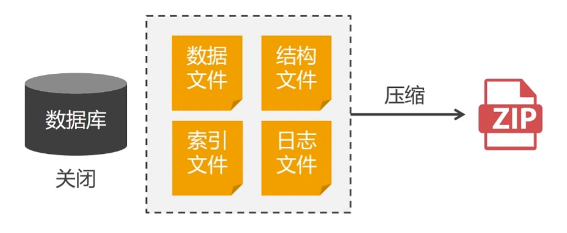
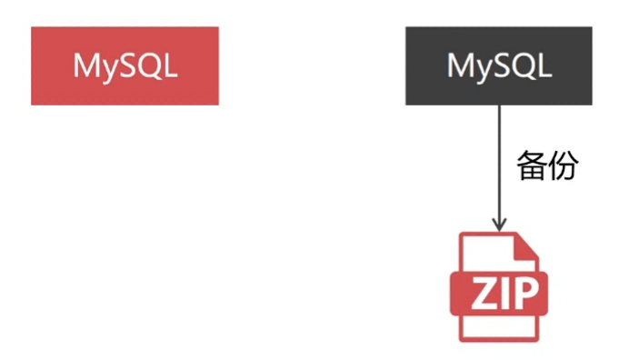
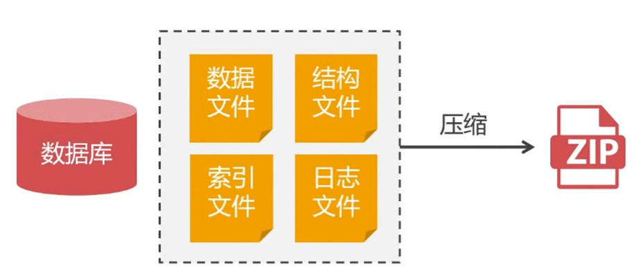
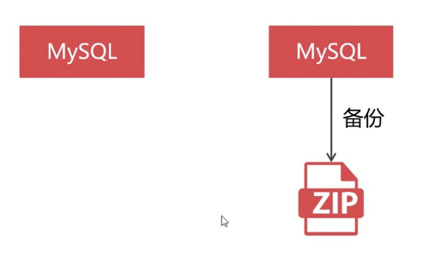

# 数据库备份基本概念  
### 1. mysqldump数据导出不完全等于数据库备份
- mysqldump 是将数据导出成为sql语句，并不是完整的备份数据库文件，并且将数据导入到数据库时非常缓慢
- 只能全备，无法做增量备份
- 使用场景：
从一个系统迁移到另外一个系统时使用 
例如：从单节点数据库导入到集群平台，这样导入时不需要原来数据库平台的全部信息，只需要数据就可以，这样可以导入任何其它数据库平台。

### 2. 数据库备份概念
- 概念：数据库备份是针对数据库的实例信息做备份，既可以做全量备份，也可以做增量备份
- 使用场景：
  备份出来的数据与原数据的文件是一模一样的，上线新节点的时候不用再去考虑全量同步，只需要针对新节点做一个增量同步就可以上线运行了。特别适合于在PXC集群中的新节点上线。

### 3. 什么是冷备份？
+ 原理：
  - 在数据库已经关闭的情况下，对数据库的数据目录的备份称作冷备份
  - 还原时先删除数据库的数据目录，然后从备份的压缩包中还原

> 针对PXC集群，主要是用压缩命令对数据库目录 `/var/lib/mysq/` 进行打包压缩和保存(注意数据库配置会导致压缩目录位置改变)

+ 冷备份的优缺点：
  - 数据库必须停机备份
  - 备份文件非常占用存储空间，不支持增量备份
  - 备份文件完全，安全可靠
  - 备份的是所有的数据文件和日志文件，所以无法按照逻辑库和数据表恢复数据

+ 联机冷备份基本方案：
  - 两个数据库同步节点，首先停止数据库同步，对不提供业务服务的数据库先关机进行备份，备份完后再开机恢复数据库同步

### 4. 什么是热备份？
+ 原理：
  - 在数据库节点不停机的状态下执行的备份被称作热备份

+ 优缺点：
  - 热备份可以做增量备份
  - 数据库备份的时候会全局加写锁，备份期间节点只能读取数据不能写入数据
  - 当备份的数据量大会影响业务使用，数据不能写入

+ 联机热备份基本方案：
  - 两个数据库同步节点，首先停止数据库同步，对不提供业务服务的数据库进行备份，备份完后再恢复数据库同步

>总结：
一般推荐做联机的热备份，因为可以做数据库增量备份（后面笔记会具体介绍），可以节省磁盘空间并且方便恢复。
