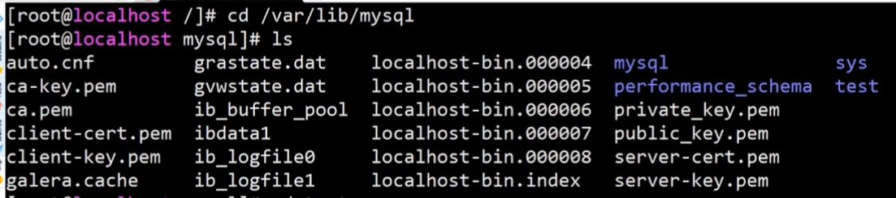
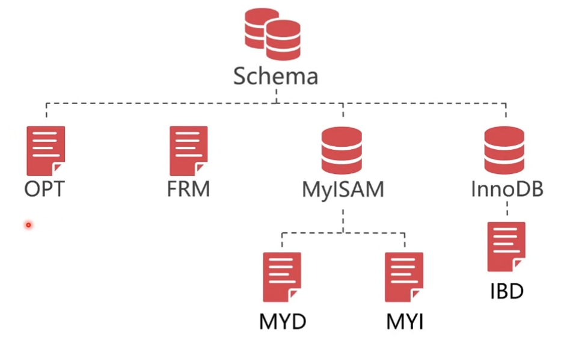
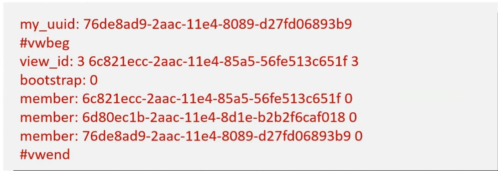
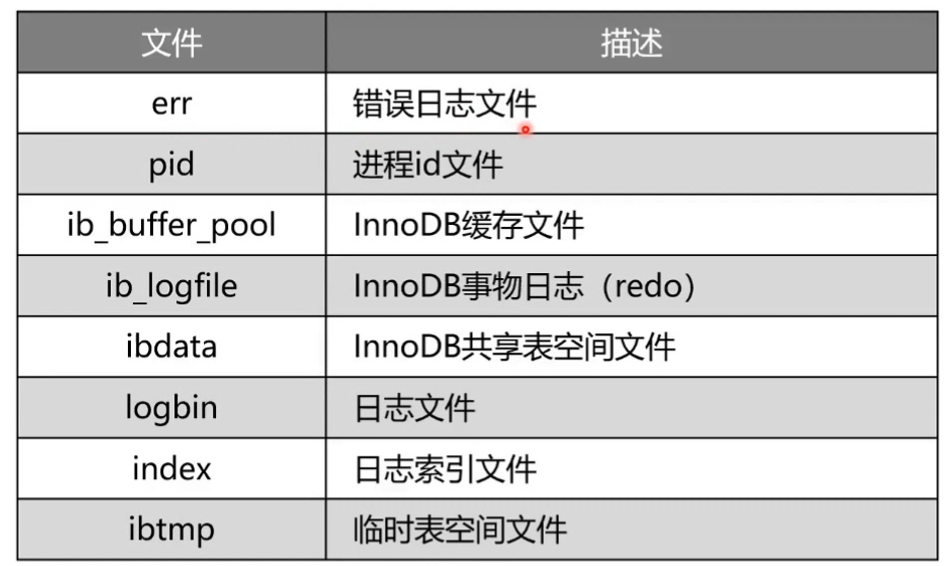
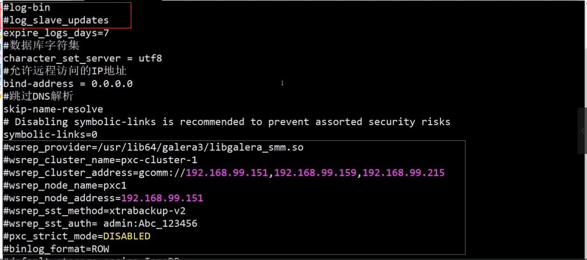

# 数据库备份-数据表文件碎片整理
- MYSQL数据库目录默认存放位置：/var/lib/mysql
- 针对数据库逻辑库目录进行备份：以 `test` 逻辑库为例


### 1. 数据库文件结构
- OPT 文件1个，数据库描述文件，用来记录逻辑库使用的字符集和排序规则
- FRM 文件，数据表单表的定义文件，包含了数据表的结构信息，是一个编译文件，直接打开是乱码
- MYISAM 数据库引擎（PXC集群不支持此引擎）
  - MYD 数据文件
  - MYI 索引文件
- InnoDB 数据库引擎
  - IBD 数据和索引文件
  - ISL 表分区文件


- auto.cnf文件
每一个mysql都有唯一的UUID，这个值被保存到auto.cnf文件，在不同的服务器做
数据还原的时候需要删除这个文件，数据库启动的时候会自动生成。

- grastate.dat 这个文件保存的是PXC数据库的同步信息
```txt
seqno: -1  表示该节点正处在集群中
safe_to_bootstrap: 1 表示最后一个退出，开启的时候要从这个开始开启
```

- gvwwtate.dat 文件，保存的是PXC集群节点的信息，是动态变化的


- 其它文件


### 2. 数据文件中的碎片是什么？
- 因为整理碎片文件会导致数据锁表，并且整理后马上有写入操作，等于还要扩容，所以数据库为了避免麻烦就会忽略对碎片文件的整理
- 备份数据库时为了保证备份数据文件的精简化，需要先整理碎片再备份


### 3. 整理碎片文件
- 碎片整理会导致锁表，如果使用PXC集群会导致所有节点做碎片整理，这样会导致PXC集群被锁，所以在pxc集群不能直接做碎片整理
```sql
sql> alter table student engine=innodb;
```

- 针对PXC集群的碎片整理
```bash
#停止PXC节点
systemctl stop mysql@bootstrap.service

# 修改数据库配置文件,关闭相关bing-log日志的记录
vi /etc/my.cnf
```

```bash
#开启单节点数据库
service mysql start

# 执行数据表碎片（表过多是使用程序执行）
sql> alter table student engine=innodb;

#关闭单节点数据库
service mysql stop

#把数据库的配置my.cnf改回为原来的配置信息，然后加节点加入到PXC集群
systemctl start mysql@bootstrap.service

```