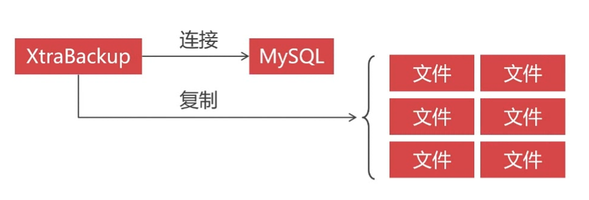
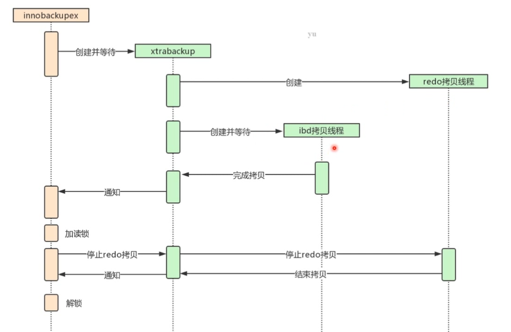
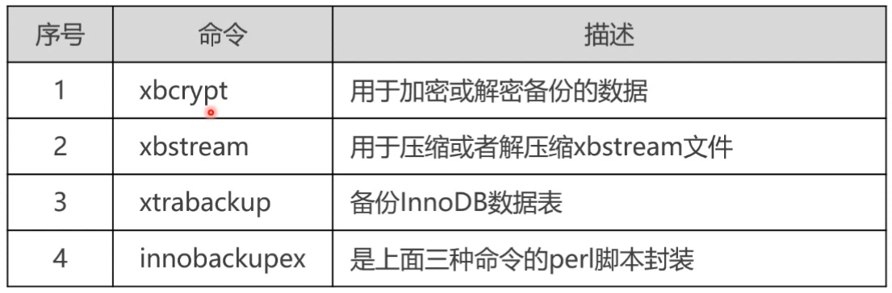
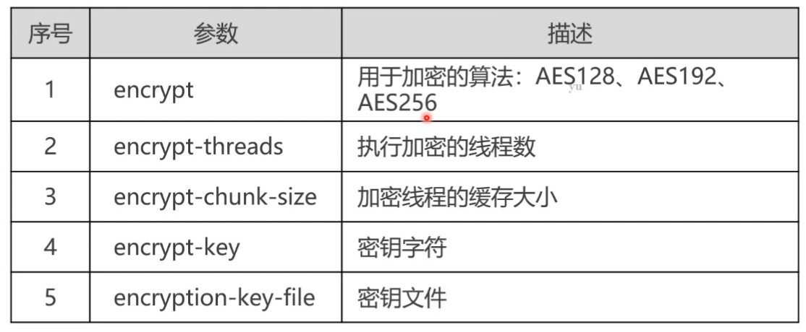
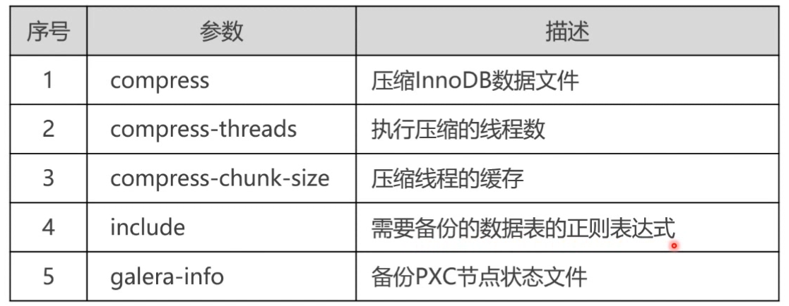
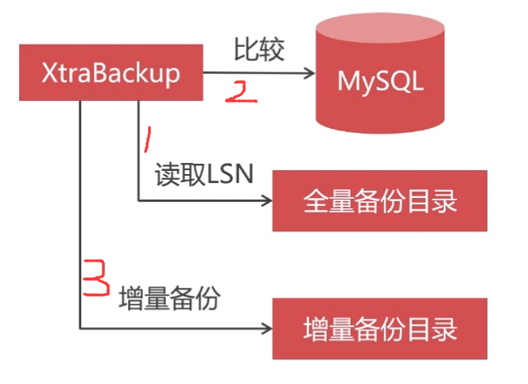
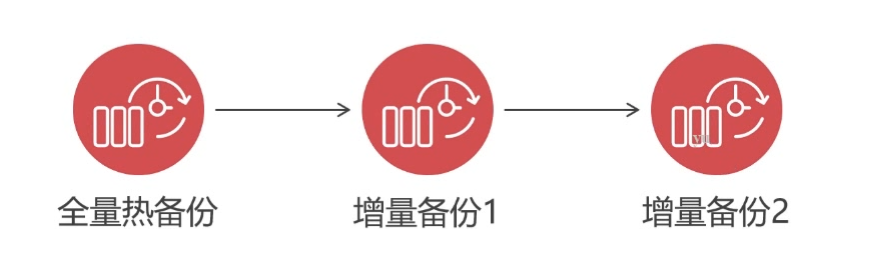

# XtraBackup备份和还原

### 1. XtraBackup特点
- 备份过程中会对数据加读锁，数据可读但是不可写
- 备份过程中不会打断正在执行的事务
- 能够自动压缩备份的文件，节约磁盘空间和流量
- 全量和增量备份都可以做

### 2. XtraBackup原理
- XtraBackup是一种物理备份工具，通过协议连接到mysql服务器，然后读取并复制底层的文件完成物理备份
- 可对备份数据进行加密
- innodb引擎支持全量和增量备份，备份过程中不会加读锁是基于事物进行备份
- myisam引擎只能全量备份，备份过程回家读锁



### 3. XtraBackup 安装和常见命令
- 安装
```bash
yum -y install percona-xtrabackup-24
```
- 常用命令


### 4. `innobackupex`命令全量热备份操作
- 基本全量备份
```bash
innobackupex --defaults-file=/etc/my.cnf \
--host=192.168.99.1 --user=admin --password=ABC123456 --port=3306 --parallel=2 /home/backup
--parallel=2 指定备份是使用的线程数，并发备份 
```
- 流式压缩备份的必要性（备份的同时直接压缩文件）
```bash
innobackupex --defaults-file=/etc/my.cnf \
--host=192.168.99.1 --user=admin --password=ABC123456 --port=3306 \
--no-timestamp --stream=xbstream > /home/backup.xbstream

# 参数详情
--no-temestamp 不创建基于时间戳的目录（备份数据会被写到指定的文件中）
--stream=xbstream 开启流式备份
```
- 加密备份
```bash
innobackupex --defaults-file=/etc/my.cnf \
--host=192.168.99.1 --user=admin --password=ABC123456 --port=3306 \
--encrypt=AES256 --encrypt-threads=10 --encrypt-key=ABC123456 --encrypt-chunk-size=512 \
--no-timestamp --stream=xbstream > /home/backup.xbstream

# 参数详情
--encrypt 加密算法 推荐使用 AES256，不要使用非对称加密算法会导致时间过程
```


- `innobackupex`命令其它常用参数
```bash
innobackupex --defaults-file=/etc/my.cnf \
--host=192.168.99.1 --user=admin --password=ABC123456 --port=3306 \
--encrypt=AES256 --encrypt-threads=10 --encrypt-key=ABC123456 --encrypt-chunk-size=512 \
--compress --compress-threads=10 --include=test.t_user,trst.t_log \
--no-timestamp --stream=xbstream > /home/backup.xbstream

# 参数详情
--encrypt 加密算法 推荐使用 AES256，不要使用非对称加密算法会导致时间过程
```


### 5. `innobackupex`增量热备份操作 
- 增量热备份的前提是读取的全量热备份如果使用了流式压缩和加密，必须先解压解密成普通全量热备份文件
- 增量热备份时也可以使用流式压缩或者内容加密


- 增量热备份命令操作

```bash
innobackupex --defaults-file=/etc/my.cnf \
--host=192.168.99.1 --user=admin --password=ABC123456 --port=3306 \
--incremental-basedir=/home/backup/2018-09-12_21-27-50 --incremental /home/backup/incremental
```


### 6. 全量和增量备份数据的还原

- 数据备份方案
```bash
# 全备 备份后的目录为 /home/db_backup/全备目录
innobackupex --defaults-file=/etc/my.cnf --user=root --password=pwd /home/db_backup/ 

# 第一次增量备份 增量备份目录为 /home/db_backup/增备目录1
innobackupex --defaults-file=/etc/my.cnf --user=root --password=pwd --incremental /home/db_backup/ --incremental-basedir=/home/db_backup/全备目录

# 第二次增量备份 增量备份目录为 /home/db_backup/增备目录2
innobackupex --defaults-file=/etc/my.cnf --user=root --password=pwd --incremental /home/db_backup/ --incremental-basedir=/home/db_backup/增备目录1


# 参数详解：
--incremental-basedir 参数：指定增量备份的基础备份目录
```



- 利用 innobackupex 进行全量和增量的数据恢复

```bash
# 步骤1：处理全量备份事务日志 
innobackupex --apply-log --redo-only /home/db_backup/全备目录

# 步骤2：处理第一次增量备份事务并导入到全备目录中
innobackupex --apply-log --redo-only /home/db_backup/全备目录 --incremental-dir /home/db_backup/增备目录1

# 步骤3：处理第二次增量备份事务并导入到全备目录中
innobackupex --apply-log --redo-only /home/db_backup/全备目录 --incremental-dir /home/db_backup/增备目录2

# ........

# 再次处理全量备份事务日志
innobackupex --apply-log /home/db_backup/全备目录

# 步骤4：停止PXC数据库集群，删除所有节点的现有数据库目录数据（或另存一份）
mv /var/lib/mysql/* /var/lib/mysql_bak

# 步骤5：执行数据恢复（注意：当恢复的数据量特别大时，应该将备份数据在所有节点都执行数据恢复，数据量较小时可以只在主节点恢复然后从节点会自动同步的。）
innobackupex --defaults-file=/etc/my.cnf --copy-back /home/db_backup/全备目录

# 步骤6：恢复mysql数据目录的权限
chown -R mysql:mysql /var/lib/mysql

# 步骤7：启动PXC数据库的主节点，然后依次启动从节点（从节点会自动同步主节点数据）
主节点启动：systemctl start mysql@bootstrap.service
从节点启动：/etc/init.c/mysqld start

# 参数详解
--apply-log 处理备份数据的事务日志
--redo-only 在当前备份跳过未提交事务的回滚，防止后面增量数据有此事务的提交导致增量备份恢复时引起事务冲突，导致备份无法使用的问题

```