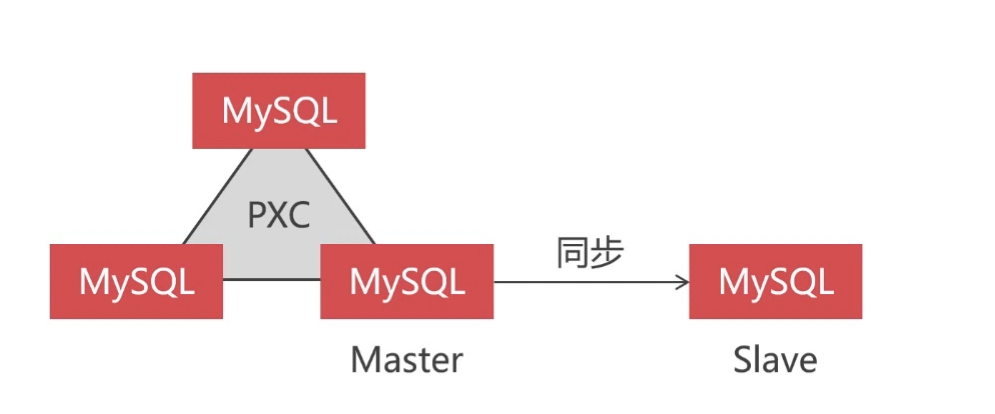
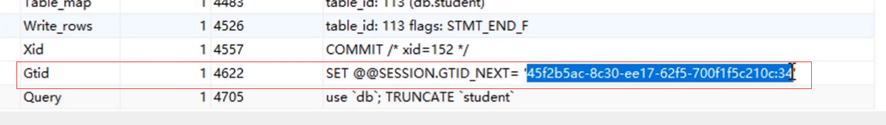

# 创建延时同步节点防止误删除操作
> 原理是采用主从数据库同步，Master主节点在数据库架构中实时保存最新的数据，一台或多台Slave从节点主动读取Master主节点日志保存在本地并按照指定的时间将日志写入到数据库，实现延时同步


### 1. 案例说明
>从PXC集群中选择一个单节点作为延时的同步master主节点，另外再搭建一台slave从节点读取数据，实现指定时间的延时同步。


### 2. 案例配置
+ 2.1 设置主从同步mysql配置文件
  - master 必须开启binlog日志，主从节点都要开启server_id，数字不重复就可以了
  - master 必须提供 slave 登录使用的账户，需要有 reload，super，replication slave 权限
  》PXC集群组建后不能再添加账户，因为会记录到binlog日志，会导致PXC集群创建失败
  》需要先把PXC集群关闭，关闭binlog日志记录，启动每一个节点并添加账号，关闭节点然后打开binlog日志，再重新组建集群 
  - slave 必须开启relay_log日志
  - 主从节点的配置文件都要开启GTID，否则无法利用延时节点找回数据
  ```bash
  gtid_mode=ON
  enforce_gtid_consistency=1
  ```

+ 2.2 slave从数据库开启同步服务
  ```sql
  # 停止同步
  stop slave;

  # 添加同步账户信息
  change master to master_host="masterip",master_port=3306,master_user="user",master_password="password";

  # 设置延时时间，300秒
  change master to master_delay=300;

  # 开启同步
  start slave;

  # 查看同步状态
  show slave status;
  ```

### 3. 误操作的排查和跳过
- 当在 master 主节点上出现误操作时，需要进入主节点通过查询binlog日志找出误操作的事务
```sql
# 显示日志文件列表
show master logs;

# 显示其中一个日志文件中的事务信息，根据实际的操作筛选出 错误事务并记录其gtid 
show binlog events in "localhost-bin.000013";
```


- 根据主节点错误事务gtid，让从节点上跳过错误事务

```sql
# 停止同步
stop slave;

# 设置要跳过的事务gtid
set gtid_next='';

#跳过
begin;commit;

# 设置其他事务自动执行
set gtid_next='automatic';

# 设置延时时间为0秒，立即同步
change master to master_delay=300;

# 开启同步
start slave;

# 查看同步状态
show slave status;
```

