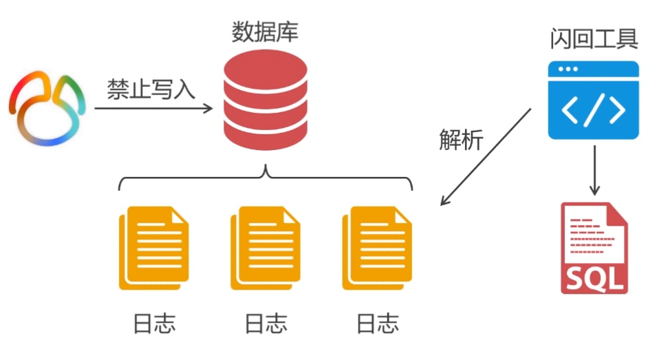

# 使用binlog日志恢复误操作
> 数据库需要记录binlog日志，row格式，同时需要安装 sql 闪回工具


### 1. [binlog2sql闪回工具的安装使用](https://github.com/danfengcao/binlog2sql)

```bash
wget https://github.com/danfengcao/binlog2sql/archive/master.zip
yum -y install -y python-pip
pip install -r requirements.txt
```
### 2. 误操作发生后的恢复
+ 2.1 恢复前的准备工作
  - 停止数据库的写操作，避免还原后覆盖新写入的数据
  - 恢复前备份一遍数据库，以确保万一数据恢复混乱能够进行重置
  - 清空需要恢复数据的业务表的全部记录，避免写入冲突

+ 2.2 排查误删除操作
```sql
# 显示日志文件列表
show master logs;

# 显示其中一个日志文件中的事务信息，根据实际的操作筛选出 错误事务并记录其gtid 
show binlog events in "localhost-bin.000013";
```
使用工具恢复：[binlog2sql闪回工具的安装使用](https://github.com/danfengcao/binlog2sql)