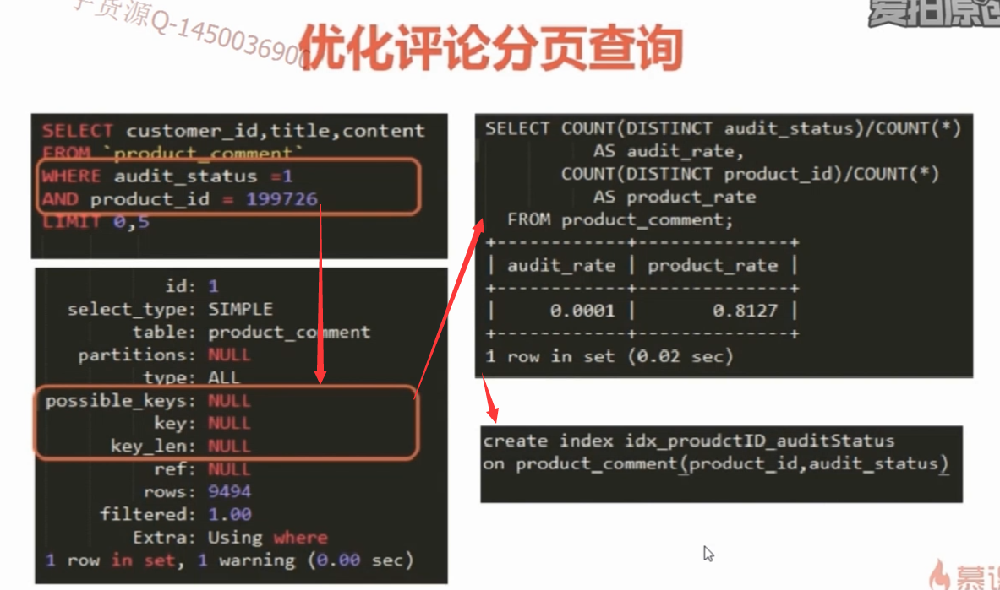
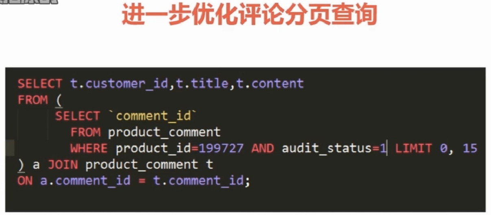
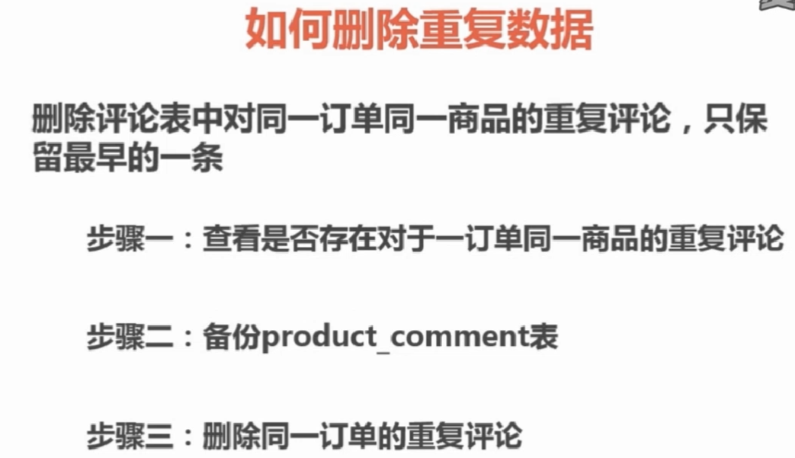

# SQL语句优化分析实例说明

#### 1 sql语句优化评论分页查询

- 第一步 通过explain对select语句执行分析计划
- 第二步 显示执行计划的分析内容，其中索引相关的 possible_keys,key,ken_len三列为空，说明没有索引，同时根据查询条件中的两个查询audit_status,product_id字段，可以建立这两个查询字段的联合索引列
- 第三步 根据索引的建立规范先要建立两个查询audit_status,product_id字段的区分度，其中得到的值越接近1区分度越好，把区分度好的列放到联合索引的左侧
```sql
select count(distinct audit_status)/count(*) as audit_rate,count(distinct product_id)/count(*) as prosuct_rate
```
- 第四部 建立联合索引
```sql
create index idx_proudctID_autidStatus on product_comment(product_id,audit_status)
```



#### 2 sql语句优化删除重复数据



#### 3 sql语句：如何进行分区间统计

- 使用`case` 关键字进行分区查询

