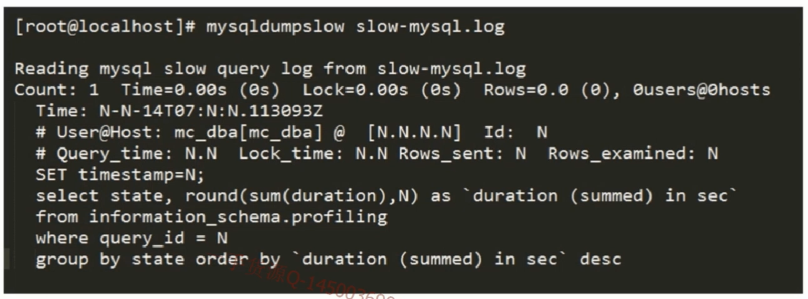

# SQL语句优化之慢查询捕获异常sql

#### 1 启用MYSQL慢查询日志
```sql
# 设置慢查询记录的日志位置
set global slow_query_log_file = /sql_log/slow_log.log;
# 是否对未使用索引的sql进行抓取 on 是
set global log_queries_not_using_indexs = on;
# 抓取所有执行时间大于0.001秒的sql
set global long_query_time = 0.001;
# 启用慢查询
set global low_query_log = on;
```
#### 2 慢查询日志内容

- time 查询执行时开始的时间
- user@host 查询使用的用户 @ 使用的IP ID:执行查询线程的ID
- query_time 查询所有的时间 lock_time 执行查询对记录锁定的时间 rows_sent 查询返回的行数 rows_esamined 查询所读取的行数
- use mc_db 查询使用的数据库

#### 3 如何分析慢查询日志
 mysqldumpslow 工具进行分析



- count 会统计同一个sql出现的次数

