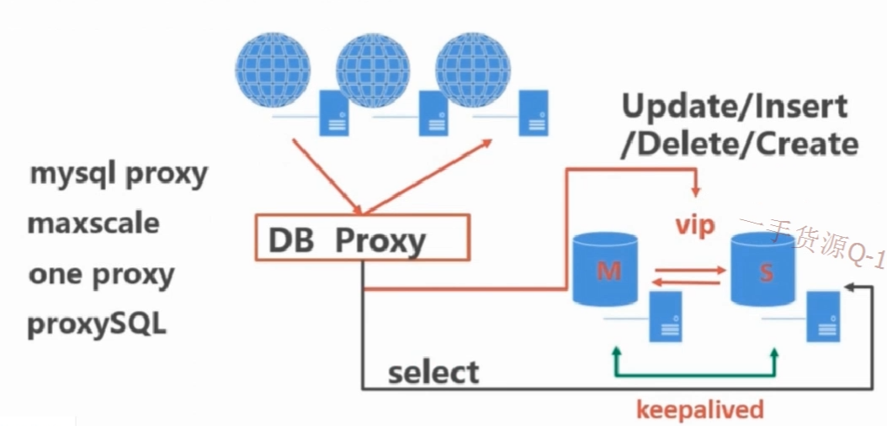

# MYSQL数据库读写分离(Keepalived+lvs实现负载均衡)
- 写操作只能在master主数据库上执行
- 读操作既可以在master主库上执行，也可以在slave从库上执行（读负载更容易处理）
- 读写分离，主服务器主要执行写操作
- 读操作分摊到不通的slave从服务器上
- 增加前段缓存服务器如 redis,memcache 等
#### 1. 读写分离
+ 1.1 由开发人员根据所执行的sql类型连接不同的服务器
     - 优点：
     - 完全由开发人员控制看，实现更加的灵活
     - 对于实时查询比较重要的数据库查询不适合在从数据库查询，此时由开发人员设置更容易控制
     - 由程序直接连接数据库，所以性能损耗比较少

     - 缺点：
     - 增加了开发的工作量，是程序代码更加复杂
     - 人为控制容易出现错误

+ 1.2 由数据库中间层完成读写分离
     - 数据库中间层软件列表：
     - msyql proxy
     - maxscale
     - one proxy
     - proxySQL

     - 优点：
     - 由中间件根据查询语法分析，自动完成读写分离
     - 对程序透明，对于已有程序不用做任何调整
     - 中间层自带负载功能
     - 缺点：
     - 由于增加了中间层，对查询效率有损耗，降低50%左右
     - 对于延迟敏感业务无法自动在主库进行

#### 2. 读服务器负载均衡方式
+ 2.1 数据库中间层实现负载均衡（使用这种方式最好读写分离也采用此种方式）
+ 2.2 DNS轮询，使用域名方式连接数据库服务器，然后靠DNS解析域名
+ 2.3 LVS / Haproxy 负载软件代理来做负载均衡
+ 2.4 硬件F5设备负载均衡

#### 3. 使用LVS进行读服务器负载均衡
- 优点：
- 属于四层代理，只进行分发，处理效率更高
- 工作稳定，本身就有双击热备高可用配置
- 无流量，不会对主机的网络IO造成影响

+ **3.1 配置实例演示：**

```bash
# 在 3.100,3.101 上安装 lvs manager
yum -y install ipvsadm.x86_64

# 在所有的服务器上加载虚拟IP模块
modprobe ip_vs
```
```bash
# 创建LVS脚本，并添加可执行权限 /etc/rc.d/init.d/lvsrs（从数据库服务器上的配置）
/etc/rc.d/init.d/lvsrs start

#!/bin/bash 
VIP=192.168.3.98
. /etc/rc.d/init.d/functions 
case "$1" in 
start) 
/sbin/ifconfig lo down 
/sbin/ifconfig lo up 
echo "1" >/proc/sys/net/ipv4/conf/lo/arp_ignore 
echo "2" >/proc/sys/net/ipv4/conf/lo/arp_announce 
echo "1" >/proc/sys/net/ipv4/conf/all/arp_ignore 
echo "2" >/proc/sys/net/ipv4/conf/all/arp_announce 
/sbin/sysctl -p >/dev/null 2>&1 
/sbin/ifconfig lo:0 $VIP netmask 255.255.255.255 up 
/sbin/route add -host $VIP dev lo:0 
echo "LVS-DR real server starts successfully.\n" 
;; 
stop) 
/sbin/ifconfig lo:0 down 
/sbin/route del $VIP >/dev/null 2>&1 
echo "0" >/proc/sys/net/ipv4/conf/lo/arp_ignore 
echo "0" >/proc/sys/net/ipv4/conf/lo/arp_announce 
echo "0" >/proc/sys/net/ipv4/conf/all/arp_ignore 
echo "0" >/proc/sys/net/ipv4/conf/all/arp_announce 
echo "LVS-DR real server stopped." 
;; 
status) 
isLoOn=`/sbin/ifconfig lo:0 | grep "$VIP"` 
isRoOn=`/bin/netstat -rn | grep "$VIP"` 
if [ "$isLoOn" == "" -a "$isRoOn" == "" ]; then 
echo "LVS-DR real server has to run yet." 
else 
echo "LVS-DR real server is running." 
fi 
exit 3 
;; 
*) 
echo "Usage: $0 {start|stop|status}" 
exit 1 
esac 
exit 0 
```

```bash
# 创建脚本，添加执行权限 LVS manager 主数据库服务器配置 /etc/init.d/lvsdr 脚本
/etc/init.d/lvsdr start

#!/bin/bash 
VIP=192.168.3.98
DEV=eth0 
. /etc/rc.d/init.d/functions 
case "$1" in 
start) 
echo "1">/proc/sys/net/ipv4/ip_forward 
/sbin/ipvsadm -A -t $VIP:3306 -s rr -p 60 
/sbin/ipvsadm -a -t $VIP:3306 -r 192.168.3.101:3306 -g 
/sbin/ipvsadm -a -t $VIP:3306 -r 192.168.3.102:3306 -g 
/sbin/ipvsadm --start-daemon 
echo "LVS-DR server starts successfully.\n" 
;; 
stop) 
/sbin/route del $VIP >/dev/null 2>&1 
echo "0" >/proc/sys/net/ipv4/ip_forward 
/sbin/ipvsadm -C 
echo "LVS-DR real server stopped." 
;; 
status) 
isLoOn=`/sbin/ifconfig lo:0 | grep "$VIP"` 
isRoOn=`/bin/netstat -rn | grep "$VIP"` 
if [ "$isLoOn" == "" -a "$isRoOn" == "" ]; then 
echo "LVS-DR real server has to run yet." 
else 
echo "LVS-DR real server is running." 
fi 
exit 3 
;; 
*) 
echo "Usage: $0 {start|stop|status}" 
exit 1 
esac 
exit 0 

```

#### 4. 使用 Keepalived 监控 从数据库服务 3.102 的健康状态
```bash
! Configuration File for keepalived

global_defs {
   router_id mysql_ha
}
vrrp_script check_run {
    script "/etc/keepalived/check_mysql.sh"
    interval 2
}

vrrp_instance VI_1 {
    state BACKUP
    interface eth0
    virtual_router_id 102
    priority 99
    advert_int 1
    nopreempt
    authentication {
        auth_type PASS
        auth_pass 1200
    }
   
  track_script {
         check_run
     }

   virtual_ipaddress {
      192.168.3.98/24
    }
}

# 添加多个配置 
vrrp_instance VI_2 {
    state BACKUP
    interface eth0
    virtual_router_id 101
    priority 99
    advert_int 1
    nopreempt
    authentication {
        auth_type PASS
        auth_pass 1200
    }
   
   virtual_ipaddress {
      192.168.3.98/24
    }
}
virtual_server 192.168.3.98 3306 { 
delay_loop 5 
lb_algo rr 
lb_kind DR 
persistence_timeout 120
protocol TCP
sorry_server 192.168.3.99 3306
real_server 192.168.3.102 3306 {
weight 1
MISC_CHECK {
  misc_path "/etc/keepalived/check_slave.sh -udba_monitor -p123456 -h192.168.3.102 -P3306"
  misc_dynamic
  }
}
real_server 192.168.3.101 3306 {
  weight 1
  MISC_CHECK {
  misc_path "/etc/keepalived/check_slave.sh -udba_monitor -p123456 -h192.168.3.101 -P3306"
  misc_dynamic
  }
}
}
```
```bash
# 创建脚本，添加执行权限 /etc/keepalived/check_slave.sh 脚本，检查从数据库的链接情况

#/bin/bash
# check_slave.sh
MYSQL=`which mysql`
VIP=192.168.3.98
VPORT=3306 
function usage()  
{  
  echo "usage:"  
  echo "example:# mysql -umonitor -pmonitor -P3306 -h10.103.9.201"  
  echo "-p, --password[=name]"  
  echo "-P, --port"  
  echo "-h, --host=name"  
  echo "-u, --user=name"  
}  
  
  
while getopts "u:p:h:P:" option  
do  
    case "$option" in  
        u)  
            dbuser="$OPTARG";;  
        p)  
            dbpwd="$OPTARG";;  
        h)  
            dbhost="$OPTARG";;  
        P)  
            dbport="$OPTARG";;  
        \?)  
            usage  
            exit 1;;  
    esac  
done  
  
if [ "-$dbuser" = "-" ]; then  
    usage  
    exit 1  
fi  
  
if [ "-$dbpwd" = "-" ]; then  
    usage  
    exit 1  
fi  
  
if [ "-$dbhost" = "-" ]; then  
    usage  
    exit 1  
fi  
  
if [ "-$dbport" = "-" ]; then  
    usage  
    exit 1  
fi  
  
$MYSQL -u$dbuser -p$dbpwd -P$dbport -h$dbhost -e "select @@version;" >/dev/null 2>&1
if [ $? = 0 ] ;then
  MySQL_ok=1
else
  /sbin/ipvsadm -d -t $VIP:$VPORT -r $dbhost:$VPORT
  exit 1
fi

slave_status=$(${MYSQL} -u$dbuser -p$dbpwd -P$dbport -h$dbhost -e 'show slave status \G' | awk ' \
  /Slave_IO_Running/{io=$2} \
  /Slave_SQL_Running/{sql=$2} \
  /Seconds_Behind_Master/{printf "%s %s %d\n",io,sql,$2}') >/dev/null 2>&1

arr=($slave_status)
io=${arr[0]}
sql=${arr[1]}
behind=${arr[2]}

if [ "$io" == "No" ]||[ "$sql" == "No" ]; then  
    /sbin/ipvsadm -d -t $VIP:$VPORT -r $dbhost:$VPORT
    exit 1  
elif [ $behind -gt 60 ]; then
    /sbin/ipvsadm -d -t $VIP:$VPORT -r $dbhost:$VPORT
    exit 1
else
    /sbin/ipvsadm -a -t $VIP:$VPORT -r $dbhost:$VPORT -g
    exit 0  
fi  
```

