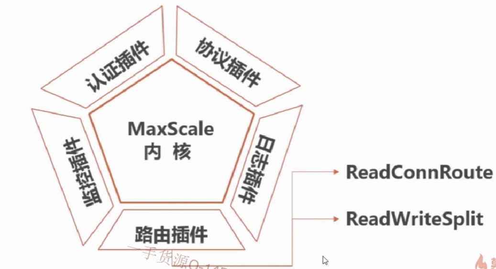
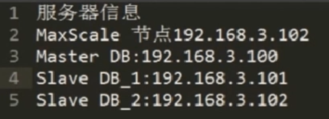
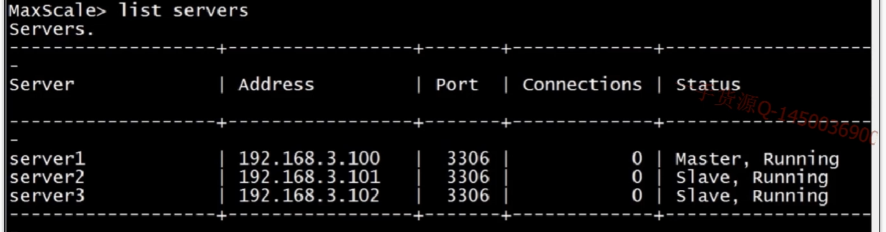

# 16.MYSQL数据库读写分离(MaxScale中间层实现负载均衡)
- MaxScale数据库总监层 由 MARIADB公司 打造
- 支持高可用，负载均衡，良好扩展的插件式数据库中夹层软件


#### 1. 安装MaxScale


#### 2. 实例演示
**2.1 服务器配置要求**


**2.2 master 主节点 创建数据库登录账号，并使用maxpassword加密数据库密码**
```
# 创建监控账户
> create user scalemon@'192.168.3.%' identified by '123456';
> grant replication slave,replication client on *.* to scalemon@'192.168.3.%';
# 创建能够读取用户权限的用户，为了认证时使用
> create user scaleroute@'192.168.3.%' identified by '123456';
> grant select on mysql.* to scaleroute@'192.168.3.%';

# 因为 MaxScal 是明文传输密码，需要用maxpassword工具加密,会生成一个加密的字符串，需要保存下来
maxpasswd /var/lib/maxscale/ 123456
SADFASDFJ12J3J2345QWD8W9FD98
```

**2.3 创建MaxScale配置和启动**
```bash
# 创建脚本 /etc/maxscale.cnf
#启动 maxscale -f /etc/maxscale.cnf

[maxscale]
# 线程数量
threads=4

[server1]
type=server
address=192.168.3.100
port=3306
protocol=MySQLBackend

[server2]
type=server
address=192.168.3.101
port=3306
protocol=MySQLBackend

[server3]
type=server
address=192.168.3.102
port=3306
protocol=MySQLBackend

[MySQL Monitor]
type=monitor
module=mysqlmon
servers=server1,server2,server3
user=scalemon
#加密的字符串
passwd=SADFASDFJ12J3J2345QWD8W9FD98
monitor_interval=1000


[Read-Write Service]
type=service
router=readwritesplit
servers=server1,server2,server3
user=scaleroute
passwd=SADFASDFJ12J3J2345QWD8W9FD98
max_slave_connections=100%
max_slave_replication_lag=60

[MaxAdmin Service]
type=service
router=cli

[Read-Write Listener]
type=listener
service=Read-Write Service
protocol=MySQLClient
port=3306

[MaxAdmin Listener]
type=listener
service=MaxAdmin Service
protocol=maxscaled
port=6603
```


**2.4 MaxScale进入命令行**
```bash
# 进入命令行
maxadmin --user=admin --password=mariadb
```

