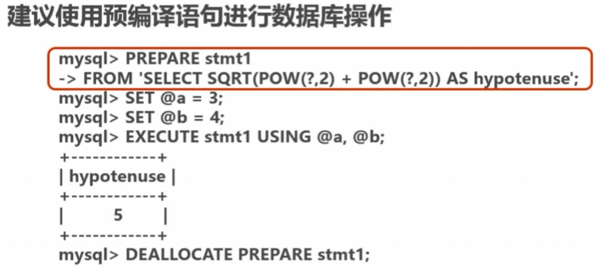

# 数据库SQL开发规范

#### 1. 建议使用 预编译语句 进行数据库操作

- 第一次预编译语句，其它时候直传参数，比传递SQL语句效率更高效
- 相同语句一次解析，多次使用，提高处理效率
- 可以防范SQL注入的风险 

#### 2. 避免数据类型的隐式转换 
> 一般出现在`WHERE`语句中，当参数类型和列的类型不一致时
- 隐式转换可能回导致索引失效
例：`select name,phone form user where id='111'`

#### 3. 充分利用表上已经存在的索引
 - 避免使用 `%%` 号的查询条件 `a like %123%`
 - 一个`sql`只能利用到复合索引中的一列进行范围查询
使用 `left join` 或 `not exists` 来优化 `not in` 操作

#### 4. 程序连接不通的数据库使用不用的账号，禁止跨库查询

 - 在编写 `sql` 语句时就应该考虑到这个问题，不能同时操作多个数据库
 - 为以后扩缩容数据库，和分库分表做准备
 - 降低业务耦合度
 - 避免权限过大而产生的安全风险

 #### 5. 禁止使用`SELECT *`查询,应该使用`SELECT 字段1，字段2`查询

 `原因`
 - 消耗更多的CPU和IO以及网络带宽资源
 - 无法使用覆盖索引
 - 不使用可减少表结构变更带来的影响

 #### 6. 禁止使用不含有字段列表的`insert`语句

 例：错误写法：`insert into t values('a','b','c')`
 - 原因是禁止使用可减少因为表结构变更带来的影响

#### 7. 避免使用子查询，可以把子查询优化为 `join` 查询
 - 子查询的结果集无法使用索引
 - 子查询会产生临时表操作，如果子查询数据量大则严重影响效率
 - 消耗过多的CPU和IO资源

#### 8. 避免关联过多表的`JOIN`查询
- 每join一个表会占用一部分内存（join_buffer_size）
- 会产生太多临时表操作，影响查询效率
- mysql最多允许关联61个表，建议不超过5个

#### 9. 减少同数据库的交互次数
- 数据库适合批量处理数据
- 合并多个相同的操作到一起，可以提高处理效率

#### 10. 使用in代替or
- in 操作可以更优效率的利用索引
- in 的值不要超过500个

#### 11. 禁止使用 order by rand() 进行随机排序
- 对性能影响较大，会把表中所有符合条件的数据装载到内存中进行排序
- 消耗大量cpu和Io资源
- 推荐在程序中获取一个随机值，然后从数据库总获取数据的方式

#### 12. WHERE 从句中禁止对列进行函数转换和计算
- 对列函数进行转换或计算会导致无法使用索引`where date(createtime)='20180524'` 优化后 `where createtime>='20180524' and createtime<'20180525'`

#### 13. 在明显不会有重复值是使用 `UNION ALL` 而不是 `UNION`
- `UNION` 会把所有数据放到临时表中后再进行去重操作
- `UNION ALL`不会再对结果集进行去重操作

#### 14. 拆分复杂的大sql为多个小sql
- mysql一个sql只能使用一个cpu进行计算
- sql拆分后可以进行并行执行来提高处理效率

## 重点总结
- 建议使用预编译语句进行数据库操作
- 避免数据类型的隐式转换
- 禁止使用`select *`进行查询即没有子段列表的insert操作
- 优先利用表上已经存在的索引