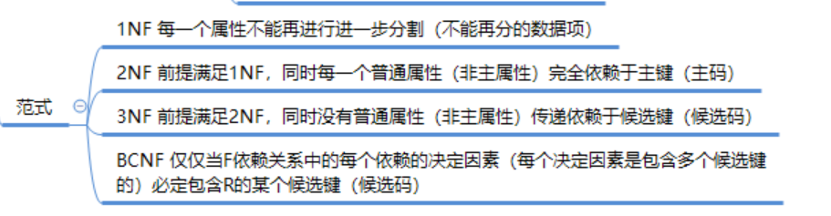

#### 1. 数据库设计范式

数据库设计需要至少遵循第三范式3NF
**3NF范式说明：**
- 一个表中的列和其它列之间既不包含函数依赖关系也不包含传递函数依赖关系，那么这个表的设计就符合第三范式

#### 2. 数据最后修改时间字段自动更新
```sql
CREATE TABLE `customer_inf` (
  `customer_inf_id` int(10) unsigned NOT NULL AUTO_INCREMENT COMMENT '自增主键ID',
  `customer_id` int(10) unsigned NOT NULL COMMENT 'customer_login表的自增ID',
  `customer_name` varchar(20) NOT NULL COMMENT '用户真实姓名',
  `identity_card_type` tinyint(4) NOT NULL DEFAULT '1' COMMENT '证件类型：1 身份证,2军官证,3护照',
  `identity_card_no` varchar(20) DEFAULT NULL COMMENT '证件号码',
  `mobile_phone` int(10) unsigned DEFAULT NULL COMMENT '手机号',
  `customer_email` varchar(50) DEFAULT NULL COMMENT '邮箱',
  `gender` char(1) DEFAULT NULL COMMENT '性别',
  `user_point` int(11) NOT NULL DEFAULT '0' COMMENT '用户积分',
  `register_time` timestamp NOT NULL DEFAULT CURRENT_TIMESTAMP ON UPDATE CURRENT_TIMESTAMP COMMENT '注册时间',
  `birthday` datetime DEFAULT NULL COMMENT '会员生日',
  `customer_level` tinyint(4) NOT NULL DEFAULT '1' COMMENT '会员级别:1普通会员,2青铜会员,3白银会员,4黄金会员,5钻石会员',
  `user_money` decimal(8,2) NOT NULL DEFAULT '0.00' COMMENT '用户余额',
  `modified_time` timestamp NOT NULL DEFAULT CURRENT_TIMESTAMP ON UPDATE CURRENT_TIMESTAMP COMMENT '最后修改时间',
  PRIMARY KEY (`customer_inf_id`)
) ENGINE=InnoDB AUTO_INCREMENT=16384 DEFAULT CHARSET=utf8 COMMENT='用户信息表';

- `modified_time` timestamp NOT NULL DEFAULT CURRENT_TIMESTAMP ON UPDATE CURRENT_TIMESTAMP COMMENT '最后修改时间',
-  这行中数据可以数据修改的时候自动更新当前数据时间
```