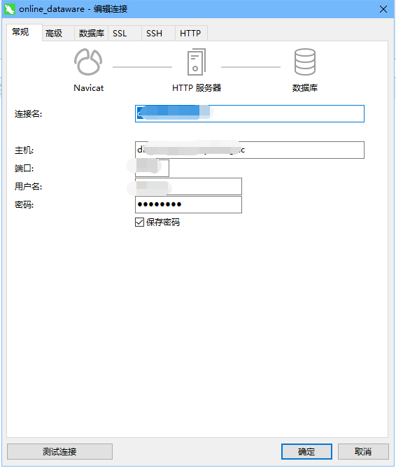

# `Navicat Preminm`通过HTTP连接进行数据库管理
```text
- 风险
数据库安全一直是建站比较重要的一部分，那么对外开放数据库的端口是有一定的风险的.
- 管理
一般来说，大部分DBA在做数据库管理时，都是针对不同的业务使用场景严格限制端口、访问权限、连接数量等等，其最终目的都是为了保证数据的安全性
以常见的阿里云数据库为例，也是提供了内网连接和外网连接两个不同的地址。外网访问时，除了能在数据本身做权限限制外，首先在网络层就是默认全关的状态，需要手动开启对应的来源IP和端口才能访问到。
- 开发需求与困难
实际开发过程中我们需要远程连接数据库，方便进行建库，建表，数据查询校验等等一些列的操作。但是方便就代表风险，也是DBA极力去限制的部分。
那么怎样在服务器不对外开放端口的情况下，安全的远程连接数据库。
实际的操作中要根据DBA的权限设定，根据不同的场景进行设置差异还是比较大的。
- 工具选择
为了提高开发效率选择一个好用的开发工具往往能事半功倍
本文我们使用的是`Navicat Preminm`，不要问为什么，自行百度，自行选择。
`Navicat Preminm` 的四种连接方式：
1. 直连（需要本机有直接访问数据库的权限）
2. SSL连接（没试过，有兴趣可以参考此文档https://www.formysql.com/jiqiao/shezhi-ssl.html） 
3. SSH连接（需要有SSH管理权限）
4. HTTP连接（开使用背景）
```

```text
HTTP连接使用背景

- 我使用的是一台Windows的办公电脑，希望通过我的本机电脑直接操作线上数据库方便开发

- DBA 做了全网的权限管理（只针对内网的业务服务器可以通过下面数据库信息连接到指定的数据库
）：
HOST主机地址:db.xxx.com
PORT端口:7688
USER用户名:db_rd_999
PASSWORD密码:123456

WEB服务器安装有(NGINX+PHP)
业务服务器web访问域名: tt.kaifaji.cc
```

## 安装 `Navicat Preminm` 管理工具

[官方下载地址](https://www.navicat.com.cn/download/navicat-premium)

[激活教程 https://www.bbsmax.com/A/Ae5RPA17zQ/](https://www.bbsmax.com/A/Ae5RPA17zQ/)

## 上传HTTP连接的脚本
- `Navicat Preminm`自带了支持HTTP连接的脚本，支持3种数据库
- 上传ntunndl_mysql.php（我使用的是mysql数据库）到web服务器的根目录下

- 上传成功后就可以进行访问了（保障你的服务器支持HTTP请求和PHP脚本的解析）
  我的脚本访问地址：`http:://tt.kaifaji.cc/ntunndl_mysql.php`
- 上传成功后可用通过脚本的测试页面看是否可以撑场连接数据库


到这里的时候我们的基本工作就做完了，下面就开始正式设置HTTP连接

## 创建MYSQL HTTP连接
- 打开`Navicat Preminm`创建一个MYSQL链接


- 选择常规选项，将数据库连接信息填入到对应的输入框，连接名可以随便填写不影响


- 选择HTTP选项输入HTTP服务器的脚本地址：http:://tt.kaifaji.cc/ntunndl_mysql.php


- 选择常规选项点击测试连接，成功后就可以点击确定保存了


- 在左侧列表双击打开数据库之后就可以进行操作了。

