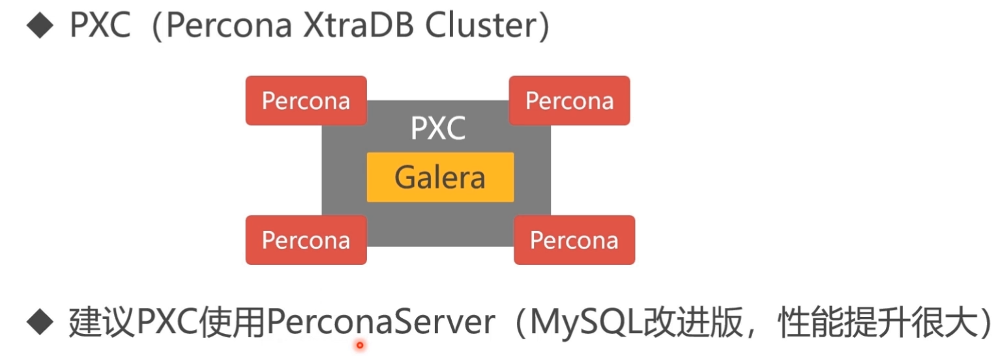
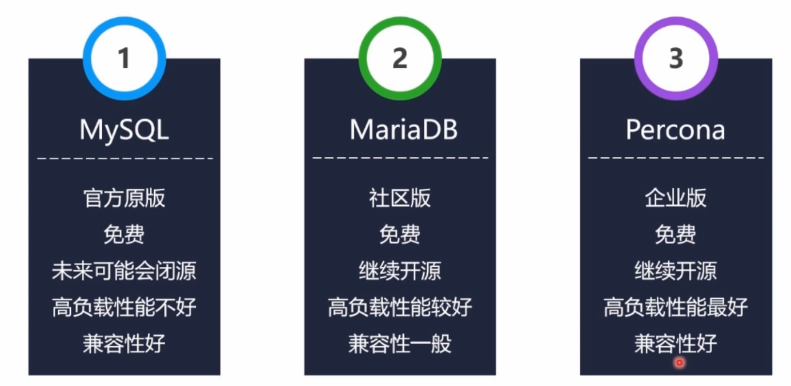
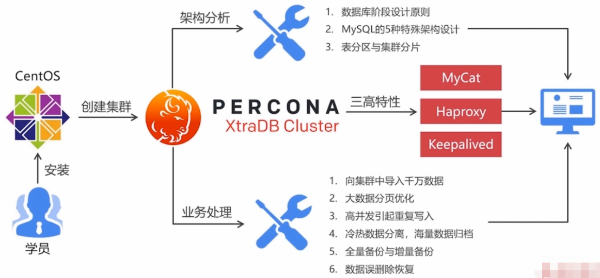

# PXC部署介绍
### 1. PXC 介绍
- Percona CtraDB Cluster 是 Percona 咨询公司提供的免费MYSQL集群产品
- PXC基于galera产品是以galera cluster方式为mysql提高高可用集群解决方案的。galera cluster就是集成了galera插件的mysql集群。galera replication是codership提供的mysql数据同步方案，具有高可用性，方便扩展，并且可以实现多个mysql节点间的数据同步复制与读写，可保障数据库的服务高可用及数据强一致性。

### 2. Mysql集群部署方案：Replication 与 [PXC 优缺点介绍(点击查看详情)](http://www.mamicode.com/info-detail-2389110.html)

+ Replication 同步：采用异步复制，无法保证数据的一致性
+ PXC集群化部署原理（此次总结使用此部署方案）
  - 同步复制，事物在所有集群节点同时提交，有一个节点挂掉所有节点不能写入，保证数据的强一致性
  - 完成了真正的多节点读写的集群方案。
  - 改善了传统意义上的主从复制延迟问题，基本上达到了实时同步。
  - 新加入的节点可以自动部署，无须提供手动备份，维护起来很方便。

### 3. MYSQL 的衍生版选择

- 推荐选择Percona版本，是在MYSQL官方企业版的基础上改进而来
- Percona版本与官方原版兼容性几乎一致（MariaDB是在5.5的基础上改进而来，与Mysql官方版本在5.6（支持json数据存储）以后兼容性差异较大MariaDB5.6支持的数据列）

### 3. PXC 业务实例架构图

