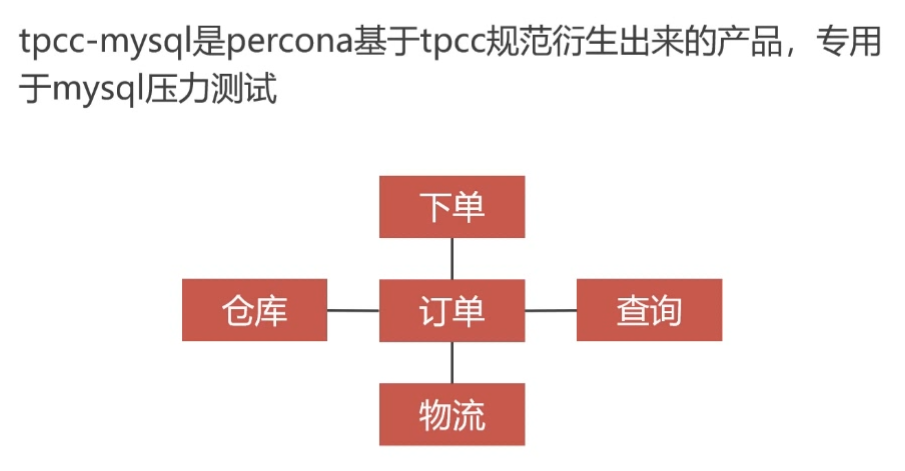
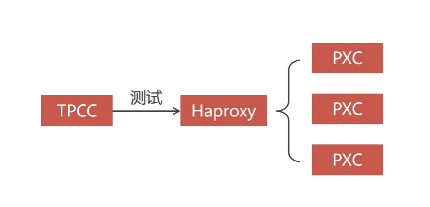
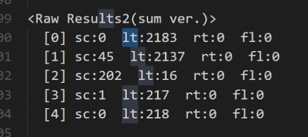
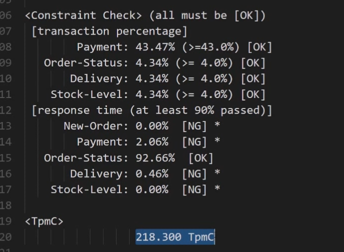

#  TPCC-MYSQL压力测试

### 1. mysql压力测试工具介绍，即测试方案图

tpcc 测试的原理是使用tpcc工具连接数据库后用自动化的脚本创建一个新的数据库，并不断的往库里面写入大量数据，长时间连续测试，最后生成一个测试报告来判断数据库的性能。

### 2. PXC集群测试前的准备工作

- pxc集群需要修改mysql配置，因为pxc集群不允许创建没有主键的表，tpcc里面的history表是没有主键的表
```bash
vim /etc/my.cnf
pxc_strict_mode=DISABLED
```

### 3. tpcc 安装及使用
- 安装
```bash
yum -y install gcc mysql-devel make unzip

wget -O https://github.com/Percona-Lab/tpcc-mysql/archive/master.zip

unzip master.zip

cd tpcc-mysql-master/src

make
```
- 创建库并开始压力测试
```bash
# 首先在目标数据库tpcc中导入两个sql文件
source add_fkey_idx.sql
source create_table.sql

#  加载数据 
./tpcc_load -h 172.101.0.11 -u root -p ABC123456 -P 3306 -d tpcc -w 1
-w 创建一个订单仓库

# 开始压力测试
./tpcc_start -h 172.101.0.11 -u root -p ABC123456 -P 3306 -d tpcc -w 1 -c 5 -r 300 -l 600 - > tpcc.$(date +%F-%T).log

-d 数据库名称
-w 测试的订单仓量量
-c 测试使用的线程数
-r 预热时间，秒
-l 测试时间，秒
```
- 测试报告分析
```bash
列：    sc 成功执行测试 lt 超时执行次数 rt 重试执行测试 fl 失败次数
第一行：新订单业务的处理结果
第二行：支付业务的处理结果
第三行：订单状态的处理结果
第四行：发货业务的处理结果 
第五行：库存业务的处理结果 
```

```bash
<tpmc> 每分钟执行的事务次数
```
