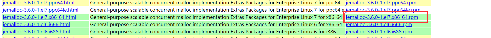
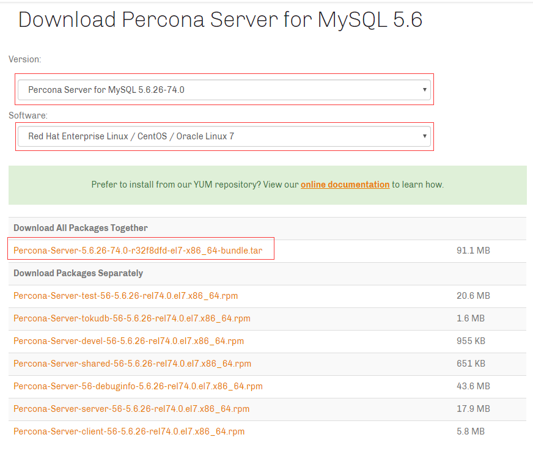

# Centos安装PerconaServer数据库
- PerconaServer只支持Linux系统
- [PerconaServer下载地址](https://www.percona.com/downloads/)
```bash
cat /etc/redhat-release
CentOS Linux release 7.6.1810 (Core) 
```

### 1. RPM安装PerconaServer
- 安装依赖工具包 [jemalloc 点击查看介绍](https://blog.csdn.net/weixin_41772366/article/details/82717671) | [jemalloc线上下载地址](http://www.rpmfind.net/linux/rpm2html/search.php?query=jemalloc&submit=Search+...&system=&arch=)
-  针对解压的RPM包进行本地安装

- 选择[PerconaServer版本](https://www.percona.com/downloads/Percona-Server-5.6/LATEST/)进行下载



-  本地RPM包安装
  [jemalloc-3.6.0-1.el7.x86_64.rpm包 当前目录下载](./source/jemalloc-3.6.0-1.el7.x86_64.rpm)
  [Percona-Server-5.6.26-74.0-r32f8dfd-el7-x86_64-bundle.tar包 当前目录下载](./source/Percona-Server-5.6.26-74.0-r32f8dfd-el7-x86_64-bundle.tar)
```bash
# Centos7 因为默认绑定了 mariadb-libs,所以要进行卸载
yum -y remove maria*

# 下载Percona-Server-5.6rpm包 并解压缩
wget https://www.percona.com/downloads/Percona-Server-5.6/Percona-Server-5.6.26-74.0/binary/redhat/7/x86_64/Percona-Server-5.6.26-74.0-r32f8dfd-el7-x86_64-bundle.tar
mkdir Percona-Server-rpm
tar xvf Percona-Server-5.6.26-74.0-r32f8dfd-el7-x86_64-bundle.tar -C Percona-Server-rpm
cd Percona-Server-rpm

# 下载jemalloc
wget http://www.rpmfind.net/linux/epel/7/x86_64/Packages/j/jemalloc-3.6.0-1.el7.x86_64.rpm

# 安装指定的rpm包
yum localinstall ./*.rpm

#开启mysql服务
systemctl start mysqld
```

- 在线安装
```bash
# 在线安装来源https://www.percona.com/downloads/percona-release/redhat/
yum install https://www.percona.com/redir/downloads/percona-release/redhat/0.1-3/percona-release-0.1-3.noarch.rpm

yum install Percona-Server-server-56
```

### 2. Percona-Server 安装后 相关文件修改
```bash
# mysql 安装成功后空密码可以进入
mysql --version
mysql  Ver 14.14 Distrib 5.6.26-74.0, for Linux (x86_64) using  6.2
mysql
```
- Mysql配置文件存放位置 /etc/my.cnf
- 禁用Mysql开机启动
mysql 配置文件修改完后需要禁用 mysql 的开机服务，原因是如果设置开机启动，一旦宕机后重启，
PXC集群会把新加入的mysql服务进行同步，如果同步数据量过大会导致长时间禁止写入操作，这样会导致数据库长时间不能使用。
正确的做法是先使用备份数据恢复挂掉的节点，然后手动启动
```bash
systemctl disable mysqld
```