# 组件PXC集群
### 1. 组建前的注意事项
- 尽量控制PXC集群规模
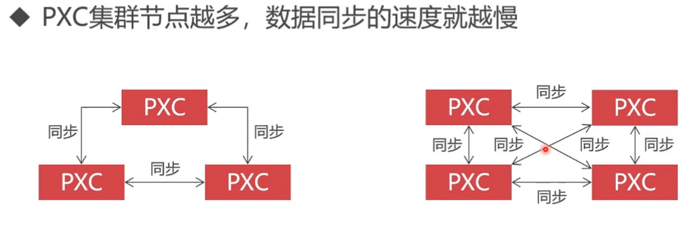
- 所有PXC节点的硬件配置要相同，因为强一致性，PXC集群同步的速度取决于配置最低的那个节点
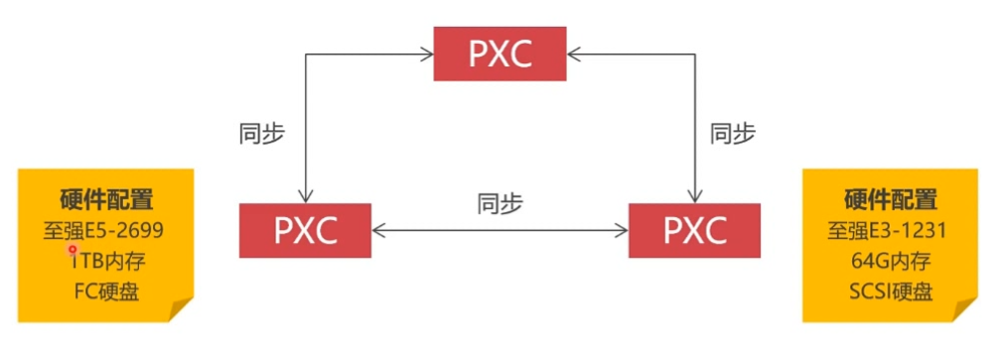
- 只有使用了 INNODB 引擎的数据库才会被同步
- Centos7 因为默认绑定了 mariadb-libs,所以要进行卸载
```bash
yum -y remove maria*
```
- 创建一个3节点的PXC集群（奇数个），默认PXC已经包含了 Precona 的 mysql 数据库,不需要再安装 percona-server
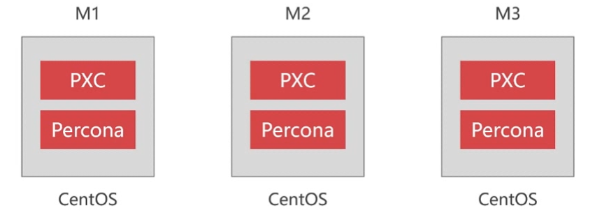

- PXC依赖的端口号需要开启
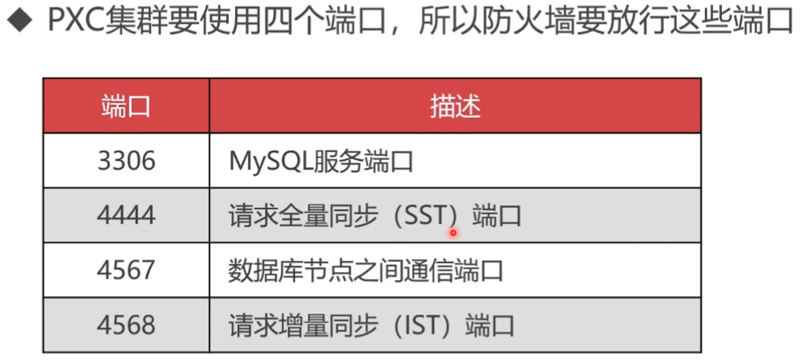

- 关闭 selinux ,设置 /etc/selinux/config 为 disabled

### 2. PXC下载和安装
- 选择要下载的版本:5.6 [点击查看线上下载地址](https://www.percona.com/downloads/)

- 选择具体的版本号下载
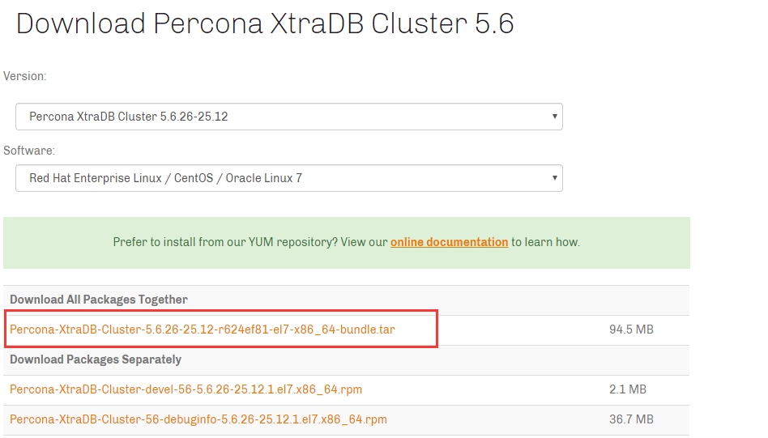
- 下载依赖包 qpress | [点击查看下载地址](http://www.rpmfind.net/linux/opensuse/tumbleweed/repo/oss/x86_64/qpress-1.1-7.13.x86_64.rpm)
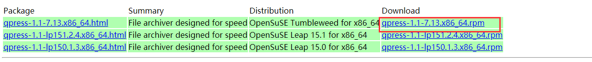


- **本地RPM包安装**
  [qpress-1.1-7.13.x86_64.rpm包 当前目录下载](./source/qpress-1.1-7.13.x86_64.rpm)
  [Percona-XtraDB-Cluster-5.6.26-25.12-r624ef81-el7-x86_64-bundle.tar包 当前目录下载](./source/Percona-XtraDB-Cluster-5.6.26-25.12-r624ef81-el7-x86_64-bundle.tar)
```bash
# 下载Percona-Server-5.6rpm包 并解压缩
wget https://www.percona.com/downloads/Percona-XtraDB-Cluster-56/Percona-XtraDB-Cluster-5.6.26-25.12/binary/redhat/7/x86_64/Percona-XtraDB-Cluster-5.6.26-25.12-r624ef81-el7-x86_64-bundle.tar
mkdir PXC
tar xvf Percona-XtraDB-Cluster-5.6.26-25.12-r624ef81-el7-x86_64-bundle.tar
cd PXC

# 下载qpress
wget http://www.rpmfind.net/linux/opensuse/tumbleweed/repo/oss/x86_64/qpress-1.1-7.13.x86_64.rpm

# 安装指定的rpm包
yum localinstall -y ./*.rpm
```

### 3. PXC安装成功后初始化
PXC安装成功后需要修改默认的 `/etc/my.cnf` 文件  [PXC课程脚本](./source/PXC课程脚本.md)
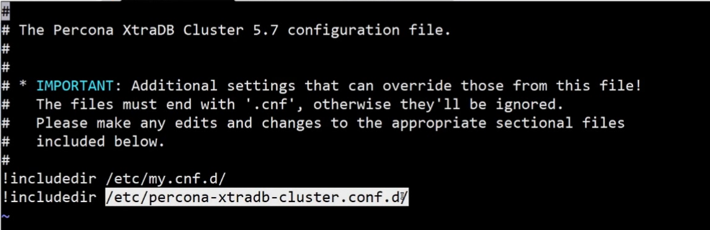
在 `/etc/my.conf.d/`默认是空目录不用看
在 `/etc/percona-xtradb-cluster.conf.d/`目录先存在三个文件
mysql.cnf 存放MYSQL常用配置信息
wsrep.cnf 存放的PXC集群信息的配置
mysqld_safe.cnf 可以不用看
```bash
# 为了方便维护配置文件，可以把所有的配置全部放在  /etc/my.cnf 里面
vim /etc/my.cnf

[mysqld]
character_set_server = utf8
bind-address = 0.0.0.0
#跳过DNS解析
skip-name-resolve
```


## 4 创建PXC集群
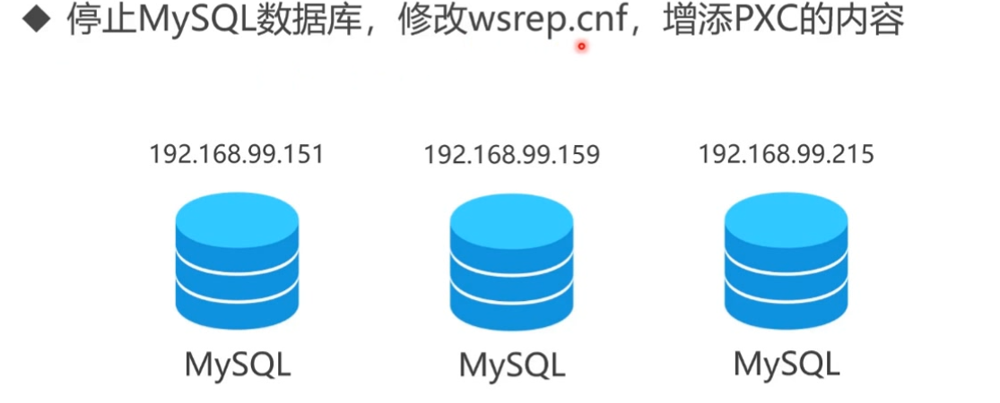
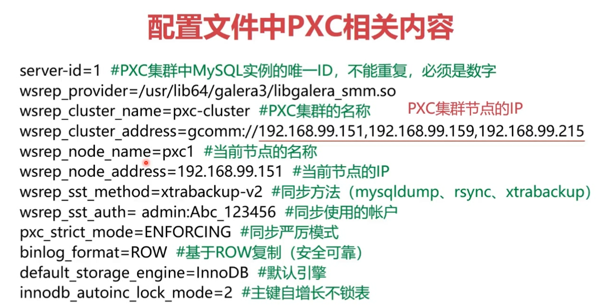

```bash
# 在三台服务器上配置好相关的mysql配置后就可以开启mysql服务了
# 其中第一台mysql 服务的开启比较特殊，使用下面的命令：目的是开启集群
syetemctl start mysql@bootstrap.service
# 第二台开启使用正常的启动就可以了
service mysql start
```
### 5. 验证是否成功开启mysql集群
```sql
# 使用 mysql 客户端软件连接
mysql > show status like 'wsrep_cluster%';
```

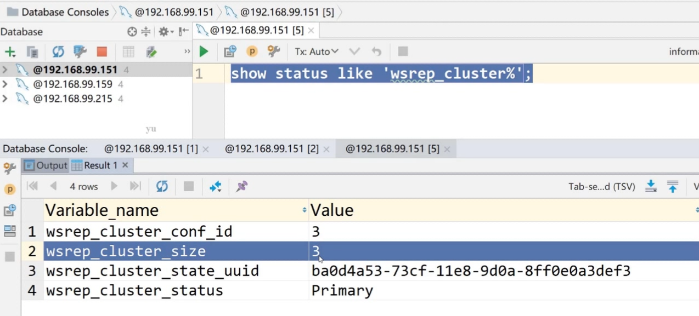

### 6. PXC集群中节点的安全上线和下线操作
- 安全下线操作不会导致节点的脑裂等操作，集群的规模会自动改变
- 节点用什么命令启动的，就对应用什么命令关闭，否则节点无法进行关闭
主节点操作：`systemctl start mysql@bootstrap.service`对应`systemctl stop mysql@bootstrap.service`
普通节点操作：`service mysql start`对应`service mysql stop`

```bash
vim /var/lib/mysql/grastate.dat
saf_to_bootstrap : 0 #此参数非常重要，0表示不能按照主节点启动，1表示可以按照主节点启动（1是最后一个关闭的节点，所以数据是最新的）
```

- 节点启动：如果PXC节点都是安全退出的，先要启动最后退出的节点，使用主节点的命令操作
`systemctl start mysql@bootstrap.service` 
确定主节点是通过查看`vim /var/lib/mysql/grastate.dat`文件中参数为`saf_to_bootstrap=1`
- 节点启动：如果集群中本身有节点在运行，那么需要上线一个新节点按照普通节点上线操作
`service mysql start`

### 7. PXC节点的意外上线和下线操作
- 意外下线集群的规模不会改变
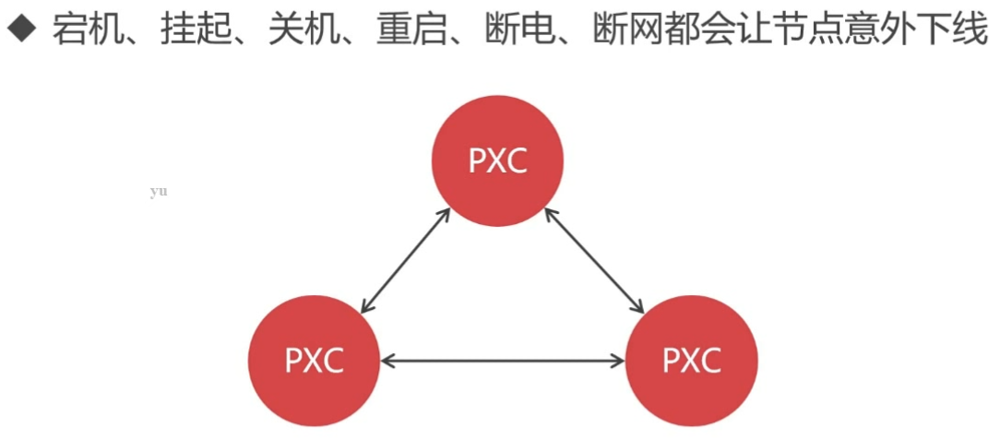
- 节点的启动：启用最后一个意外退出的节点为主节点`systemctl start mysql@bootstrap.service`
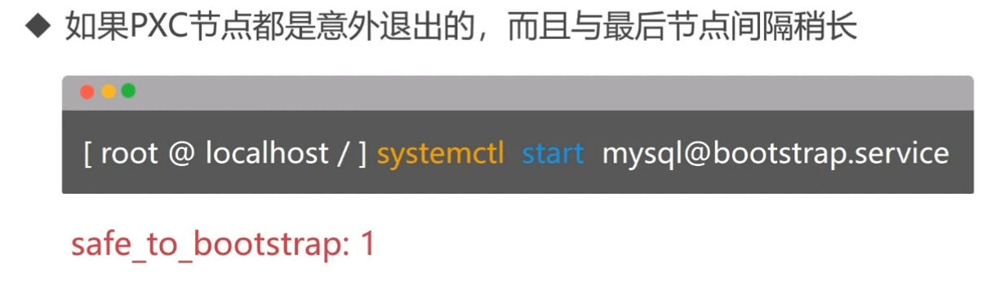
- 节点的启动：所有节点同时退出，无法通过grastate.dat判断出那个是最后退出的节点
此时修改其中一个节点的文件`vim /var/lib/mysql/grastate.dat`文件中参数设置为`saf_to_bootstrap=1`
将此节点作为主节点启动`systemctl start mysql@bootstrap.service`