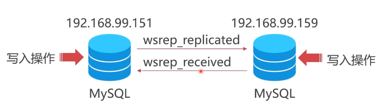
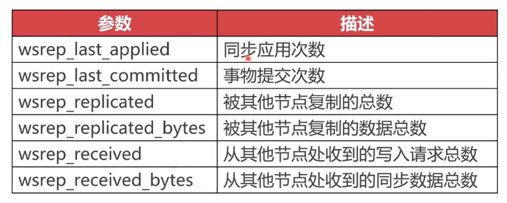
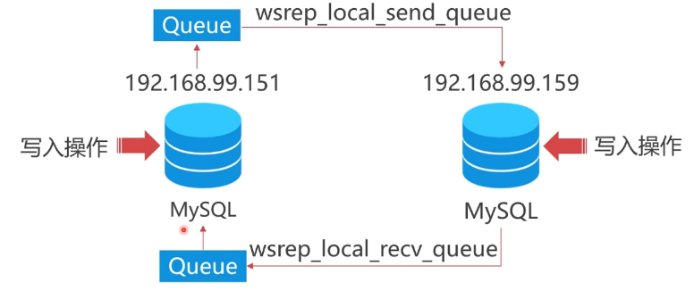
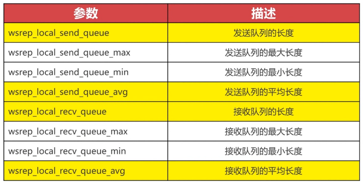
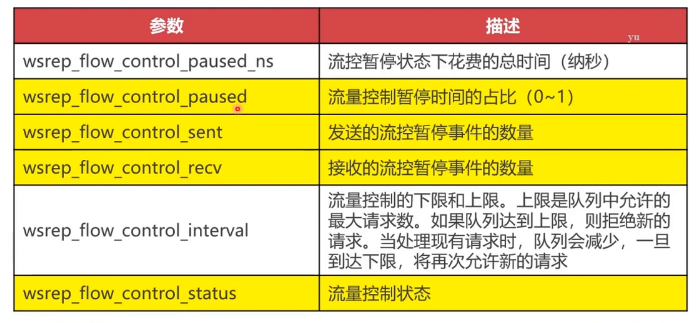
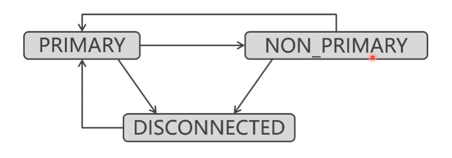
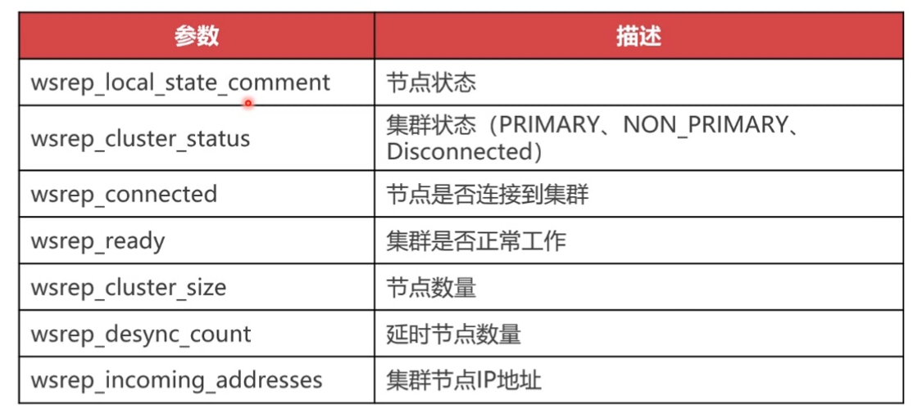
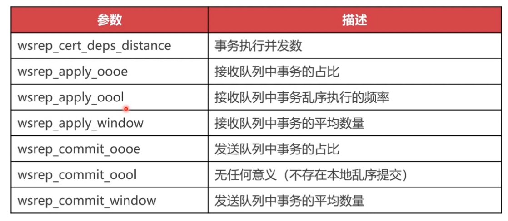

# PXC集群常用的状态管理
```sql
# 查看 集群规模  
mysql > show status like 'wsrep_cluster%';
```
### 1. PXC集群状态信息分类 


### 2. 数据复制相关信息
```sql
# 查看 集群规模  
mysql > show status like '%wsrep%';

wsrep_replicated 当前节点发送数据的次数
wsrep_received   当前节点接收数据的次数
```



### 3. 队列的相关信息
```sql
# 查看 集群规模  
mysql > show status like '%queue%';
```

- 黄色部分格外重要


### 3. 流量控制的相关信息
- 流控状态的开启是非常严重的
```sql
# 查看 集群规模  
mysql > show status like '%queue%';
```


- 实例解析
  当队列超过最大值时会引发流控
```txt
出现流控的原因：节点之间同步慢，在队列中挤压了大量的请求需要处理。
- 解决办法
1. 改善网速，提高贷款，更换网卡交换机，更换为千兆以上网卡 
2. 增加线程数量 在PXC配置文件中修改参数`wsrep_slave_threads=16`正常为CPU线程数的1-1.5倍
3. 提升硬件性能，提升CPU,硬盘，内存等方法
```
 ### 4. PXC节点状态说明
 - OPEN    节点启动成功
 - PRINARY 节点成功加入集群
 - JOINER  节点与其他节点同步数据
 - JOINED  节点数据同步成功
 - DONER   节点与其他节点进行全量同步，此时数据库进入流控，不能对外提供服务
 - SYNCED  同步状态：可以对外提供读写服务


 ### 5. PXC集群状态说明
- NON_PRIMARY 脑裂故障：投票超过半数组建新的集群
示例：一个集群部署在两个机房，当出现机房之间断网时，PXC会去判断当前机房服务器数是否超过半数，超过则组建新的集群，此时进入NON_PRIMARY状态。没有超过则当前机房集群瘫痪不再提供服务。要保证两个机房机器数不一致。同时要做好负载，保证当瘫痪的机房无法提供服务时负载不会把请求负载到这个上面
- PRIMARY      正常状态
- DISCONNFCTED 脑裂故障：投票平票，彻底瘫痪


 ### 6. PXC节点与集群状态说明


 ### 7. PXC事物的相关信息


