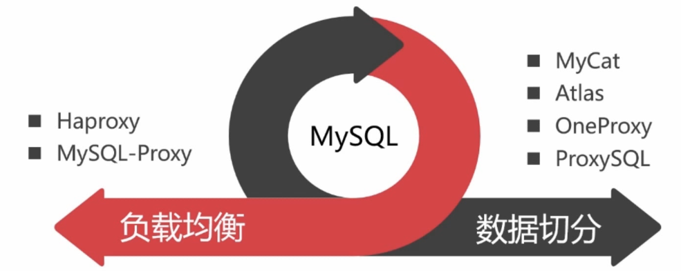
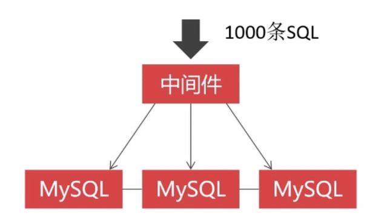
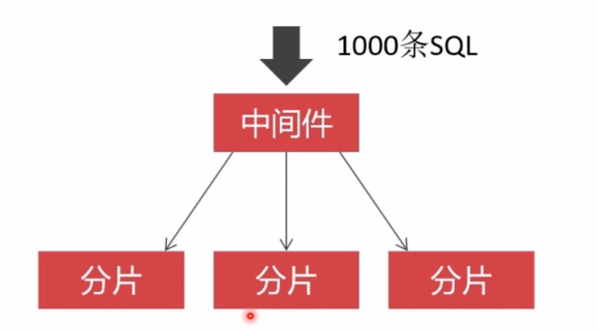
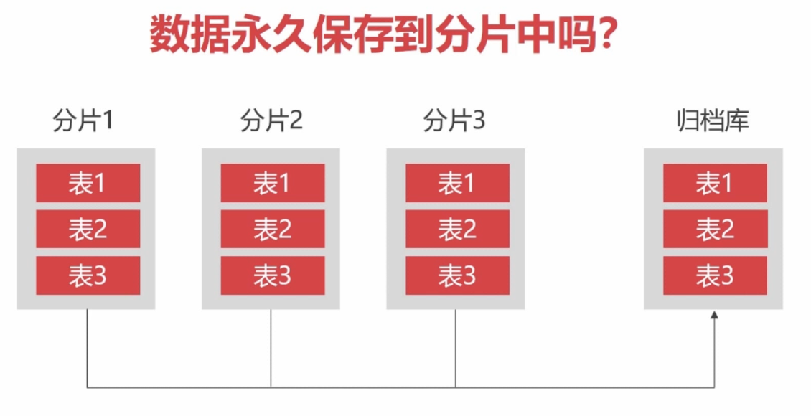
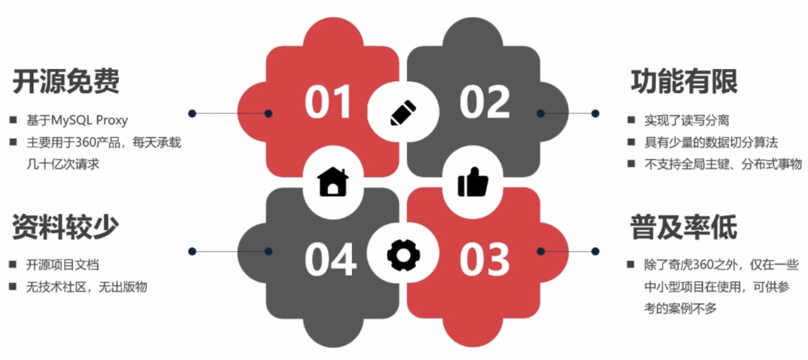
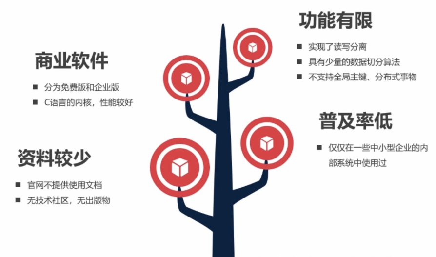

# Mysql数据库常用中间件介绍

### 1. Mysql集群中间件分类

### 2. 负载均衡中间件
- 负载均衡提供了请求转发，减低了单节点的负载

### 3. 数据切分中间件
- 一个数据库集群为一个分片，各个分片不进行数据同步
- 按照不同的路由算法分发SQL语句就形成了数据切分

- 使用归档数据库保存分片数据，然后移除长时间以前的分片数据

+ 3.1 MyCat 中间件

+ 3.2 Atlas

+ 3.3 One Proxy

+ 3.4 ProxySql

