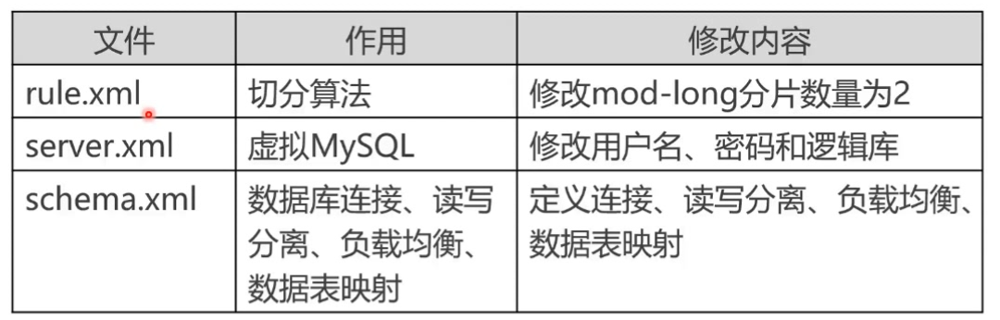
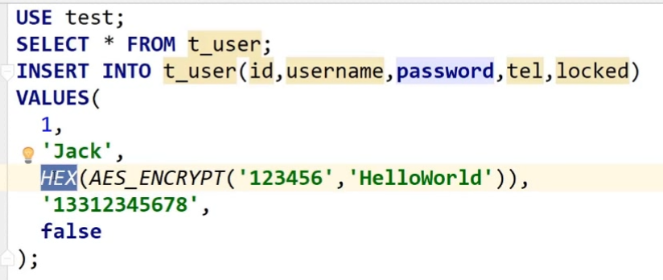
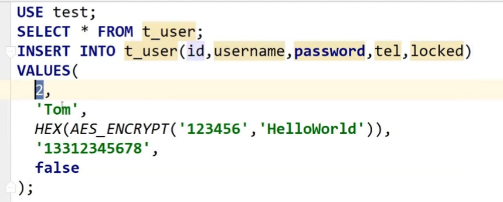

# MyCat双切片存储配置和负载均衡

### 1. MyCat准备工作
- MyCat依赖Java环境，所以必须安装JDK
```bash
# 安装开发版本的JDK
yum install -y java-1.8.0-openjdk-devel.x86_64

# 查看环境变量位置
ls -lrt /etc/alternatives/java
lrwxrwxrwx 1 root root 73 Apr 11 08:27 /etc/alternatives/java -> /usr/lib/jvm/java-1.8.0-openjdk-1.8.0.201.b09-2.el7_6.x86_64/jre/bin/java

# 添加环境变量
vim /etc/profile
export JAVA_HOME=/usr/lib/jvm/java-1.8.0-openjdk-1.8.0.201.b09-2.el7_6.x86_64

source /etc/profile
```
- 创建两个3节点的PXC集群

```txt
PXC集群1：172.18.0.2 172.18.0.3 172.18.0.4
PXC集群2：172.18.0.5 172.18.0.6 172.18.0.7
```
- 分别在两个集群中创建一个test数据库 和 一个t_user表
```sql
DROP TABLE IF EXISTS `t_user`;
CREATE TABLE `t_user` (
`id`  int(11) UNSIGNED NOT NULL AUTO_INCREMENT COMMENT '主键ID' ,
`name`  varchar(50) CHARACTER SET utf8 COLLATE utf8_general_ci NOT NULL  COMMENT '名称信息',
`password`  varchar(200) NOT NULL COMMENT '密码信息' ,
`tel`  varchar(50) NOT NULL COMMENT '电话',
PRIMARY KEY (`id`),
INDEX `idx_name`(`name`) USING BTREE
)
ENGINE=InnoDB
DEFAULT CHARACTER SET=utf8 COLLATE=utf8_general_ci
AUTO_INCREMENT=1
;
```

### 2. MyCat 下载和配置文件设置 
- [MyCat 下载地址](http://dl.mycat.io/1.6.6.1/Mycat-server-1.6.6.1-release-20181031195535-linux.tar.gz)
- MyCat配置文件说明 | [MyCat权威指南](./source/mycat-definitive-guide.pdf)

```xml
<!-- 此处使用对2求模的切分算法，所以对默认的配置要修改 rule.xml 中的 参数为2 -->
<function name="mod-long" class="io.mycat.route.function.PartitionByMod">
  <!-- how many data nodes -->
  <property name="count">2</property>
</function>
```
- [server.xml配置文件示例](./source/mycat/conf/server.xml) | [schema.xml配置文件示例](./source/mycat/conf/schema.xml) | [rule.xml配置文件示例](./source/mycat/conf/rule.xml)
- 打开防火墙，关闭selinux 


### 3. 启动和关闭MyCat
```bash
# 启动 mycat 支持的命令{ console | start | stop | restart | status | dump }
chmod -R 777 ./*.sh
./mycat start
```

#### 4. 数据测试分片
- 向表 t_user 中插入两条数据，id为1，id为2，根据mycat的rule:mod-long对id进行2的求模，两个PXC分片会哥被插入一条数据
```sql
insert into t_user(id,name,password,tel) VALUES(1,'jack',HEX(AES_ENCRYPT('123456','helloword')),'12345679');
insert into t_user(id,name,password,tel) VALUES(2,'shm',HEX(AES_ENCRYPT('123456','helloword')),'12345679');
```



