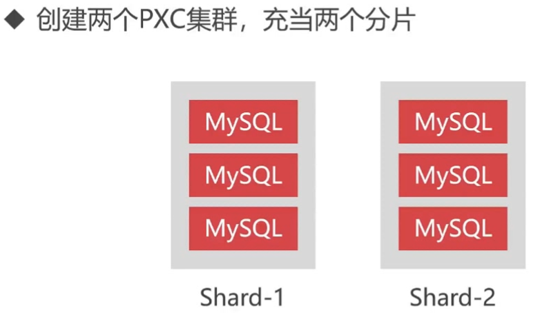

# MyCat配置负载均衡

### 1 MyCat准备工作
- MyCat依赖Java环境，所以必须安装JDK
```bash
# 安装开发版本的JDK
yum install -y java-1.8.0-openjdk-devel.x86_64

# 查看环境变量位置
ls -lrt /etc/alternatives/java
lrwxrwxrwx 1 root root 73 Apr 11 08:27 /etc/alternatives/java -> /usr/lib/jvm/java-1.8.0-openjdk-1.8.0.201.b09-2.el7_6.x86_64/jre/bin/java

# 添加环境变量
vim /etc/profile
export JAVA_HOME=/usr/lib/jvm/java-1.8.0-openjdk-1.8.0.201.b09-2.el7_6.x86_64

source /etc/profile
```
- 创建两个3节点的PXC集群

```txt
PXC集群1：172.18.0.2 172.18.0.3 172.18.0.4
PXC集群2：172.18.0.5 172.18.0.6 172.18.0.7
```
- 分别在两个集群中创建一个test数据库 和 一个t_user表
```sql
DROP TABLE IF EXISTS `t_user`;
CREATE TABLE `t_user` (
`id`  int(11) UNSIGNED NOT NULL AUTO_INCREMENT COMMENT '主键ID' ,
`name`  varchar(50) CHARACTER SET utf8 COLLATE utf8_general_ci NOT NULL  COMMENT '名称信息',
`password`  varchar(200) NOT NULL COMMENT '密码信息' ,
`tel`  varchar(50) NOT NULL COMMENT '电话',
PRIMARY KEY (`id`),
INDEX `idx_name`(`name`) USING BTREE
)
ENGINE=InnoDB
DEFAULT CHARACTER SET=utf8 COLLATE=utf8_general_ci
AUTO_INCREMENT=1
;
```