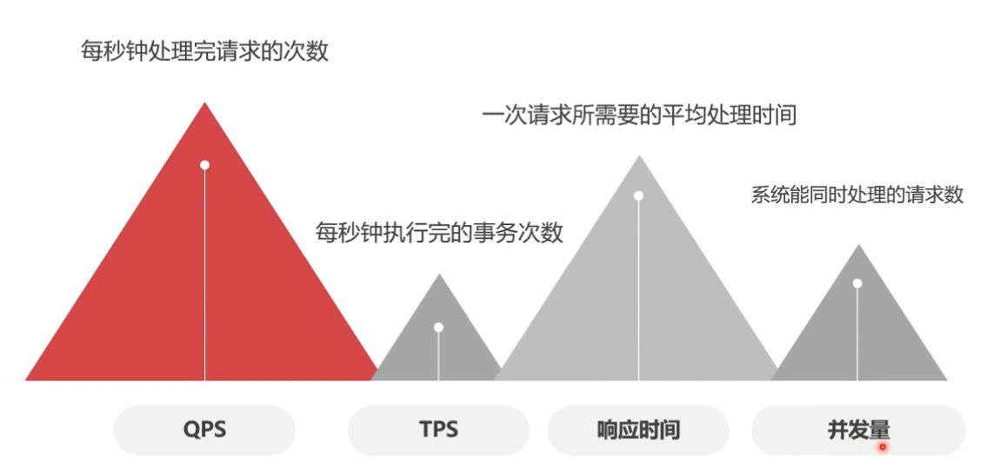
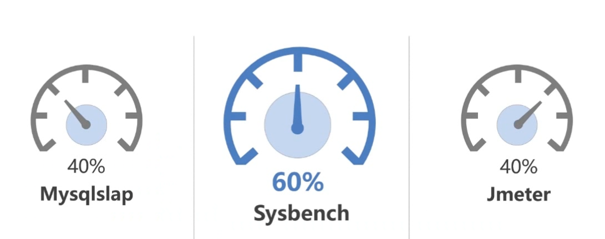
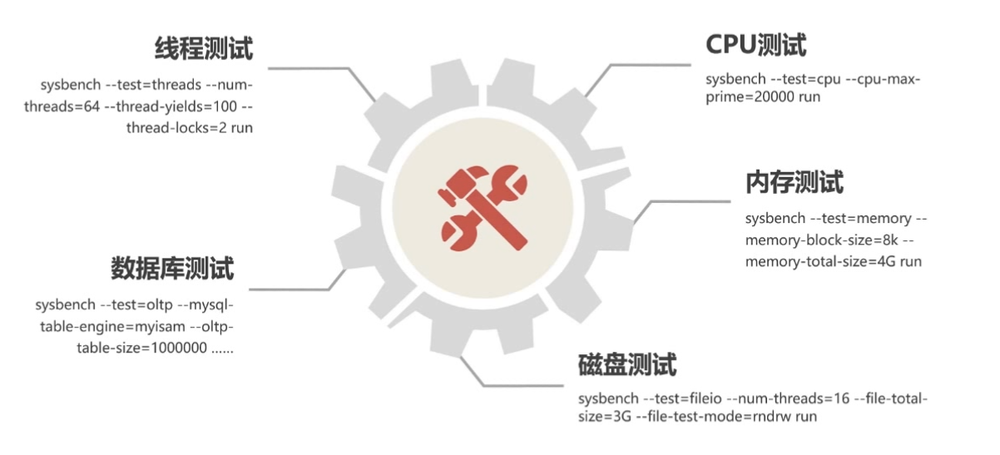
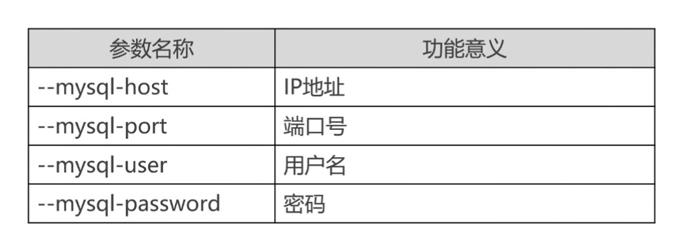
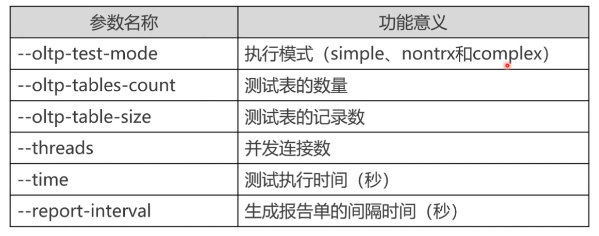
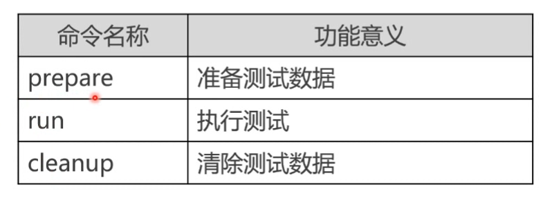

# 数据库基准测试Sysbench

### 1. 基准测试
- 基准测试是针对系统的一种压力测试，测试不关心业务逻辑，更加简单，直接，易于测试，不要求真实
- 反应的是硬件性能，并不是真实业务的性能
- 测试测指标


### 2.基准测试工具
- mysqlslap myslq自带的工具，不用安装。但是无法测试硬件cpu,磁盘等无法测试
- sysbench 可以测试硬件和mysql数据库，功能强大，建议使用此工具
- jmeter java图形化测试工具，能测试的东西比较多，但是数据库测试属于入门级


### 3.Sysbench工具介绍


### 4.Sysbench工具安装
- 需要更换yum为163或者阿里云的源，否则会导致失败
```bash
# yum源备份
cp /etc/yum.repos.d/CentOS-Base.repo /etc/yum.repos.d/CentOS-Base.repo.$(date +%F_%T)

# 阿里云yum
wget -O /etc/yum.repos.d/CentOS-Base.repo http://mirrors.aliyun.com/repo/Centos-7.repo
# 163yum源
wget -O /etc/yum.repos.d/CentOS-Base.repo http://mirrors.163.com/.help/CentOS7-Base-163.repo

yum clean all
yum makecache
yum  -y update

# 在线安装
curl -s https://packagecloud.io/install/repositories/akopytov/sysbench/script.rpm.sh | sudo bash
yum -y install sysbench

# 本地安装
yum -y install automake libtool
yum -y install mysql-devel

wget https://github.com/akopytov/sysbench/archive/1.0.17.zip

unzip 1.0.17.zip
cd 1.0.17

./autogen.sh
./configure && make && make install
```

### 5.Sysbench工具使用
```bash
sysbench --version
sysbench scripet [option] [commond]
```
- option 连接参数信息


- command 连接参数信息


```bsh
sysbench 
```