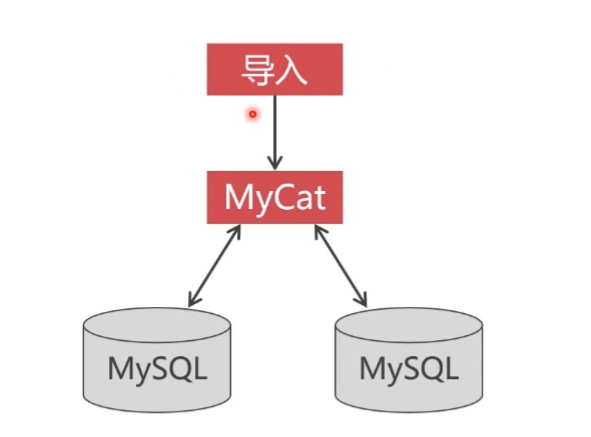

# 向PXC集群中导入大量数据
> 在mycat端导入 10以下数据使用 source 命令 , 100万以上使用 load data, 超过千万建议切分数据后使用load data 多线程操作 



### 00 数据文件切分
```bash
# 每100万数据切分为一个文件
split -l 1000000 -d data.txt
```


### 修改PXC配置文件
```sql
innodb_flush_log_at_trx_commit=0
innodb_flush_method=O_DIRECT
innodb_buffer_pool_size=200M
```