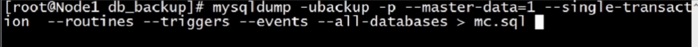
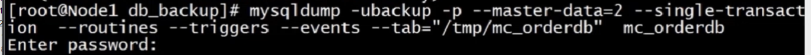
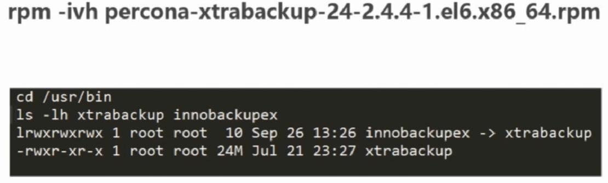
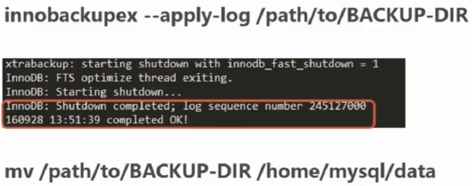

# MYSQL数据库备份
- 对于任何数据库来说，备份都是非常重要的
- 数据库的主从同步并不能取代数据库的备份功能（当出现故障时主从的延时可能会导致数据缺失）

#### 1 逻辑备份和物理备份
- 逻辑备份的结果为sql语句，适合于所有存储引擎，逻辑备份花费的时间较长（mysqldump就属于逻辑备份）
- 物理备份是对数据库目录的拷贝，对于内存表只备份结构（比逻辑备份快，直接拷贝目录就行了）
  -- 离线物理备份，需要关闭数据库业务进行冷备份
  -- 在线物理备份，可以在线进行热备份，不用关闭数据库，可以使用第三方备份工具：`percona`软件的`xtrabackup`工具

#### 2 全量备份和增量备份
- 全量备份就是对整个数据库进行的一个完整备份
- 增量备份是在上次全量或增量备份的基础上，对于更改数据进行的备份
> msyqldump 工具并不支持增量备份
> xtrabackup 提供增量备份功能，对INNODB更加安全和高效
> 通过对mysql的binlog二进制日志来进行增量备份（无论使用什么工具备份，在恢复时需要使用恢复时间点的二进制日志，所以二进制日志的备份都要做）

#### 3 mysqldump 官方工具备份（逻辑备份，在线热备，恢复时需要关闭数据库冷恢复）
+ 第一步： mysqldump 备份和常用参数解析
```sql
mysqldump -h ip -u root -p db_name > mysqldump001.sql
```
- 常用参数：用户参数和用户备份需要的权限


- 常用参数：用户参数和用户备份需要的权限
```
--single-transaction 会在备份开始前，启动一个事物，保证数据库在备份开始时的一致性，此时所有的会dbl被隔绝，只支队INNODB存储引擎有效
-l, --lock-tables 非INNODB引擎是使用，确保数据的一致性，会锁定所有数据表（表混合使用了两个引擎使用这个参数，不确定一致性）
-x, --lock-all-talbe 对数据库中所有实例得的表进行加锁，执行是数据库只读
--master-data=1  值为2，那么CHANGE MASTER TO 语句会被写成一个SQL comment（注释），从而只提供信息; 值为1，那么语句不会被写成注释并且在dump被载入时生效。默认值为1。自动忽略 --lock-talbe 参数
 
-R,--routines 记录存储过程
--triggers 指定备份数据库中所存在的触发器
-E,--events 指定备份数据中的调度事件

--hex-blob 字段类型 date,blog等类型数据存储为16进制格式存储
--tab=path 会在指定路径下为数据库每个表生成两个文件 ，一个文件存储表结构哦，一个存储表数据
-w,--where="条件" 指定条件导出，但是只支持单表导出
```

+ 第二步：  mysqldump 备份实例
- 创建一个备份用户
```sql
create user 'backup'@'localhost' identified by '123456';
grant select,file,reload,lock tables,replication client,show view,event,process on *.* to 'backup'@'localhost';
```
- 单数据库备份

- 单数据库单表备份

- 全量数据库备份

- --where参数的使用

- --tab参数的使用



+ 第三步： 恢复mysqldump备份的数据库文件
- 客户端恢复：`mysql -u -p dbname < /backupdir/backup.sql`
- 进入命令行恢复：`mysql> source /backupdir/backup.sql`
> 单线程恢复，速度和服务器的cpu和IO性能有关
- 使用--tab参数导出的数据库的恢复（因为产生了 表结构和表数据 两个文件，所以要分开导入）
导入数据表结构（选择一个恢复方式）
此处使用：进入命令行恢复：`mysql> source /backupdir/table_user_desc.sql`
加载数据`mysql> load data infile '/backupdir/table_user_data.txt' into table table_user;`


#### 4 Mysqldump工具 + Binlog 工具实现指定时间点的备份恢复
需求： 恢复到误操作的时间
先决条件：
- 具有指点时间点前的一个全备
- 具有自上次全备后到指定时间点的所有二进制文件

恢复步骤：
> 数据库全备文件`/backupdir/allbackup.sql` 
```sql
# 首先恢复一个最近日期的全备文件
mysql -uroot -p db_name < /backupdir/allbackup.sql
```
查看全备份文件的二进制日志的文件编号和master信息，在这个信息之后的数据到误操作之间的数据需要恢复
```bash
more /backupdir/allbackup.sql
```

进入mysql二进制文件的日志目录，查看所有二进制文件`cat /var/log/mysql/`

`mysqlbinlog --base64-output=decode-rows -vv --start-position=84882 --database=mc_orderdb mysql-bin.000011 | grep -B DELETE | more`

通过分析还需要恢复从全备份 84882 到 169348 之间的数据
```bash
# 将全备的日志ID到误操作的日志ID的差异数据导出一个sql文件
mysqlbinlog --start-position=84882 --stop-position=169348 --database=mc_orderdb mysql-bin.000011 > mc_order_diff.sql
# 将sql文件导入到数据库
mysql -uroot - p mc_orderdb < mc_order_diff.sql
```

#### 5 Binlog工具实时二进制日志备份
```sql
# 进入mysql命令行 创建备份二进制文件的账户 userbinlog
> grant replication slave on *.* to 'userbinlog'@'localhost' identified by '123456';

mysqlbinlog --rwa --read-from-remote-server --stop-nerver --host localhost --port 3306 -u userbinlog -p123456 mysql-bin.000011
```

#### 6 xtrabackup 备份工具（物理备份，在线热备，恢复时需要关闭数据库冷恢复）


+ 第一步：安装依赖库
```bash
yum install -y perl-DBD-MySQL.X86 perl-DBl.x86 perl-Time-HiRes.x86_64 perl-IO-Socker-SSL.noarch perl-TermReadKey.x86_64
```
+ 第二步：[xtrabackup下载地址](https://www.percona.com/downloads/XtraBackup/LATEST/) 
```bash
rpm -ivh percona-ctrabackup-24-2.4.4-1.el6.x86_64.rpm
```

+ 第三步：备份数据库
```bash
innobackupex --user=root --password=pwd --parallel=2 /home/db_backup/ --no-timestamp
#参数解析：
--parallel=2 指定备份是使用的线程数，并发备份 
/home/db_backup/ 指定备份到的目录
--no-timestamp 生成时不指定时间戳生成的目录
```
+ 第四部：利用innobackupex 进行全备的恢复

>全备份后的目录: /home/db_backup/2019-04-02_10-30-30 , MYSQL使用中的数据库文件目录位置 : /mysql/data
```
# 导入最新数据到全备目录中
innobackupex --apply-log /home/db_backup/2019-04-02_10-30-30

# mysql实例的停止
/etc/init.c/mysqld stop

# 用备份目录替换数据库目录
mv /mysql/data mv /mysql/data_bak
mv /home/db_backup/2019-04-02_10-30-30 /mysql/data
chown -R mysql:mysql /mysql/data

# mysql实例的启动
/etc/init.c/mysqld start
```
+ 第五步：利用innobackupex 进行增量备份
```bash
# innobackupex 备份工具
# --incremental-basedir 参数：指定增量备份的基础备份目录

# 全备 备份后的目录为 /home/db_backup/2019-04-02_10-30-30
innobackupex --user=root --password=pwd --incremental /home/db_backup/  
# 第一次增量备份 增量备份目录为 /home/db_backup/2019-04-02_12-30-30
innobackupex --user=root --password=pwd --incremental /home/db_backup/ --incremental-basedir=/home/db_backup/2019-04-02_10-30-30
# 第二次增量备份 增量备份目录为 /home/db_backup/2019-04-02_14-30-30
innobackupex --user=root --password=pwd --incremental /home/db_backup/ --incremental-basedir=/home/db_backup/2019-04-02_12-30-30
```
+ 第六步： 利用innobackupex 进行增量备份的恢复


```bash
# 将第一次增量备份导入到全备目录中
innobackupex --apply-log --redo-only /home/db_backup/2019-04-02_10-30-30 --incremental-dir /home/db_backup/2019-04-02_12-30-30

# 将第二次增量备份导入到全备目录中
innobackupex --apply-log --redo-only /home/db_backup/2019-04-02_10-30-30 --incremental-dir /home/db_backup/2019-04-02_14-30-30

# ........

# 将所有的增量备份导入到全备中后，导入最新数据到全备目录中
innobackupex --apply-log /home/db_backup/2019-04-02_10-30-30

# mysql实例的停止
/etc/init.c/mysqld stop

# 用备份目录替换数据库目录
mv /mysql/data mv /mysql/data_bak
mv /home/db_backup/2019-04-02_10-30-30 /mysql/data
chown -R mysql:mysql /mysql/data

# mysql实例的启动
/etc/init.c/mysqld start
```