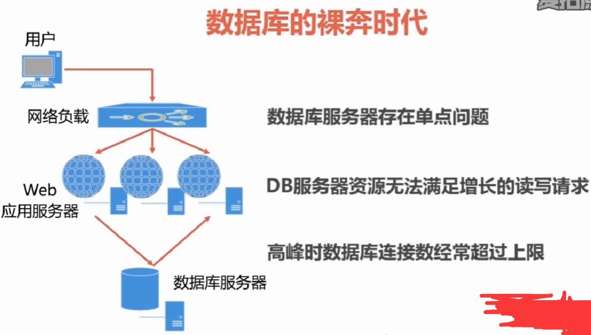
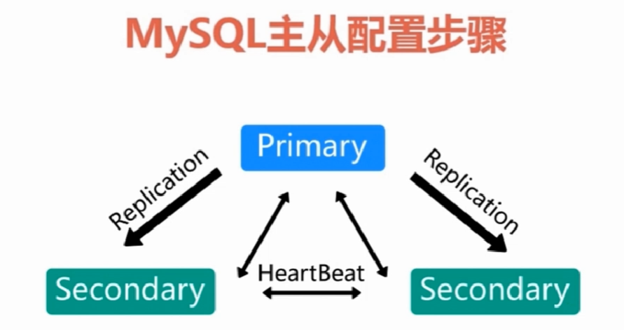
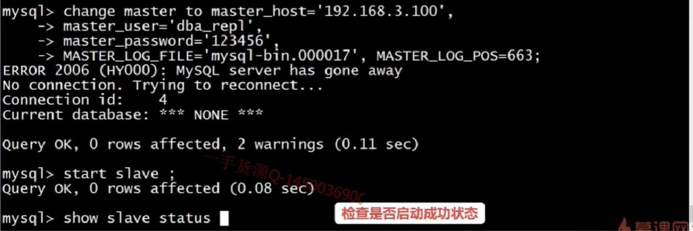
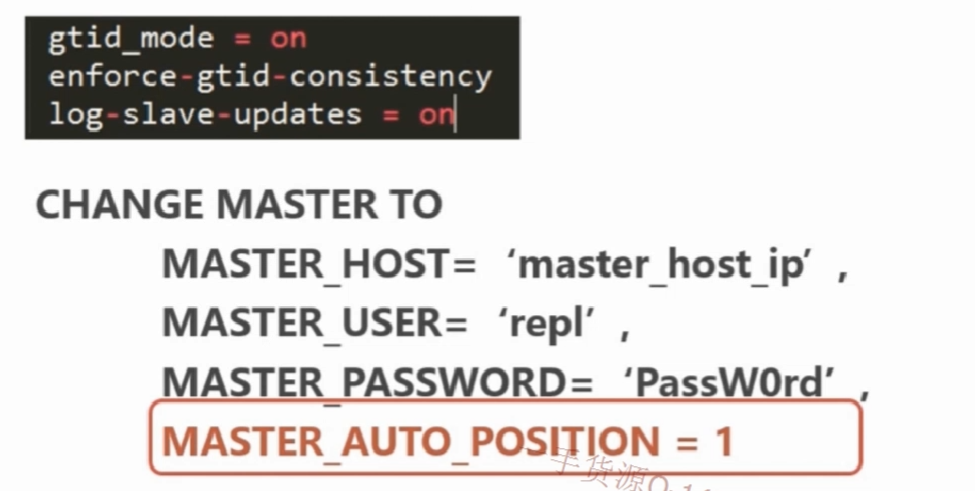
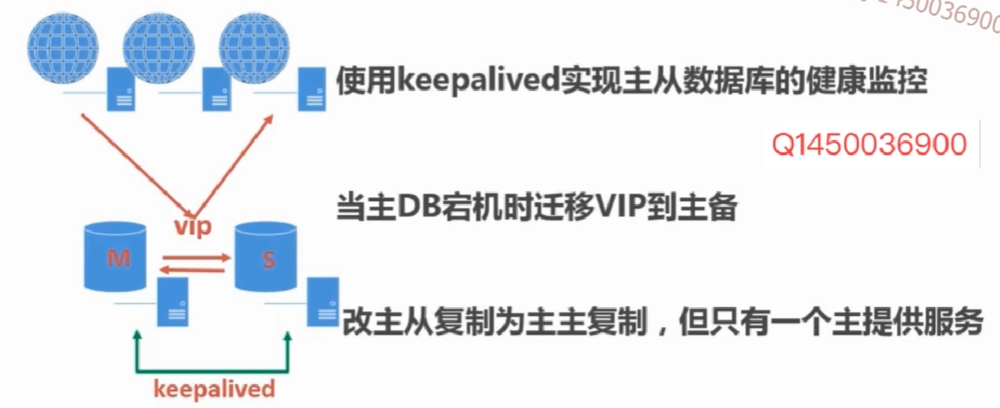
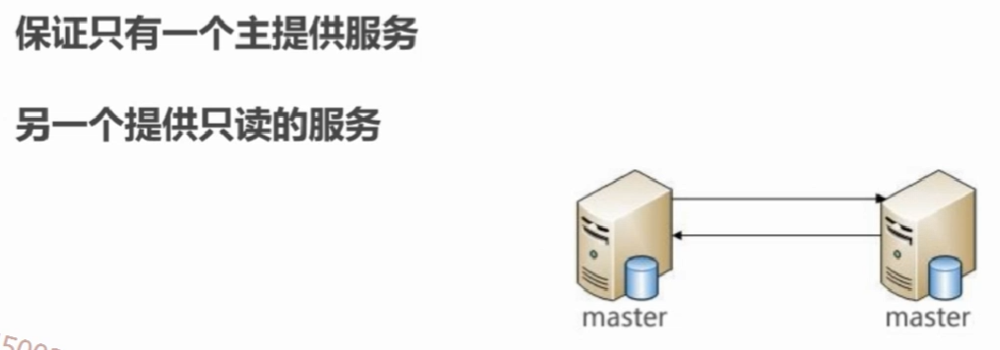

# MYSQL数据库架构主从同步

#### 1 数据库单点裸奔时代

- 单点问题处理方案：
- 组件数据库集群
- 统一及群众的数据库服务器需要具有相同的数
- 集群中的热议服务器宕机后，其它服务器可以取代宕机服务器

#### 2. Myslql 主从复制架构
+ **2.1 主从同步原理**
- 主从复制时一定要开启数据库二进制日志，否则主从复制不能生效

+ **2.2 主从同步配置**

- 配置主从数据库服务器参数
- 在主服务器上创建用于复制的数据库账号
- 备份主服务器上数据库，使用备份的数据库文件初始化从服务器数据库
- 启动主从同步
+ **2.3 主从同步配置参数详情**
```bash
#存储二进制文件的目录位置,最好和数据库的目录不在一个磁盘阵列上，可以提高I/0读写效率,`mysql-bin`为文件的前缀（默认是以主机名为前缀，这里设置前缀是为了防止主机名修改收无法读取的问题）
log_bin = /data/mysql/sql_log/mysql-bin
#存储二进制文件的目录位置,最好和数据库的目录不在一个磁盘阵列上，可以提高I/0读写效率,`relay-bin`为文件的前缀（默认是以主机名为前缀，这里设置前缀是为了防止主机名修改收无法读取的问题）
relay_log /data/mysql/sql_log/relay-bin

server_id # 主从服务器不能一样

read_only # 设置从服务器上没有sql权限的用户是不能进行写操作的，无论这个用户时候只有写权限（无法限制root）

super_read_only # msyql5.7之后新增参数，设置从服务器上没有sql权限的用户是不能进行写操作的，无论这个用户时候只有写权限（root也会被限制不能写）

skip_slave_start # 数据库服务器重启后自动开启同步链路 

master_info_repository = TABLE
relay_log_info_repository = TABLE # 将文件信息存储到表格中，防止突然宕机信息丢失（默认是存储在文件系统中）
```


+ **2.4 Master主服务器上建立复制账号**
- 用于IO进程连接master服务器获取binlog日志，需要 replication slave 权限
```sql
grant user 'userrepl'@'IP段' identified by 'Password';
grant replication slave on *.* to 'userrepl'@'IP网段';
```

+ **2.5 初始化slave从服务器**
- 保证主从数据库版本的一致
- 使用全备的数据备份初始化slave从服务器

+ **2.6 启动基于二进制日志复制链路**
```sql
#启动同步链路
change master to master_host= 'master_host_ip',
master_user='userrepl',
master_password='Password',
master_log_file='log_file_name', #全备份文件中的参数信息
master_log_pos=****, #全备份文件中的参数信息
```




+ **2.7 Msyql5.7 版本主从同步注意事项**
- mysql 目录中有一个auto.cnf文件，存储的是 server_uuid 值，这个值主从不能一致。使用镜像安装时需要删除这个文件，数据库重启后会自动生成

+ **2.8 启动基于GTID的复制链路（GDID:全局事物ID）**
```sql
# slave 从数据库 mysql 配置
gtid_mode = on
enforce-gtid-consistency
log-slave-updates = on # 5.6版本必须启动，5.7不用起也可以

#启动同步链路
change master to master_host= 'master_host_ip',
master_user='userrepl',
master_password='Password',
master_auto_position=1
```



#### 3 数据库服务器的到宕机自动切换
+ **第一步：单主从服务器存在的问题**

+ **第二步：引入虚拟IP的数据库架构：keepalived 理论分析**


+ **第三步：准备工作，修改为主主备份**

```bash
# MASTER数据库配置修改
auto_increment_increment=2
auto_increment_offset=1
# 主服务器的自增按照偏移量实现自增 1,3,5,7,9.....

# 另一台的备用的 主MASTER数据库配置修改
auto_increment_increment=2
auto_increment_offset=2
# 备服务器的自增按照偏移量实现自增 2,4,6,8.....
```

**引入虚拟IP的数据库架构：[keepalived健康监控](./14.Keepalived数据库心跳监控及自动切换.md) 具体使用可查看下一篇内容**


