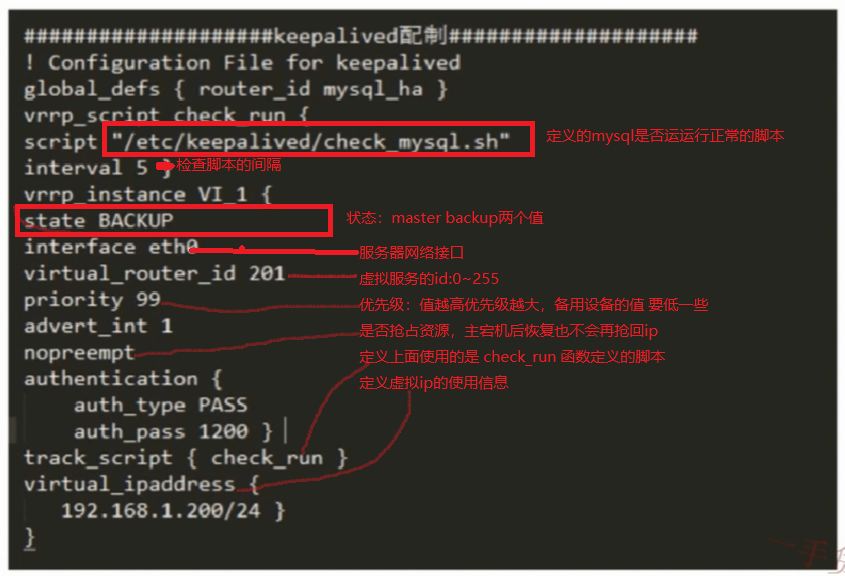
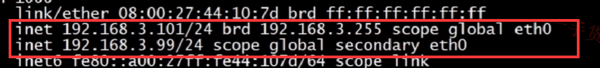

# Keepalived数据库心跳监控及自动切换
- 前提条件，请先设置好数据库的主主同步相关设置
#### 1. Keepalived 简介

- ARRP  协议可以将两台设备虚拟为一个设备，为每个设备虚拟一个IP出来

#### 2. 安装
```bash
yum install keepalived -y

/etc/keepalived/keepalived.conf
```


#### 3. 添加msyql监控脚本
```bash
# 创建脚本文件 /etc/keepalived/check_mysql.sh(脚本内容不再详细解释 )
chmod a+x /etc/keepalived/check_mysql.sh

#!/bin/bash
MYSQL=/home/mysql/bin/mysql
MYSQL_HOST=127.0.0.1
MYSQL_USER=root
MYSQL_PASSWORD=123456
CHECK_TIME=3
#mysql is working MYSQL_OK is 1 , mysql down MYSQL_OK is 0
MYSQL_OK=1
function check_mysql_helth (){
$MYSQL -h $MYSQL_HOST -u $MYSQL_USER -e "select @@version;" >/dev/null 2>&1
if [ $? = 0 ] ;then
     MYSQL_OK=1
else
     MYSQL_OK=0
fi
     return $MYSQL_OK
}
while [ $CHECK_TIME -ne 0 ]
do
     let "CHECK_TIME -= 1"
     check_mysql_helth

     echo $MYSQL_OK
if [ $MYSQL_OK = 1 ] ; then
     CHECK_TIME=0
     exit 0
fi
if [ $MYSQL_OK -eq 0 ] && [ $CHECK_TIME -eq 0 ]
then
     pkill keepalived
exit 1
fi
sleep 1
done
```

#### 4. 启动 keepalived 进程
```
/etc/init.d/keepalived start
# 查看 master 主数据库 ip信息
ip addr
```

```
# 停止mysql服务（模拟宕机），查看 master 主数据库 ip信息，3.99的ip已经不存在，keepalived进程也已经被杀死
/etc/init.d/mysqld stop
ip addr
```

```
# 查看 slave 从数据库 ip信息，此时已经进行虚拟ip切换
ip addr
```


**综合以上测试，我们只需要绑定一个数据库虚拟IP就可以，keepalived会自动进行健康服务的切换**

