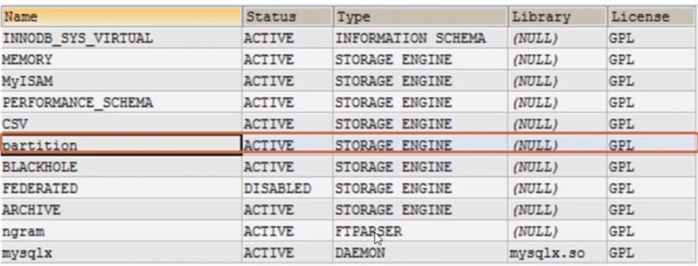
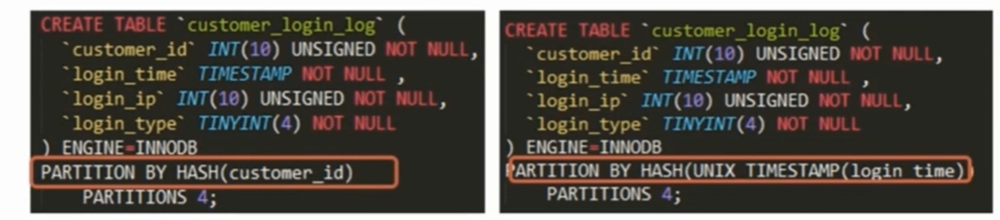
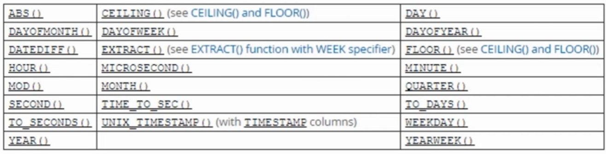
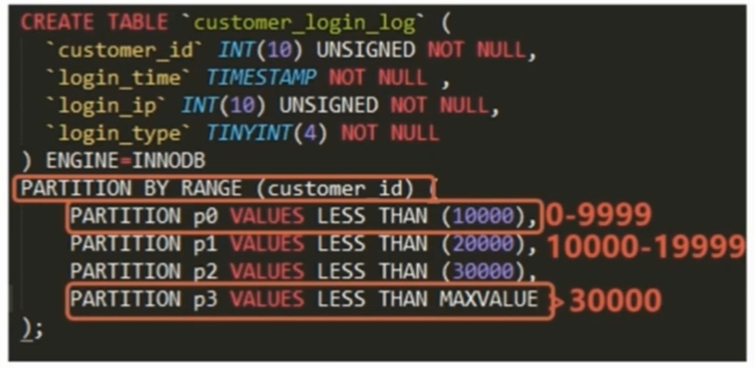
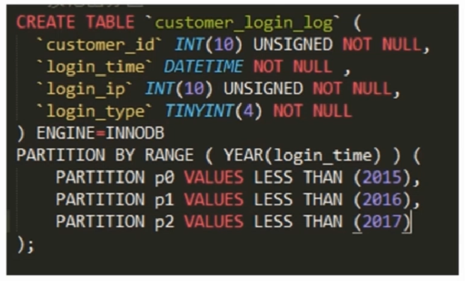
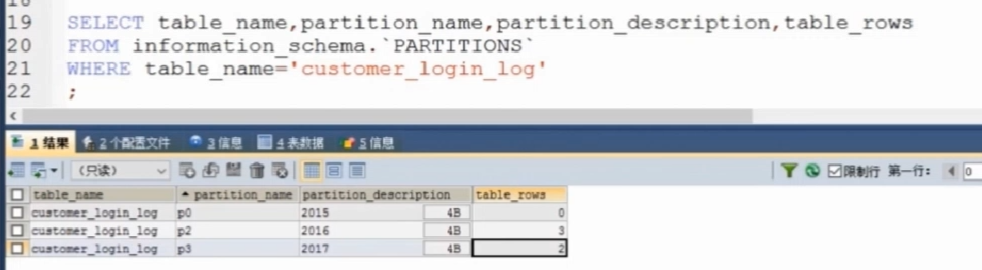

# MYSQL分区表使用
#### 1. 确认Mysql服务器是否支持分区表
有`partition`参数表示数据库是支持分区表功能，否则需要重新编译数据库
```sql
mysql > show plugins;
```


#### 2. 设置分区表功能
主键ID使用hash值进行分区

非分区表物理文件存储类型
```
customer_login_log.grm
customer_login_log.ibd
```
分区表物理文件存储类型
```
customer_login_log.grm
customer_login_log#P#p0.ibd
customer_login_log#P#p1.ibd
customer_login_log#P#p2.ibd
customer_login_log#P#p3.ibd
```
#### 3. 按HASH分区及其特点、
- 特点：
- 根据MOD（分区键，分区树）的值把数据行存储到表的不同分区中
- 数据可以平均的分布在各个分区中
- HASH分区的键值是一个INT类型的值，或是通过函数可以转为INT类型

**分区设置：整型分区和非整型分区，同时选择一个分区数量**

**分区时使用的函数**



#### 4. 按范围分区（RANGE）
- 特点：
- 根据分区键值的范围把数据行存储到表的不同分区中
- 多个分区的范围要连续，但是不能重叠
- 默认情况下使用VULUES LESS THAN属性，即每个分区不包括指定的那个值

**分区设置：指定分区使用的键，和每个分区的范围**

- 使用场景：
- 需要最后设置一个大于值，否则会出现后面的无法存入的情况
- 分区为日期类型或是时间类型（如果是id数字则会出现最后一个分区会出现过大的情况），便于按照日期归档
- 所有查询中都包括分区键

#### 5. LIST分区


#### 实例：如何为 customer_login_log 表分区
- 业务场景：
- 用户每次登陆都会记录日志
- 用户登录日志保存一年，一年后可以删除

- 说明
- 使用 RANGE 分区便于按照时间范围分区
- 选用 `login_time` 字段

#### 6. 查看分区的使用信息


#### 7. customer_login_log 增加分区
```sql
- 增加一个2018年的分区
ALTER TABLE customer_login_log ADD PARTITION (PARTITION p4 VALUES LESS TTHAN(2018));
```

#### 8. customer_login_log 删除分区
```sql
- 删除2015年以前的分区数据
ALTER TABLE customer_login_log DRON PARTITION p0;
```

#### 9. Mysql5.7交换分区归档
Mysql >= 5.7 以上版本对分区归档数据非常方便,创建归档表，使用交换分区概念对指定分区进行归档

- Mysql版本大于5.7
- 归档的表不能是临时表，表结构要与原表结构一直，不能有外键约束
- 归档后使用sql语句将归档表改为归档引擎`ALTER TABLE arch_customer_login_log ENGINE=ARCHVIE`,好处是比`INNODB`引擎占用空间小，但是只能进行查询操作，不能进行写操作。

------------------------------------------
## 总结：使用分区表的注意事项
- 结合业务场景选择分区键，避免跨分区查询。
- 对分区表进行查询最好在WHERE从句中分区分区键
- 具有主键或唯一索引的表，主键和唯一索引必须是分区键的一部分