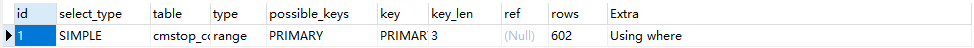
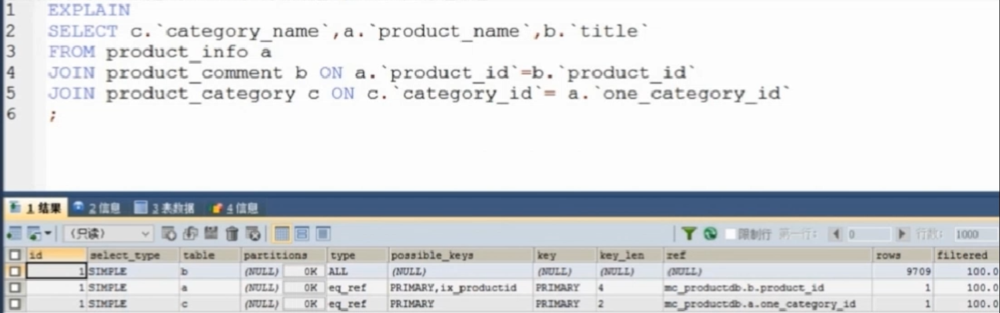
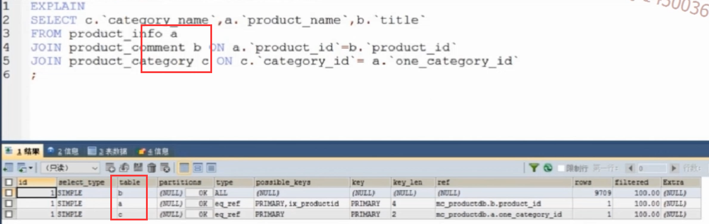
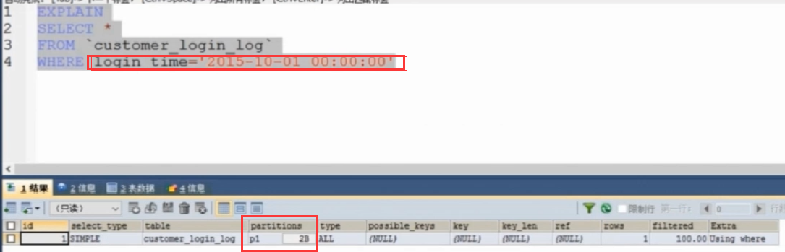
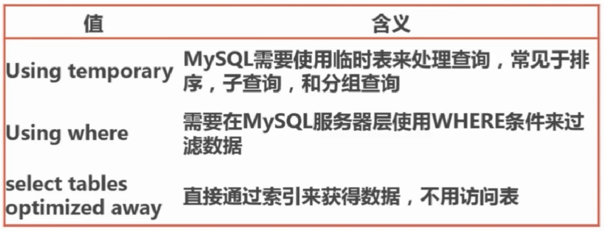

# SQL语句执行计划分析
- 在sql语句前添加关键字`EXPLAIN`,例如：`EXPLAIN SELECT title FROM mc_user_dtail WHERE userid=1 LIMIT 0,5;`
- 支持范围`select`,`update`,`insert`,`replace`,`delete`

#### 1. sql执行计划的作用
- 能告诉我们sql如何使用索引，用于分析索引的使用，一次来优化sql语句或数据库表结构
- 能显示出联结查询的执行顺序，方便我们调整索引和sql语句排序等
- 查询扫描的数据行数，可以分析sql执行效率语句中查询条件的限定是否合理等

#### 2. sql执行计划中的内容分析
SQL语句示例：`EXPLAIN SELECT title,contentid from content where contentid<10000 limit 0,10;`
查询展示：


###### **2.1 id列说明：**
- id列中数据为一组数字，表示执行select语句的顺序。如果为NONE，表示是有另外的语句组成的结果集
- id值相同时，执行顺序由上而下
- id值越大优先级越高，越先执行

```
每一个SELECT语句时一个id值，上图执行顺序：按照id值从上往下
```


```
每一个SELECT语句时一个id值，上图执行顺序：3,2，1 如果id值相同从上往下
```

###### **2.2 select_type 列说明**


###### **2.3 table 列说明**
- 输出数据行所在的表的名称或别名

- `<unionM,N>`由ID为M,N查询union产生的结果集
- `<derviedN> / <subqueryN>` 由ID为N的查询产生的结果
`例：由id为2的查询产生的结果集`


###### **2.4 partitions 列说明**
- 主要是用来查询分区表，显示查询分区的ID，对于非分区表显示为`NOLL`
示例：第一步：`login_time`为分区键，使用分区键进行查询，显示分区键范围内的分区信息

第二步：当查询的条件不为分区键时，则会显示所有的分区信息，但是效率很慢，会扫描所有的分区表


###### **2.5 type 列说明**


###### **2.6 extra 列说明**



###### **2.7 possible_keys 列说明**
- 指出mysql能使用那些索引来优化查询
- 查询列所涉及到的裂伤的索引都会被列出，但不一定会被使用

###### **2.8 key 列说明**
- 差查询优化器优化查询实际所使用的索引
- 没有可用的索引，则显示为NULL
- key实际使用的索引也可能不会出现在possible_keys中，说明使用了覆盖索引，该索引只会出现在key列

###### **2.9 key_len 列说明**
- 表示索引字段的最大可能长度
- key_len的长度是有字段定义来计算的，并非数据的实际长度

###### **2.10 ref 列说明**
- 表示哪些列或常量被用于查询索引裂伤的值

###### **2.11 rows 列说明**
- 表示mysql通过索引统计信息，估算的所需读取的行数  
- rows值的大小是个统计抽样的结果，并不十分准确 

###### **2.12 filtered 列说明**
- 表示返回结果的行数站需读取行数的百分比
- 值越大越好
- 值依赖统计信息，并不十分准确，参考值

#### 3 执行计划的限制
- 无法展示存储过程，触发器，UDF对查询的影响
- 无法使用explain对存储过程进行分析
- 早起版本只支持select语句的分析