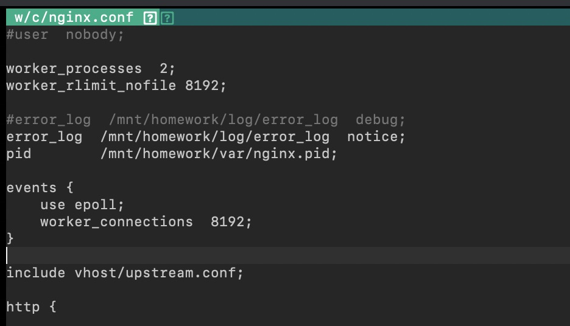

# nginx转发mysql链接.md

## 设置 nginx.conf



## 设置`mysql`负载

```bash
stream {
    upstream bzrdb {
        server dbproxy.ss.cc:8947 weight=1 max_fails=3 fail_timeout=30s;
    }

    server {
        listen       3388;
        proxy_pass  bzrdb;

        allow 192.168.236.37;
        deny all;
#       proxy_set_header Host $host:$server_port;
#       proxy_http_version 1.1;
#       proxy_set_header Host $http_host;
#       proxy_set_header X-Forwarded-For 192.168.241.153;


    }
}
```
