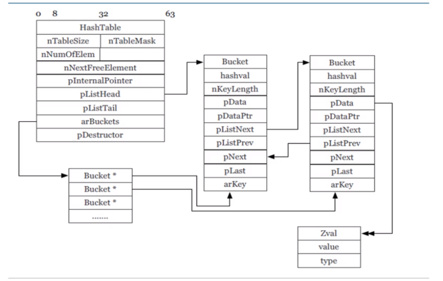
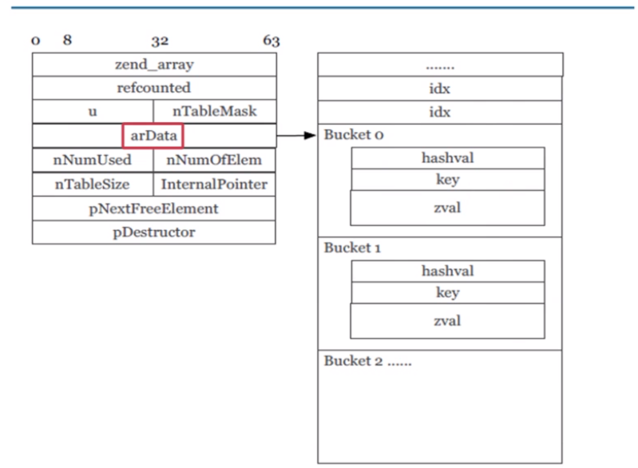
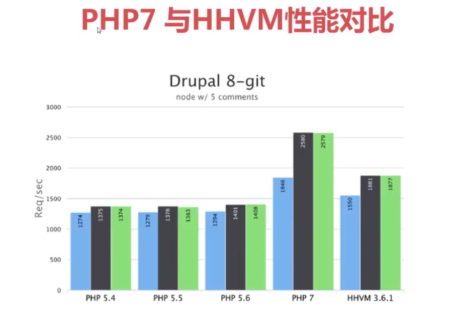
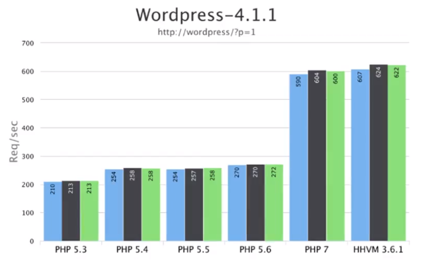
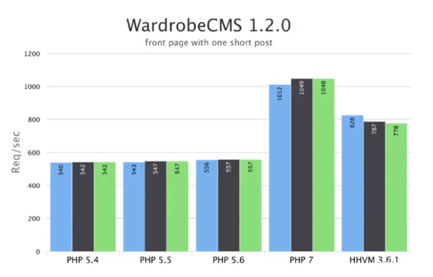

# PHP7 新特性
>PHP是IO密集性操作，如果论计算能力性能与C，Java差几十倍。但是开发效率快，本身性能不够。
- ZendVM,PHP早期引擎，速度慢，对计算密集型的指令效率不高
- HHVM引擎 facebook开发的新版PHP引擎
- 新版php7重构了新的引擎，是以前QPS的两倍。


### 1. 变量类型
函数的参数和返回值增加了类型限定。增加够可以让JIT准确判断变量类型，生成最佳的机器命令。
```php

function  test(int $a,array $arr,string $str) : init {

}
```

### 2. 错误异常
```php
try{
  none_fun();
} catch (EngineException $e) {
  echo "Exception:{$e->getMessage()}\n";
}
```

#### 3. zval使用栈内存
zend引擎中，是PHP7可以直接使用栈内存，不用像以前一样，需要动态的从堆内存中获取，减少了一次内存分配
```php
// php5
zval *val; ,AKE_STD_ZVAL(val);
// php7
zval val;
```

#### 4. zend_string 底层zend引擎存储hash值，array 查找不需要重复计算hash
php7 为字符串类型创建了新的类型 zend_string，除了char *指针和长度之外，增加了hash字段，用于保存字符串的hash值。数组键值查找不需要反复计算hash值。
```php
strut _zend_string {
  zend_refcounted gc;
  zend_ulong h;
  size_t len;
  char val[1]
};
```

### 5. 性能分析
- php 早期的 hash table 结构


- php7 优化后的结构


- hash table 桶内直接存储数据，减少了内存申请次数，提升了cache命中率和内存访问速度
- zend_parse_parameters改为宏观性，性能提升5%
- 新增加4中OPCODE,call_user_function,is_init/string/array,strlen,definde 4个函数变为PHP OpCode指令，速度更快。
- 其它更多性能优化，如基础类型int,float,bool等改为直接进行值拷贝，排序算法改进，PCRE with JIT,execute_data 和opline使用全局寄存器，使用gdb4.8的PGO功能。

### 6. 性能对比
- drupal 8-git Drupal是使用PHP语言编写的开源内容管理框架（CMF），它由内容管理系统（CMS）和PHP开发框架（Framework）共同构成

- WordPress是使用PHP语言开发的博客平台

- WordrobeCMS是使用PHP语言开发的博客平台


### 7. JIT特性：即时编译和执行
- just in time 缩写JIT，表示运行时将指令转化为二级制机器码运行
- 通常编译时与运行时两个阶段是独立分开的，脚本编译完成后，像 APC 与 OPCache 这样的字节码缓存组件会缓存这些操作码。而 JIT 去掉了编译时阶段，它将这编译时与运行时两个阶段合为一体，实现即时编译与执行。
- 对于计算密集型的程序，JIT可以大幅提升性能
- 官方PHP7.0目前没有携带JIT，PHP7.4可以开启JIT功能，属于体验使用，预计在PHP8的官方版本中会正式引入JIT特性

### 8. 新版PHP内置了WEB服务器，不需要再额外安装apache，nginx就可以运行
```bash
root@04372043559c:/usr/src/myapp# php -S 0.0.0.0:9000
PHP 7.3.6 Development Server started at Sat Jun 29 03:28:31 2019
Listening on http://0.0.0.0:9000
Document root is /usr/src/myapp
Press Ctrl-C to quit.
```
- 使用curl或浏览器测试php内置的web服务器
```bash
[root@localhost php-apache]# curl http://172.17.0.3:9000/index.php
Hello World
```