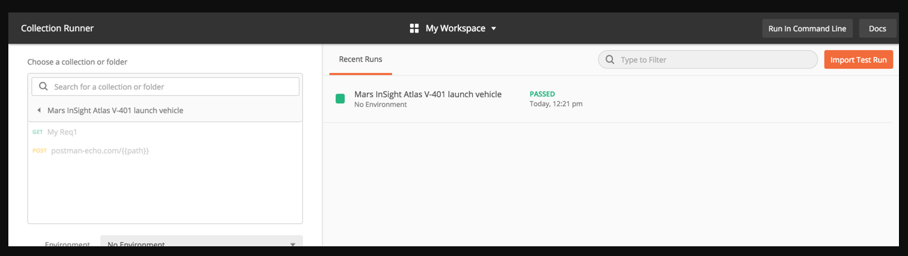
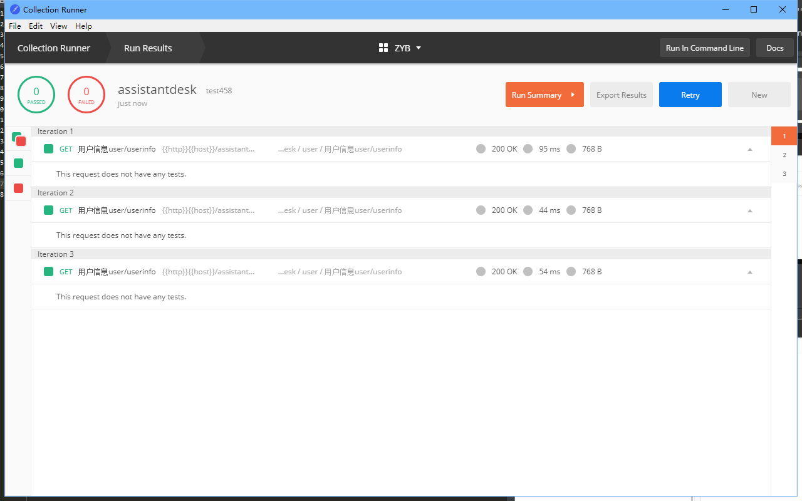
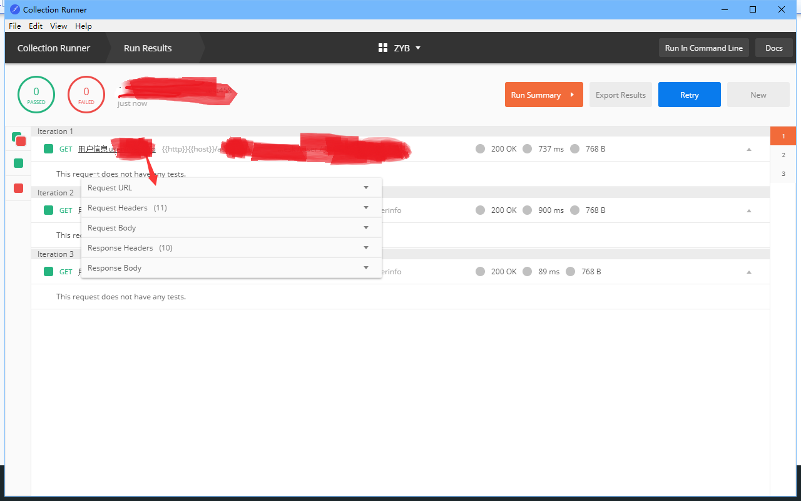
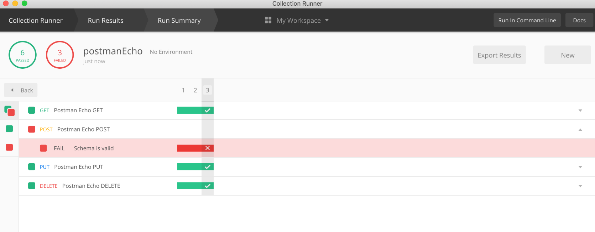

## 1. Collection 简介
```txt
Collection是一组请求，可以在对应的环境下作为一系列请求一起运行。

当您想自动进行API测试时，运行Collection非常有用。运行Collection时，您会依次发送Collection中的所有请求。

要运行集合，可以使用：标题栏中的Postman应用程序Collection `Runner`程序。
```




## 2. Collection Run 选项设置及运行

-   选项设置



-   运行结果



-   Run Summary


```text
顾名思义，此屏幕是运行的概述。在这里，您可以看到每个请求及其通过/失败状态的时间表。

如果请求中的所有测试均通过，则该请求被视为“通过”。同样，如果一个或多个测试失败，则该请求将标记为“失败”。

标头中的数字表示当前迭代。现在可以很容易地确定行为异常的测试。单击标题中的该迭代，以便您可以进一步调查可能出了什么问题。
```
集合运行器中的迭代从1开始以1为索引，从1开始计数。

请注意，这与Postman沙箱中以编程方式可访问的迭代计数不同，后者以0开头的第一个迭代为0索引。

以编程方式自定义迭代数据
为了提供收集运行的数据，收集运行器提供了“数据文件”选项。但是，如果要访问和操作集合运行中的数据，则需要通过脚本以编程方式进行处理。这可以通过pm.iterationData对象来完成，该对象提供了几种以编程方式访问和操纵数据的方法，从而允许在收集运行期间访问迭代数据。

有关iterationData对象提供的方法的列表，请参见：pm.iterationData