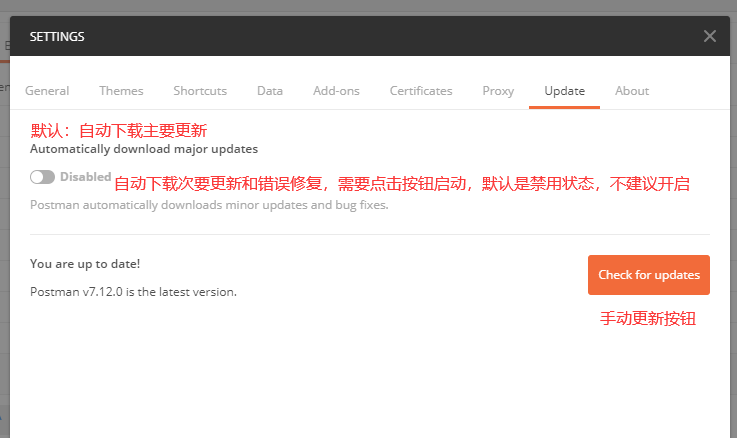
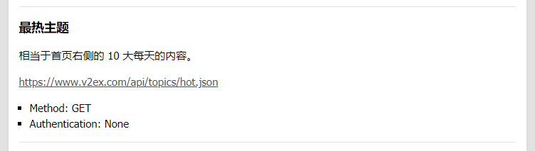
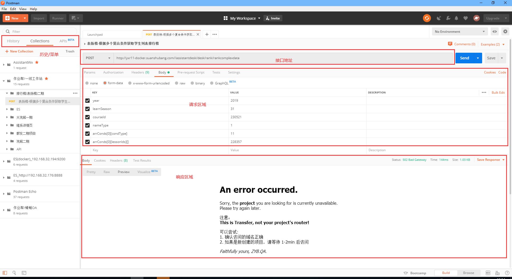
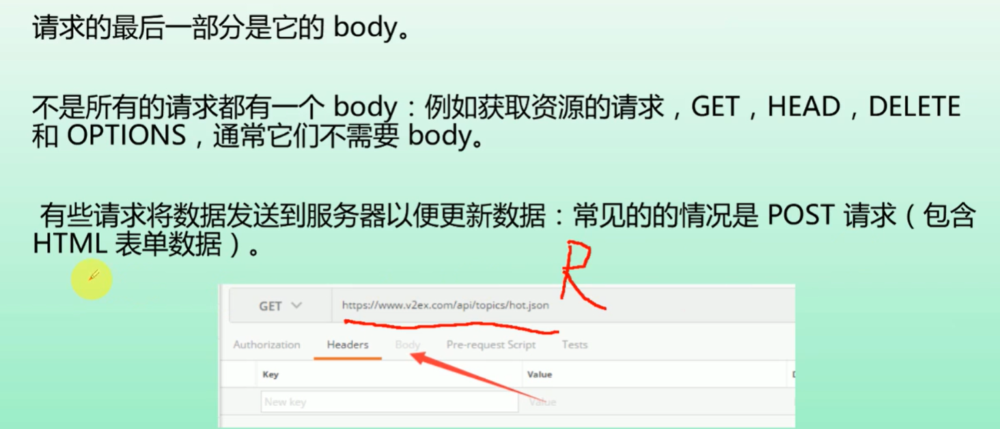
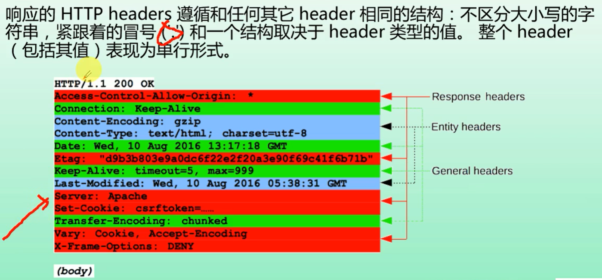
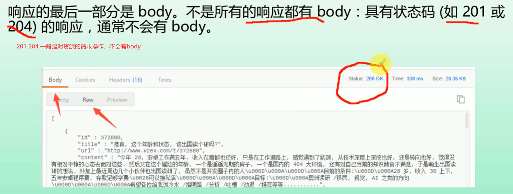
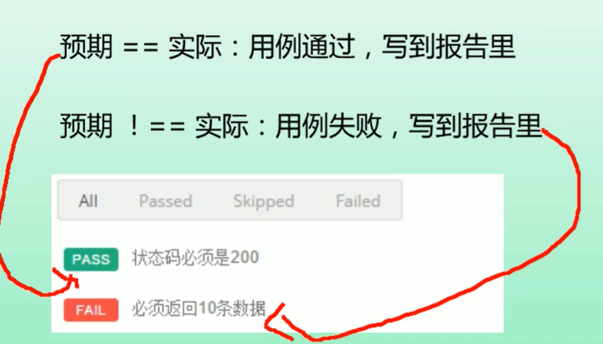
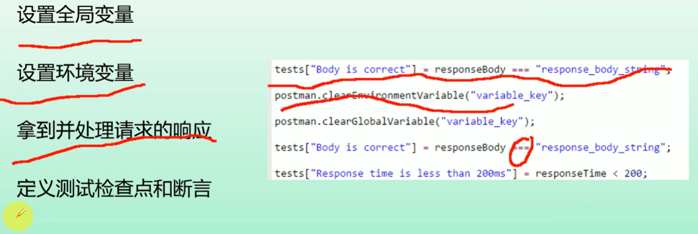
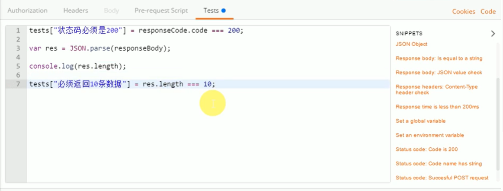
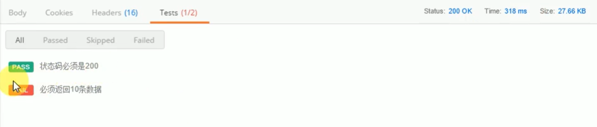

[官网下载地址](https://www.getpostman.com/) |
[官网文档](https://www.getpostman.com/docs/) |
[社区及支持](https://www.getpostman.com/)
## 1. 使用场景
- 方便开发：开发接口的时候快速调用接口，以便调试
- 方便测试：测试的时候需要非常方便的调用接口，通过不同的参数去测试接口的输出
- 重复测试：这些接口调用是需要保存下来反复运行的
- 断言（测试目的）：在运行过程中如果有断言（检查点）加持就更好了
> 对于前后端分离的开发环境来说，是需要前端，开发，测试人员都需要掌握的一个非常实用的工具
## 2. 系统支持
- MACOS
- Windows
- Linux
## 3. chrome 与 native 版本区别 （chrome 版本目前官方已经不支持了，推荐使用native）
- native 版本可以直接操作cookie，chrome版本需要额外安装插件
- native 自带proxy,可以用来抓包
- 有一些header在chrome版本上时受限的，比如 Origin 和 User-Agent （主要用来说明来源，用于伪造身份，chrome是很难修改的）
- Don't follow redirects option 不去跟随重定向的选项 （chrome版本不支持，主要用于重定向状态码获取）
- postman console （native支持，用于测试断言）
## 4. 版本更新
- 自动更新，不用设置
> 打开native版本APP，点击： File->Settings->Update


## 5. 发送第一个API
- 接口文档 https://www.v2ex.com/p/7v9tec53
- API地址 https://www.v2ex.com/api/topics/hot.json

- postman 区域划分


## 6. HTTP请求
- HTTP消息是服务器与客户端之间交换数据的格式
- 有两种消息类型：
  - 请求 ： 由客户端发送用来触发服务器一个动作
  - 相应 ： 来自服务器的返回信息
- HTTP请求REQUEST的构成：
  - 起始行
  - heads
  - body
```txt
POST /log/performance HTTP/1.1
Host: nlogtj.zuoyebang.cc
Connection: keep-alive
Content-Length: 995
Origin: http://assistantdesk.zuoyebang.cc
User-Agent: Mozilla/5.0 (Windows NT 10.0; Win64; x64) AppleWebKit/537.36 (KHTML, like Gecko) Chrome/78.0.3904.87 Safari/537.36
Content-type: application/x-www-form-urlencoded
Accept: */*
Sec-Fetch-Site: cross-site
Sec-Fetch-Mode: cors
Referer: http://assistantdesk.zuoyebang.cc/assistantdesk/view/first-line-teacher/new-new-task
Accept-Encoding: gzip, deflate, br
Accept-Language: zh-CN,zh;q=0.9,en;q=0.8,zh-TW;q=0.7,ja;q=0.6
{"reqStartTime":1578285700509,"reqType":"GET","reqUrl":"http://assistantdesk.zuoyebang.cc/assistantdesk/tool/getassistantinfo","type":"slow","reqParams":"_=1578285700472&ignoreFS=1","timeLong":843,"status":200,"clientTime":1578285701352,"sysPlat":"Other","agent":"Mozilla/5.0 (Windows NT 10.0; Win64; x64) AppleWebKit/537.36 (KHTML, like Gecko) Chrome/78.0.3904.87 Safari/537.36","sysVersion":"1.0","runPlat":"OTHER","phoneBrand":"测试","url":"http://assistantdesk.zuoyebang.cc/assistantdesk/view/first-line-teacher/new-new-task","referrer":"http://www.zuoyebang.cc/session/browse/login?redirect=http%3A%2F%2Fassistantdesk.zuoyebang.cc%2Fassistantdesk%2Fview%2Ffirst-line-teacher%2Fnew-new-task","urlParams":"{}","network":"4g","winW":1920,"winH":1080,"locale":"zh-CN","metaData":"教师工作站","createTime":1578285699230,"authkey":"00ee0684-84f1-4db8-963c-7c4f553ad328","sysMv":"1","uvId":"Jb2f0ST1dJMJbath","sdkVersion":"0.1.31","jre":"prod","cname":"","br":"chrome","brv":"78.0.3904.87"}
```


- HTTP响应RESPONSE的构成：
  - 2XX 成功
  - 3XX 重定向
  - 4XX 资源未找到
  - 5XX 服务器错误





## 7 断言
- 预期结果与实际结果之间的判断
```txt
预期 == 实际 > 用例成功，写到报告了
预期 !== 实际 > 用例失败写到失败报告里
```

- postman 的test功能





## 8 请求的导入导出


