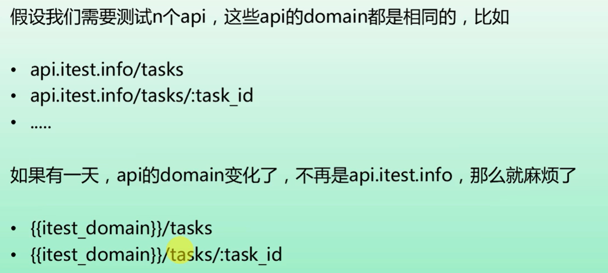
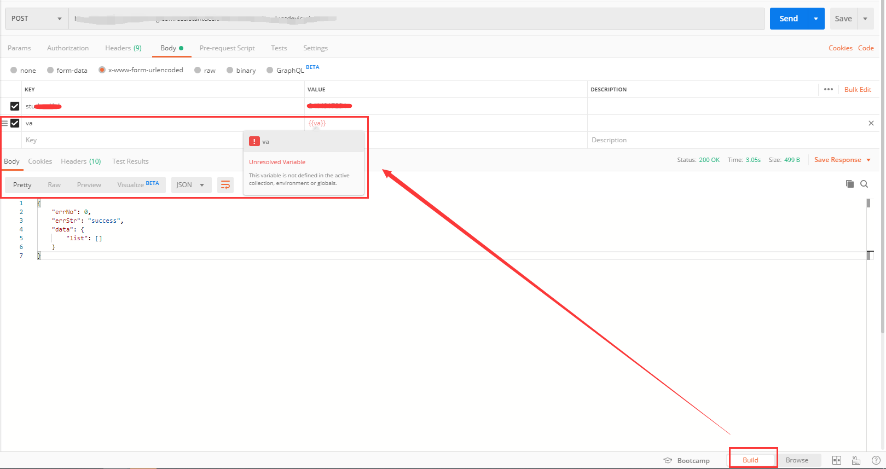
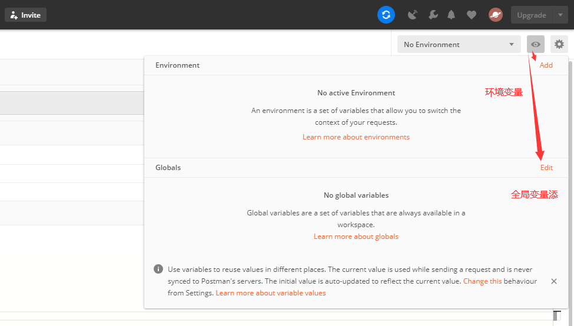
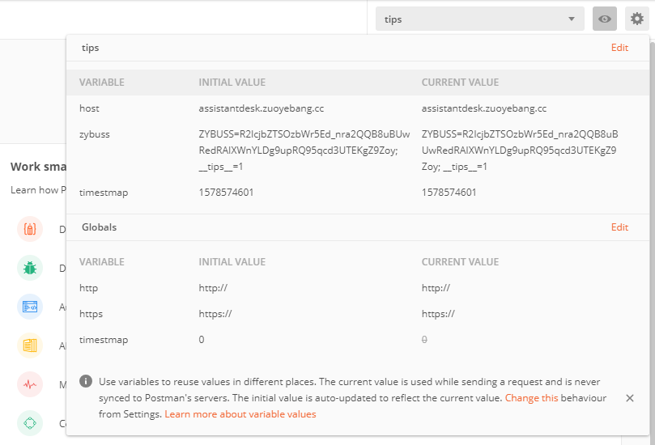

# 常用变量

### 响应结果格式化为object 
```javascript
var resdata = JSON.parse(responseBody);
```


# 变量的设置
### 为什么使用变量

- 好处是不用把 API 或者 环境 写死

### 变量的作用域


### 变量的引用
- 在 `build` 引用 `{{vairable}}` 如果没有定义变量会显示红色，鼠标移上去会有提示



### 变量的定义



