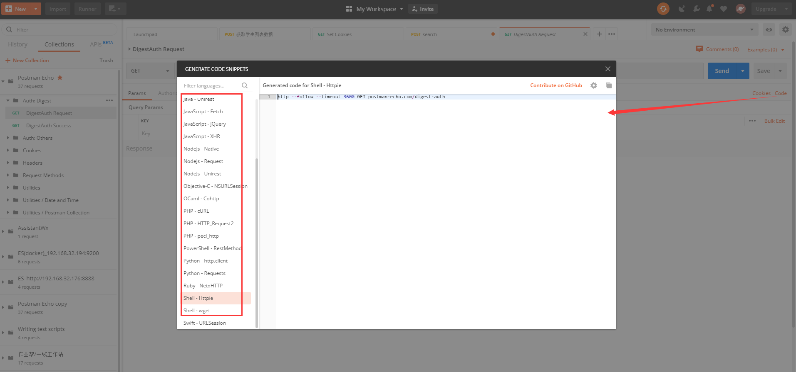
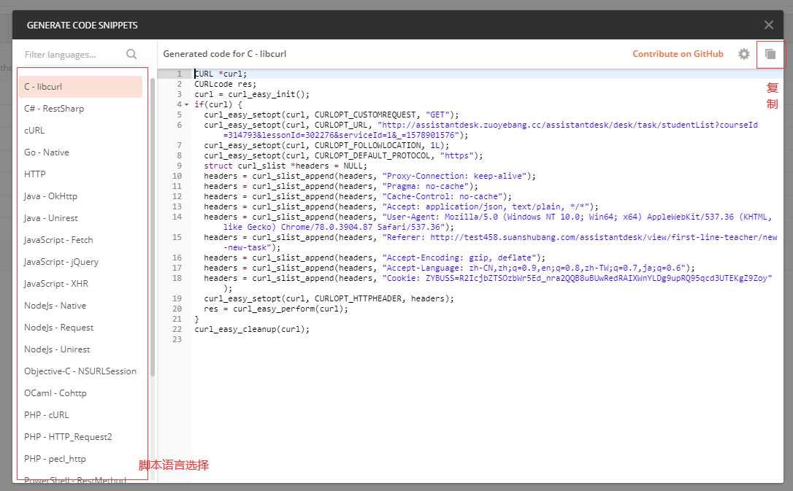
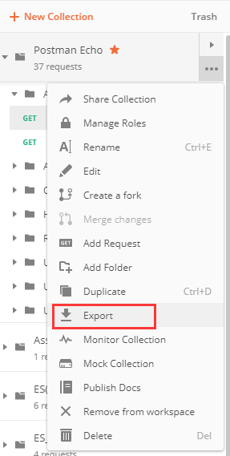
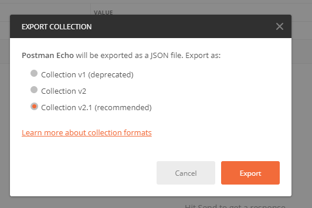
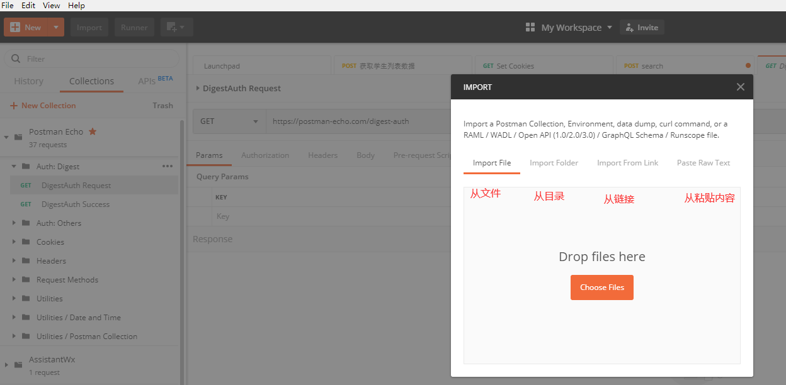
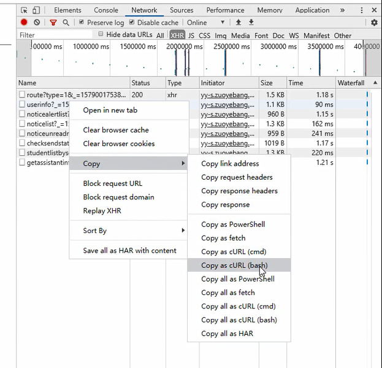
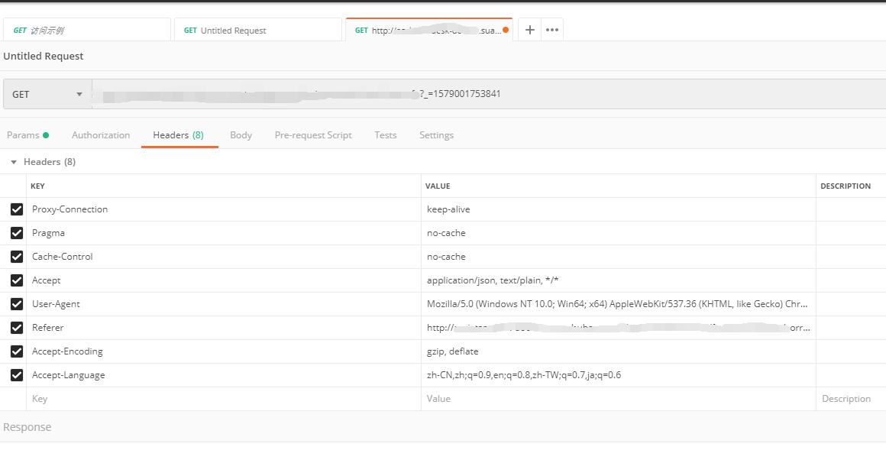

## 1. 单请求的的导出（可选择淡出脚本语言）

## 2. 导出整个Collection

## 3. 请求的导入
- 第1部中复制的内容导入时选择 `Parst Raw Text`

- 第2步中整个Collection选择`Import File`

## 4. 将浏览器中的请求导入到`Postman`

- 复制浏览器请求为 curlbash 文本（点击即可复制到粘贴板）

- 导入`Postman`

