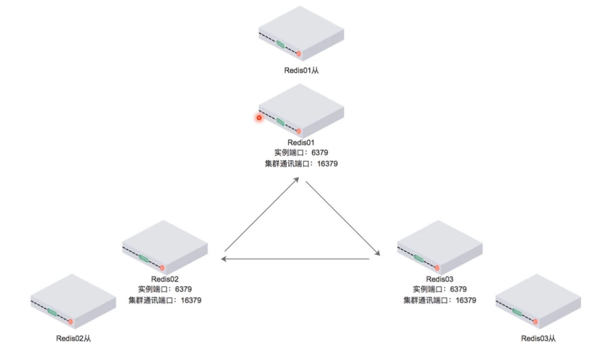
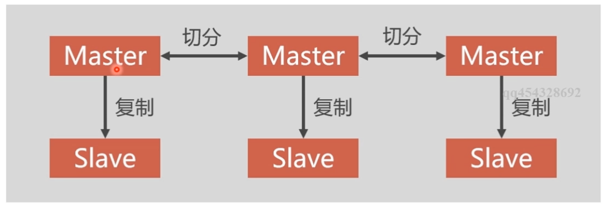
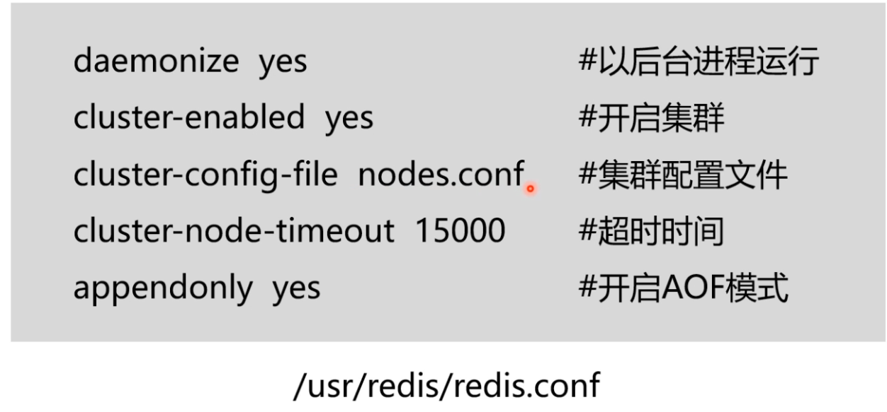
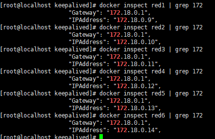
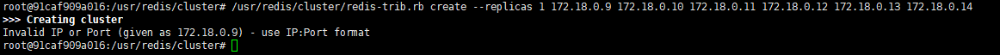

# Redis高速缓存介绍及集群部署方案
### 1. 高速缓存介绍
- 高速缓存利用内存保存数据，读写速度远超硬盘
- 高速缓存可以减少I/O操作，降低I/O压力

### 2. Redis 介绍
- 是Wmware开发的开源免费的KV型的NOSQL缓存产品
- 具有良好的性能，最多可以提供10万次/秒的读写
- 目前新浪微博团队组建了世界上最大的Redis集群

### 3. Redis 集群介绍（推荐3.1）
+ redis目前的集群方案分为以下几种：
3.1 rediscluster： 官方推荐，没有中心节点
3.2 codis:360公司开发中间件产品，存在中心节点
3.3 Twemproxy: 中间件产品，存在中心节点

### 4. RedisCluster集群部署介绍
+ 4.1 RedisCluster集群优势
  - 无中心节点，客户端与redis节点直连，不需要中间代理层
  - 数据可以被分片存储，每个节点存储都不一样，所以每个节点都要做冗余设计
  - 管理方便，后续可自行增加或摘除节点

+ 4.2 集群方案介绍
  - 集群中数据的复制时通过主从同步来实现的
  - 节点(master)把数据分发给从节点（slave），好处是高可用
  - Rdis集群中应该包含奇数个master主节点（防止投票时出现平票的情况（脑裂）），至少应该有3个master节点，加上冗余应该至少有6个节点
  - 每个master节点都需要有slave节点，冗余设计



### 5. RedisCluster集群部署实例
+ 5.1 Redis 部署和启动
```bash
# Docker下载 redis镜像
docker pull yyyyttttwwww/redis

docker run -itd --name red1 --network=netpxc yyyyttttwwww/redis bash 
docker run -itd --name red2 --network=netpxc yyyyttttwwww/redis bash 
docker run -itd --name red3 --network=netpxc yyyyttttwwww/redis bash 
docker run -itd --name red4 --network=netpxc yyyyttttwwww/redis bash 
docker run -itd --name red5 --network=netpxc yyyyttttwwww/redis bash 
docker run -itd --name red6 --network=netpxc yyyyttttwwww/redis bash 

# 进入 每一个 容器配置 redis节点
docker exec -it red1 bash

vi /usr/redis/redis.conf

# 启动 redis 服务
/usr/redis/src/redis-server /usr/redis/redis.conf 
```


+ 5.2  查看所有redis节点的容器IP，并配置redis-trib.rb


```bash
# 进入 redis 容器安装 redis-trib （基于ruby的redis集群命令行工具）
#此处的 redis-trib .rb 工具已经在容器中提供了，没有的小伙伴需要自己去下载
mkdir -p /usr/redis/cluster/
cp /usr/redis/src/redis-trib.rb /usr/redis/cluster/
apt-get install ruby
apt-get install rubygems
gem install redis

# 使用 redis-trib.rb 创建 Redis 集群
/usr/redis/cluster/redis-trib.rb create --replicas 1 172.18.0.9:6379 172.18.0.10:6379 172.18.0.11:6379 172.18.0.12:6379 172.18.0.13:6379 172.18.0.14:6379
```


# **课程视频成功启动，自己测试等待过长，手动关闭后出现报错信息，文档未完成，后面补充完相关知识后再补齐此文**