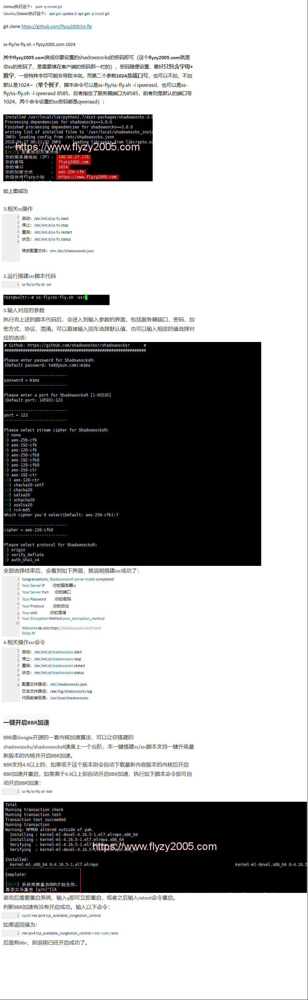

# VPN安装教程(装载)

```bash
yum -y instlll unzip wget
wget https://github.com/flyzy2005/ss-fly/archive/master.zip
unzip master.zip
cd ss-fly-master/

# 安装ssr
./ss-fly.sh -ssr

# 安装加速
./ss-fly.sh -bbr
# 验证 bbr 是否安装成功
sysctl net.ipv4.tcp_available_congestion_control
```
